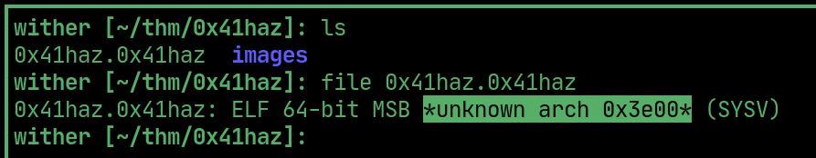
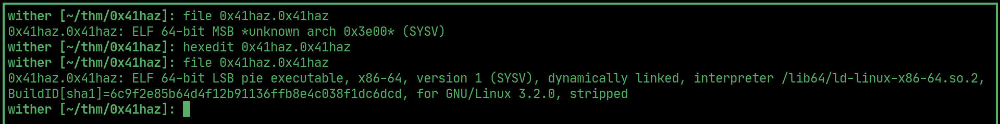
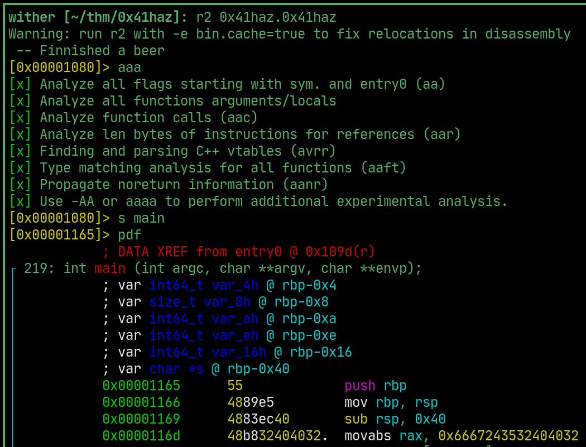

# 0x41haz

---

> file header unavailable 

  

> change the 6th byte from 02 to 01, now its visible

  

> use radare2 to analyze the binary and compile several strings to form password

  

> run the binary and enter the combined strings to check the password