# agent-sudo

---

## Nmap

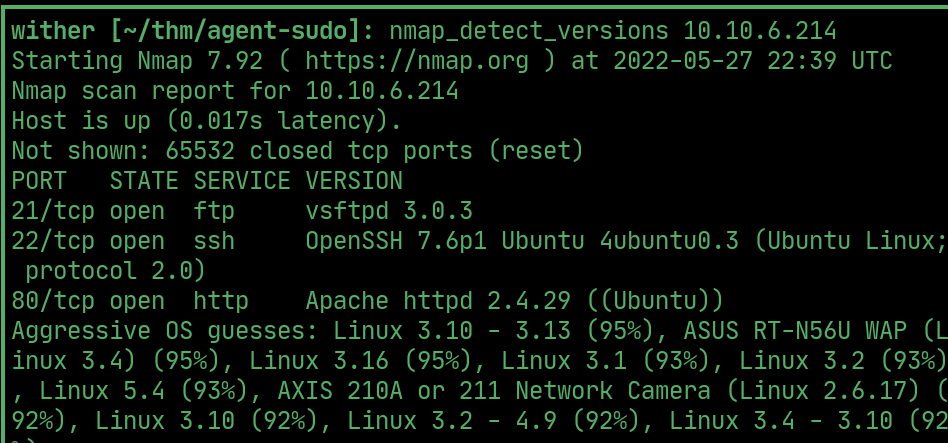  

## Codename

> The website says to use a codename as the `user-agent` to access more.

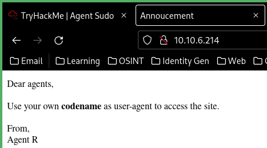  

## Burpsuite

> `R` as the `user-agent` discloses there are 25 other employees (1 for each letter of the alphabet)

 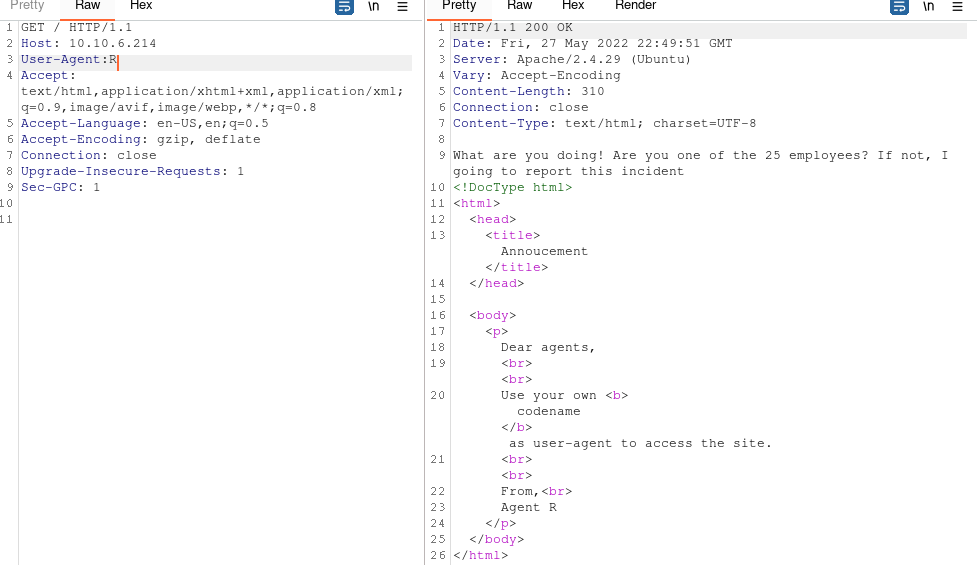  

> Use `BurpSuite`'s `intruder` tool to bruteforce the codename.

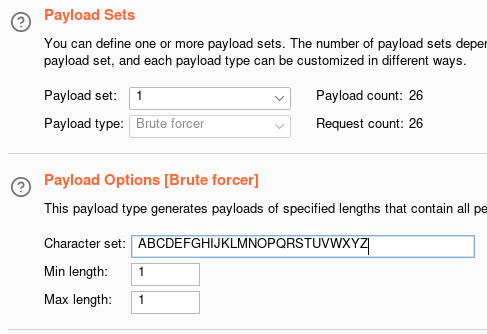   

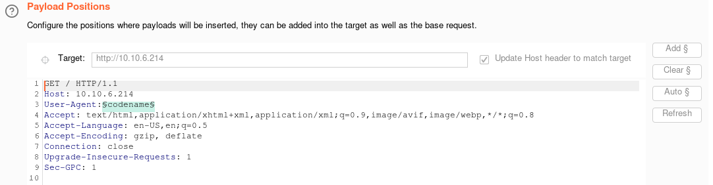 

## Agent C

> `user-agent:C` redirects to `agent_C_attention.php`

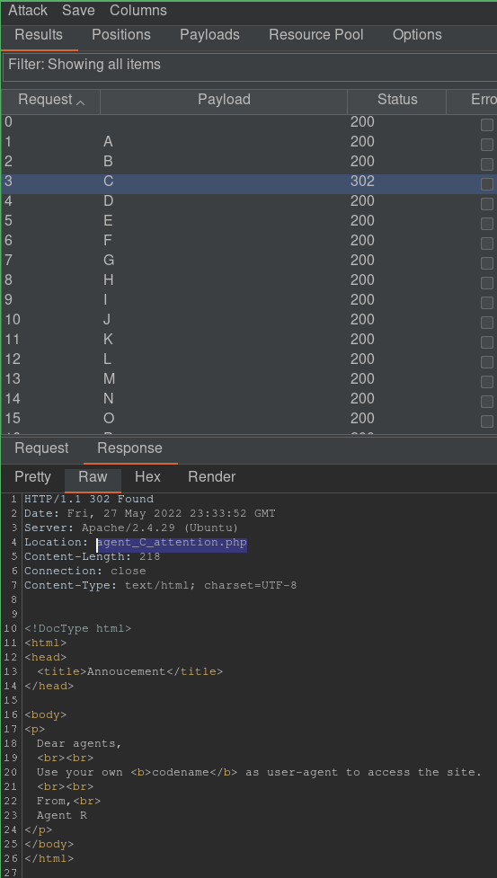  

> `agent_C_attention.php` reads this:

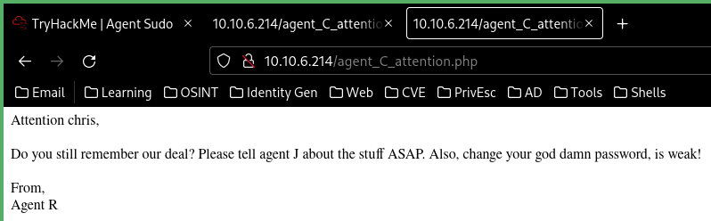  

## Hydra

> Use `hydra` to bruteforce `chris`'s FTP password

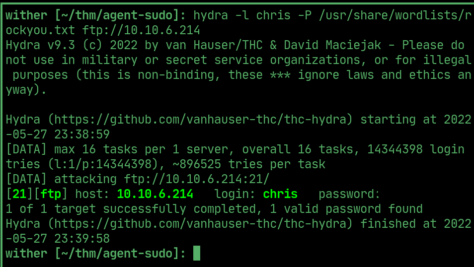  

## ftp

> Login and download the `To_agentJ.txt` file

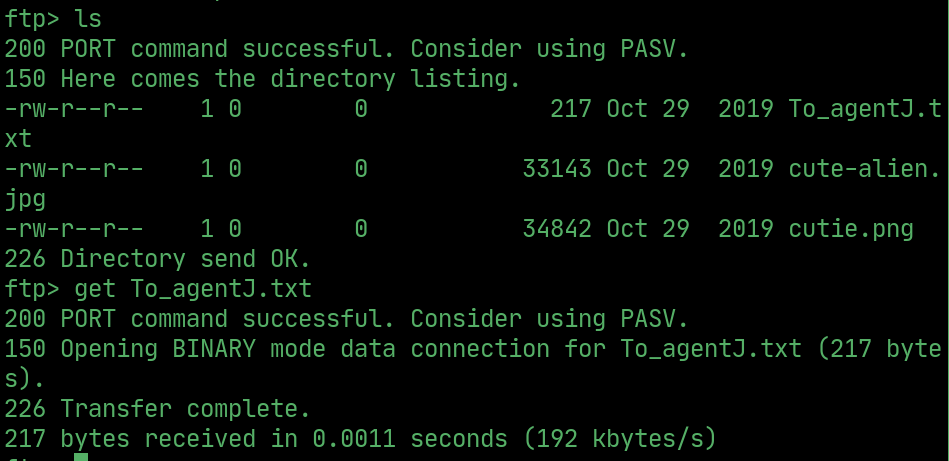  

> Agent J's password is somewhere in the images

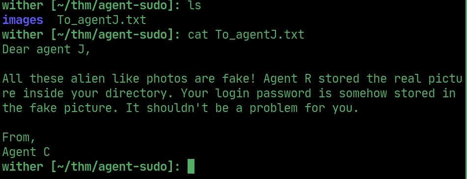  

> Download the images.

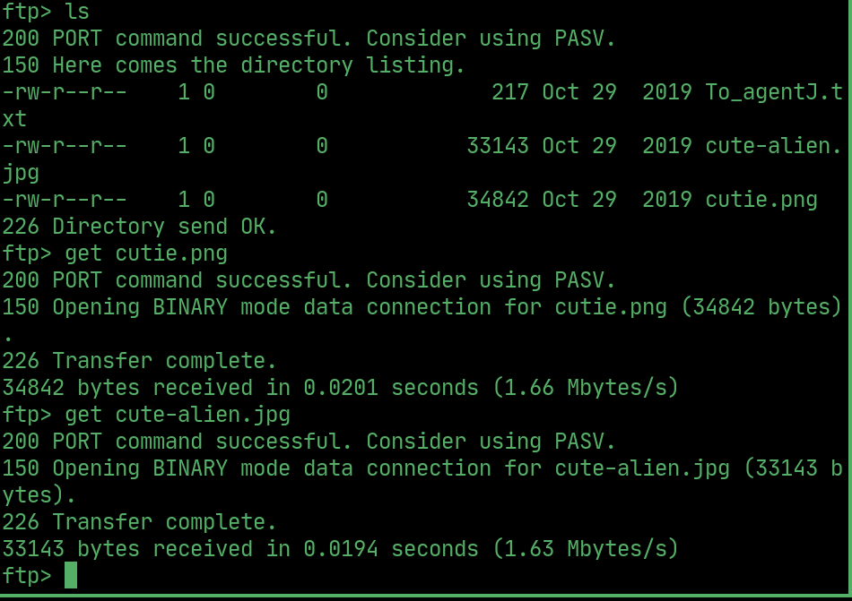 

## Steganography

>  Use `stegseek` to view the steganographic data within `cute-alien.jpg`, ireavealing a name and password that we can login to via SSH.

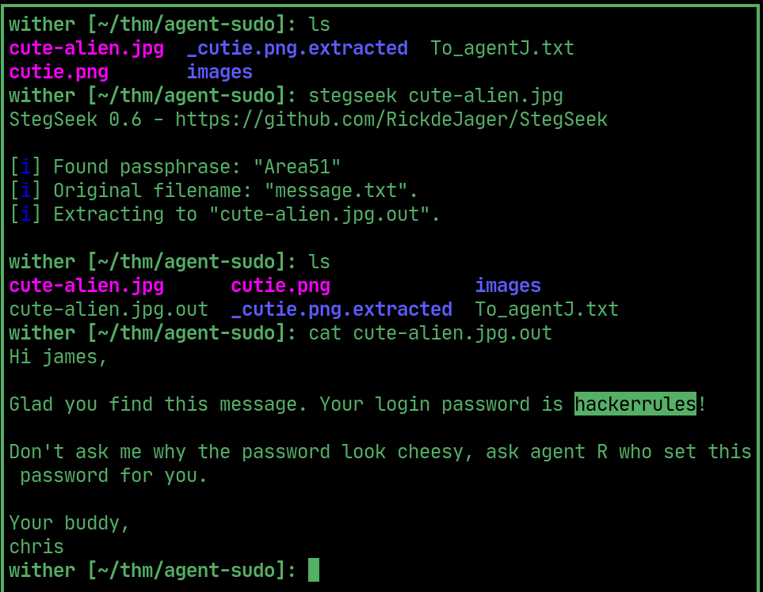  

## User flag

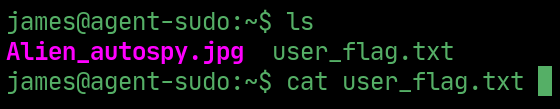  

## PrivEsc

> Use `CVE-2019-14287` to escalate privilages to root.

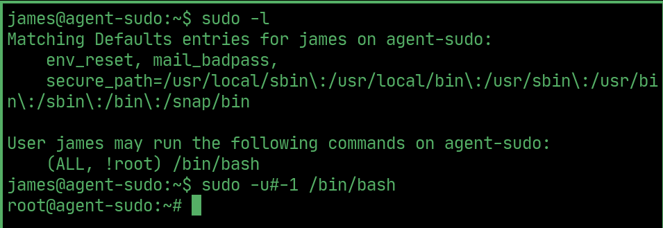  

## Root flag

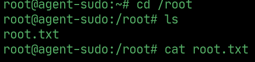  