# Biblioteca [Medium]

---

## Rustscan

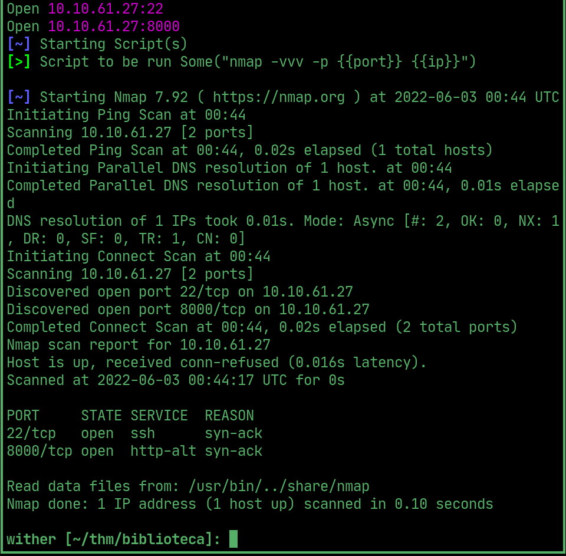  

## Website

> Site is a login form

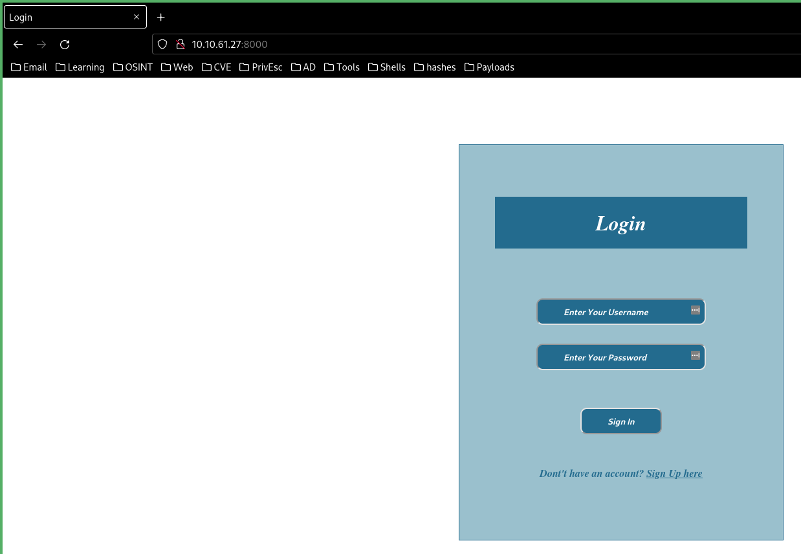  

## Burp

> seems to be vulnerable to simple SQLi, get a login and a user 'smokey'

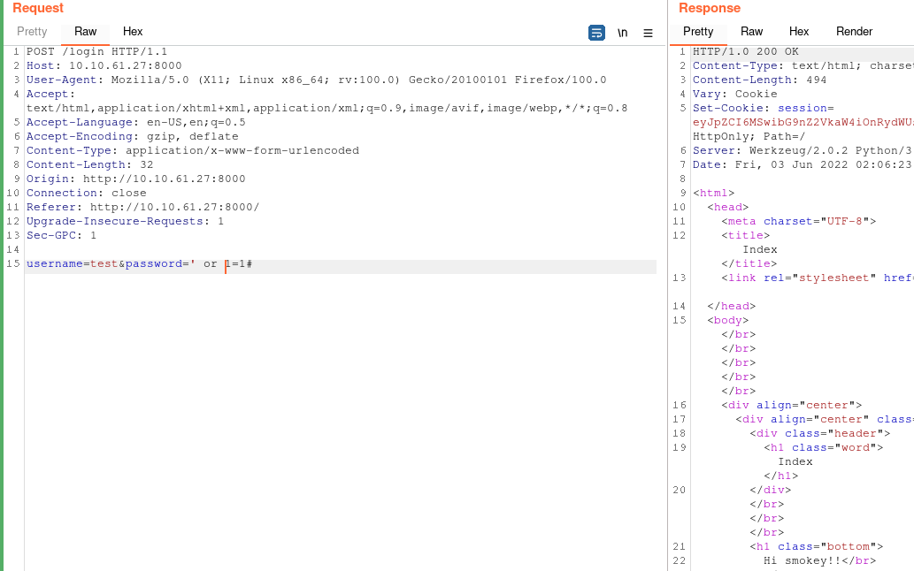  

> username is in column 2

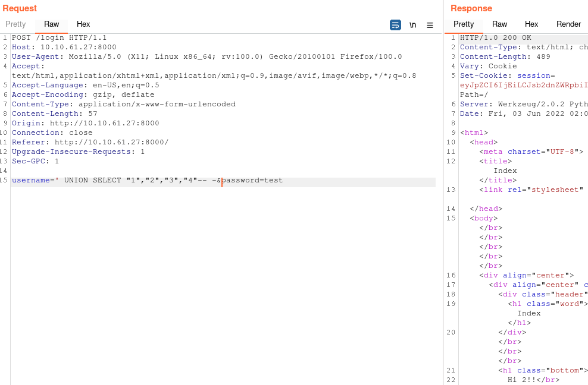  

> found the website database

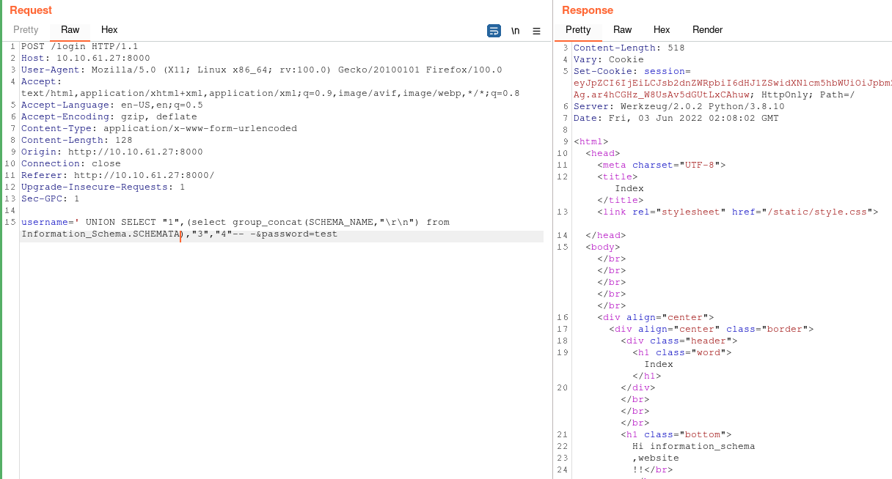 

> query the users table to find password column

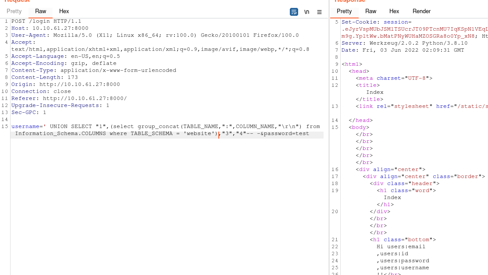  

> Get smokey's password

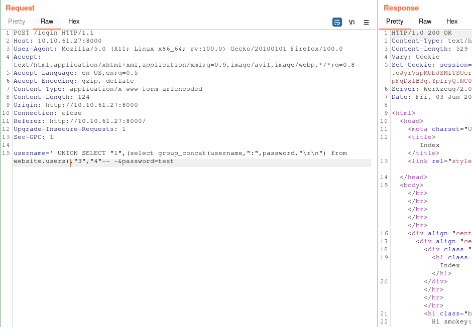  

## User

> ssh in as smokey

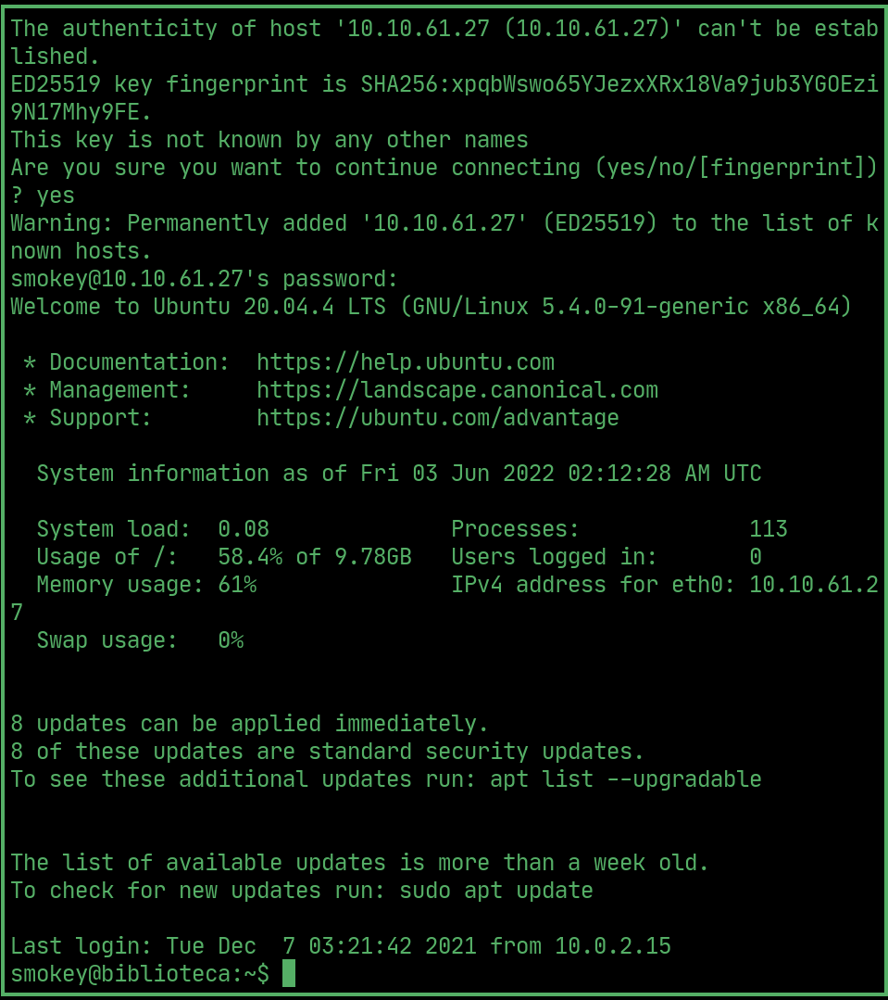  

## PrivEsc

> theres another user called hazel, their password is very easy to guess

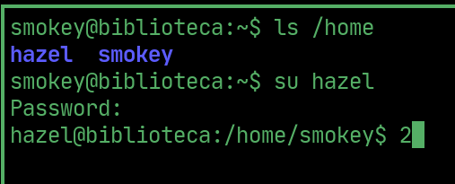  

> hazel can set the python environment variable as well as run hasher.py as root. hasher.py uses a library called hashlib

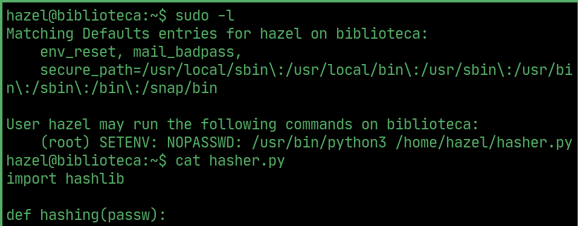  

## Root

> make a hashlib.py in /tmp to spawn a bash shell, sudo set the python environment variable to /tmp and run hasher.py. Wait for hasher.py to import and execute the malicious library to get root

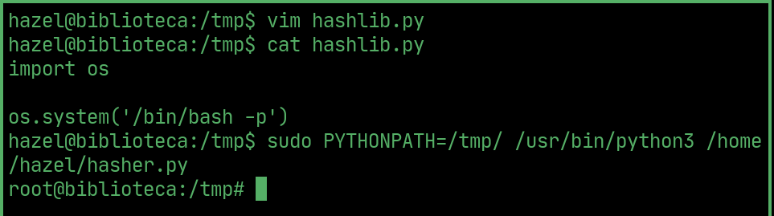  

## Root flag

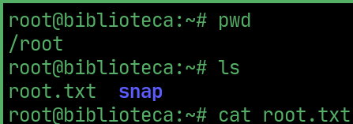  