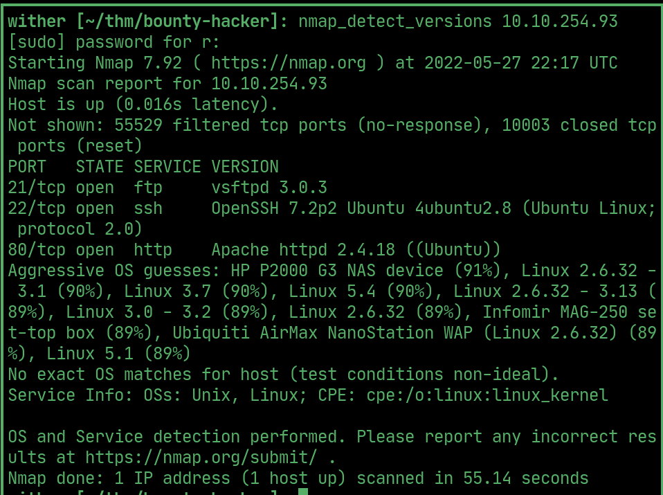
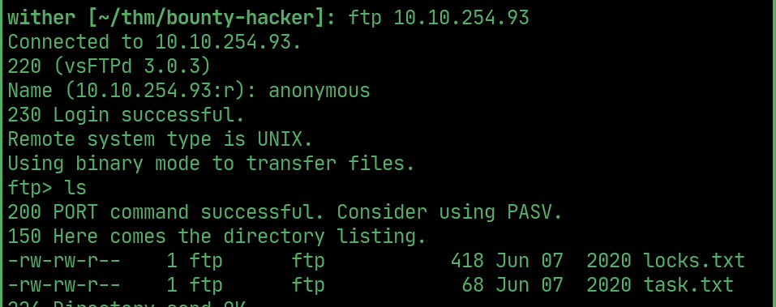
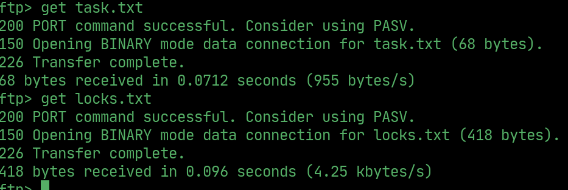
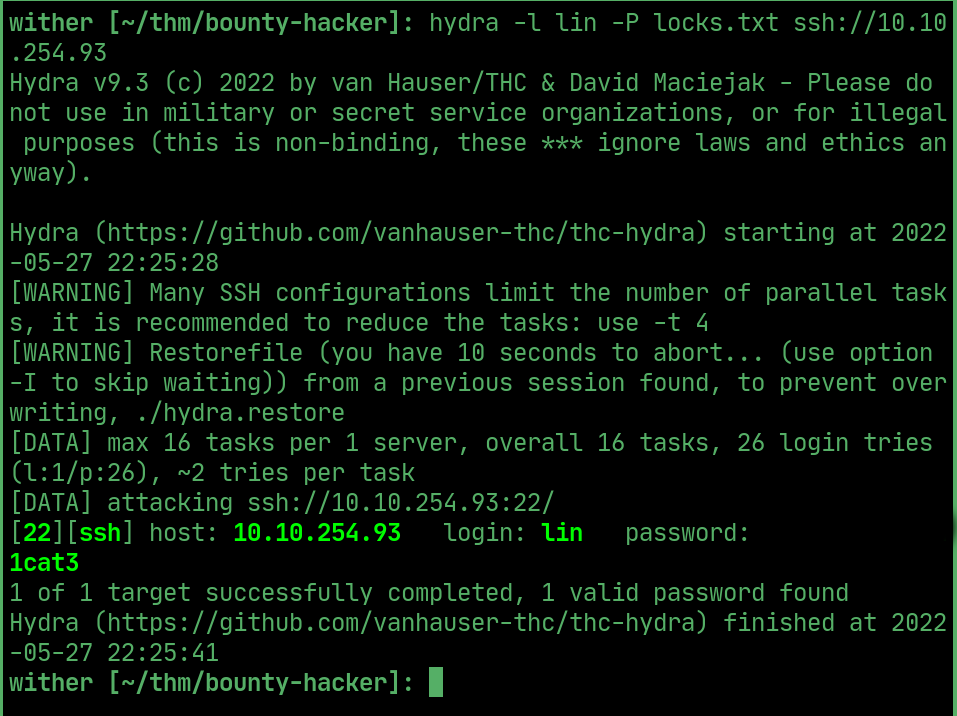
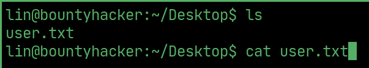
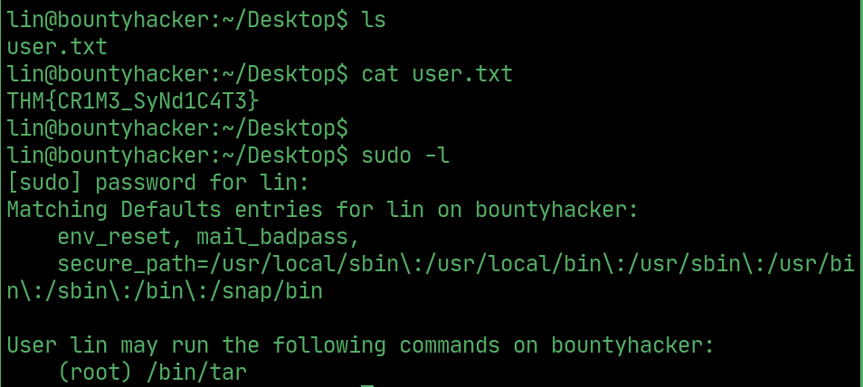
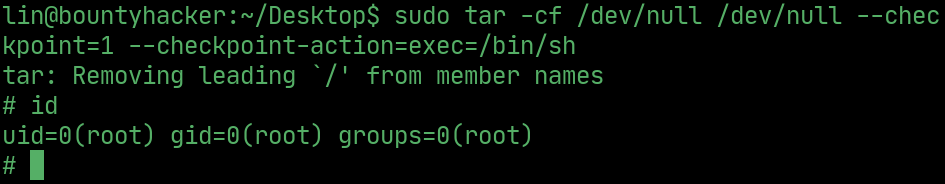
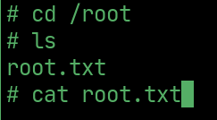

# Bounty Hacker

---

## nmap

  

## ftp

> Login to FTP using `anonymous:anonymous`

  

> Download the files `locks.txt` and `task.txt`

  

> Use `hydra` and `locks.txt` as a wordlist to bruteforce `lin`'s SSH password.

  

## User flag

  

## PrivEsc

> `tar` can be run as root.

  

## Root

> Exploit `tar` to gain root access.

  

## Root flag

  