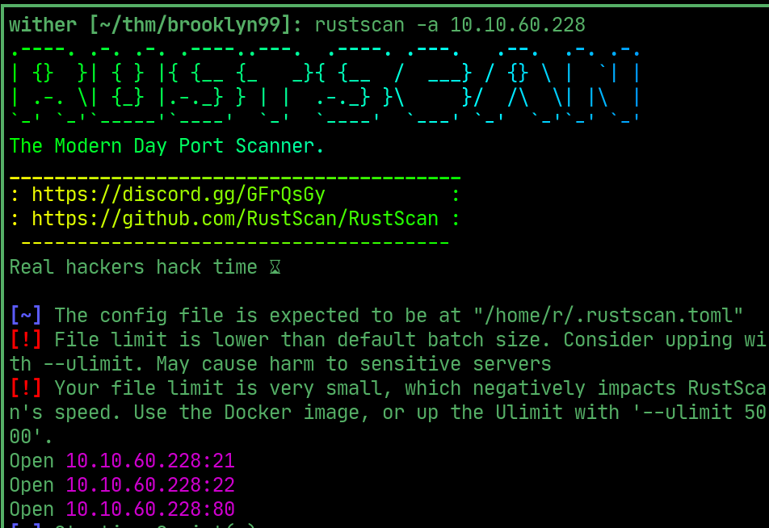
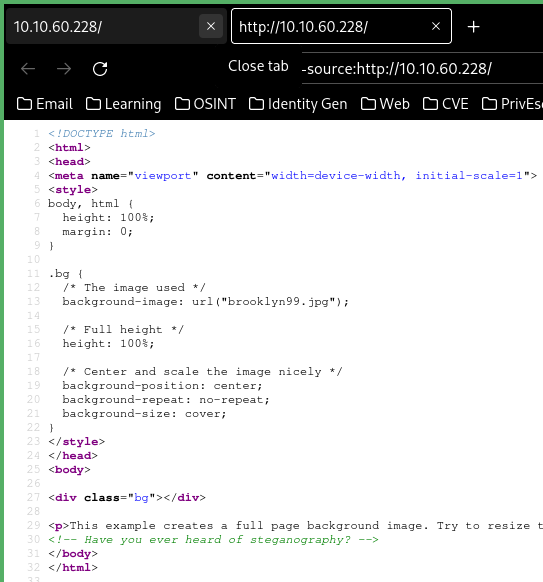
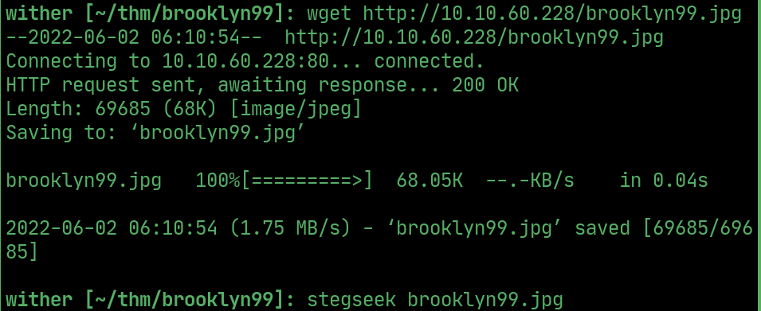
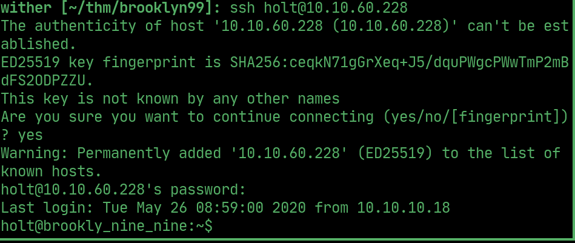
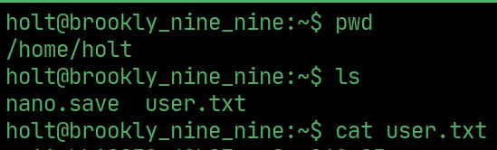
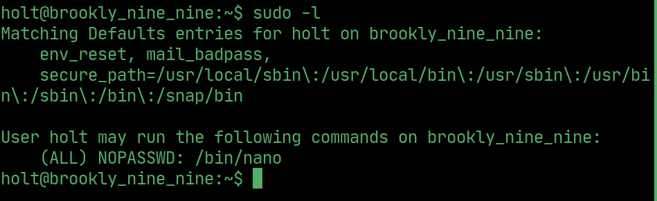
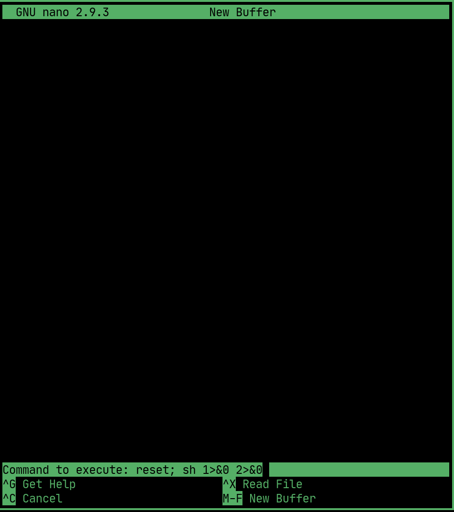
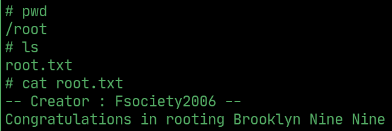

# Brooklyn Nine Nine

---

## Rustscan

  

## Source

> comment mentions steganography

  

> use stegseek to get holt's credentials

  

## User

> ssh as holt

  

## User flag

  

## PrivEsc

> holt can run nano as root

  

> Exploit nano to get root

  

## Root flag

  

