# Chill Hack

## Rustscan

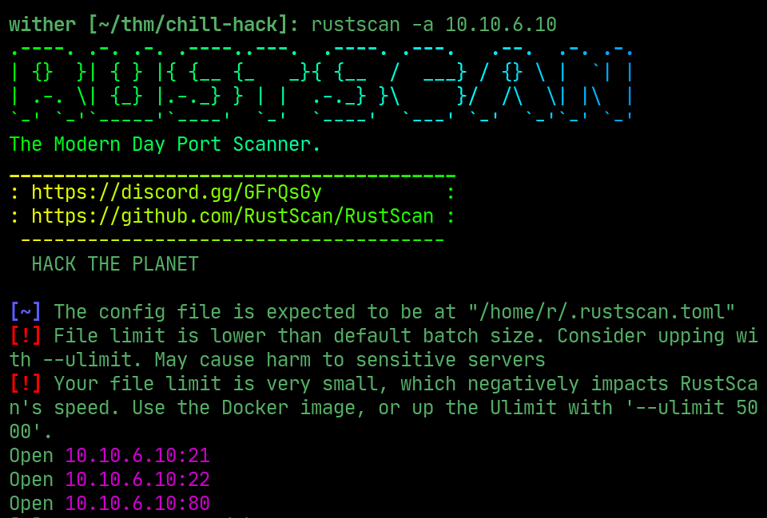  

## ffuf

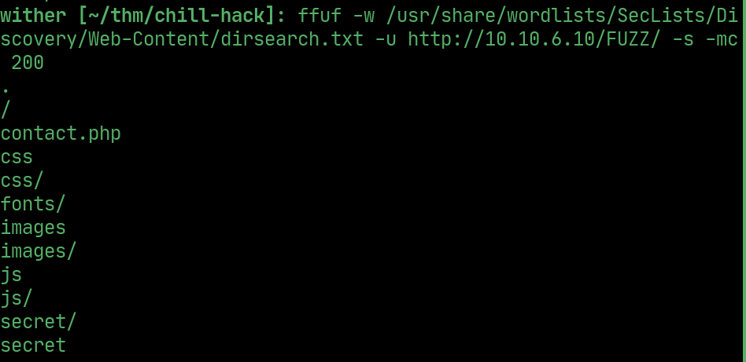  

 > /secret has a command execution form

 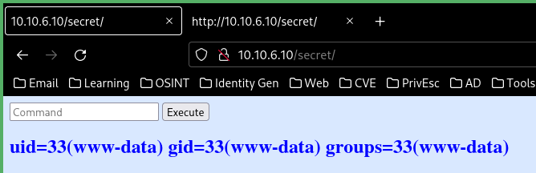  

 > some commands are restricted

 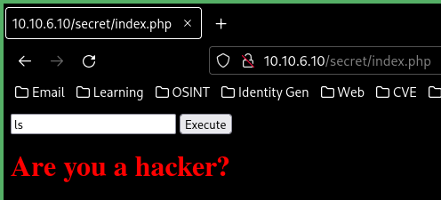  

 > using \ to bypass the filter works

 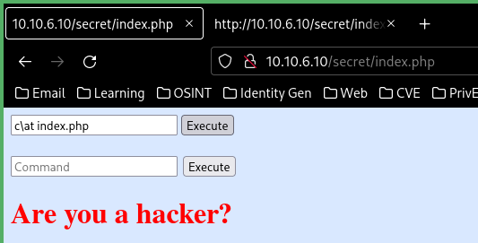  

 > blacklisted commands are in the source
 
 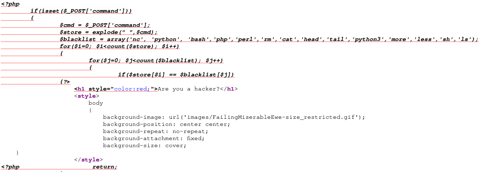  

## Reverse shell

> make a file with a reverse shell in it, open a http server and download and execute it on the website

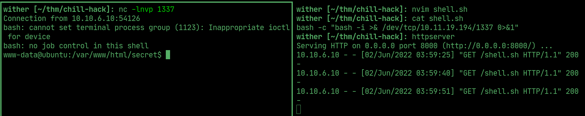  

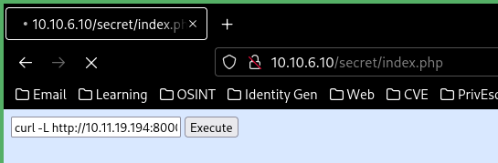  

## www-data

> sudo -l shows that www-data can run a helpline script as apaar, inject /bin/bash into the second line to get a shell as apaar

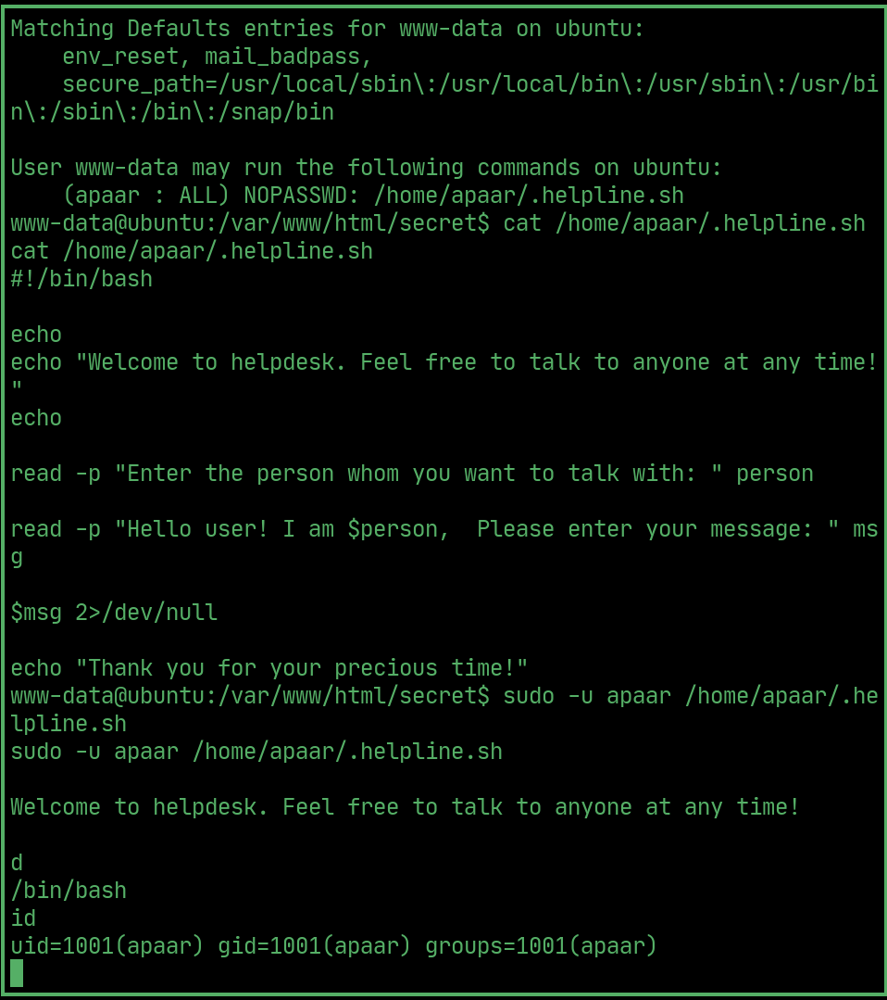  

## Local flag

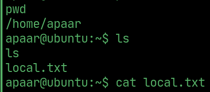  

## PrivEsc

> download the image in the /files/images folder in /var/html

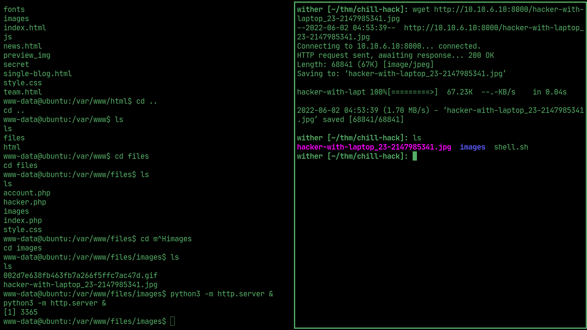  

> use stegseek to find the zip file, use zip2john to crack the hash to the passphrase

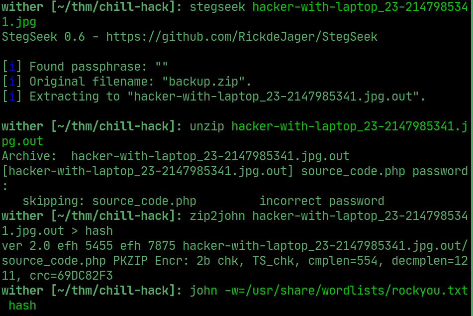  

> use the passphrase to download source_code.php 

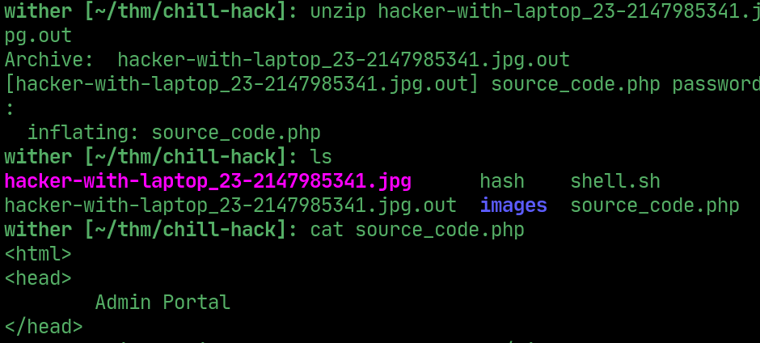  

## User 

> use the credentials in the source code file to SSh as anurodh

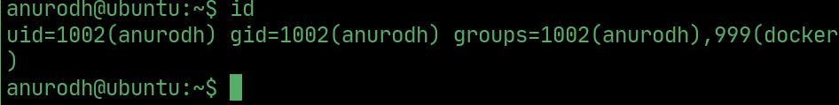  

## Root

> Anurodh is in the docker group, exploit docker to get root.

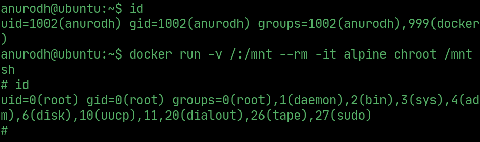  

## Root flag

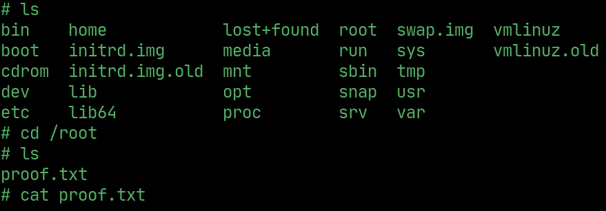  

