# dogcat

---

## nmap

> It's running an Apache webserver, lets check it out

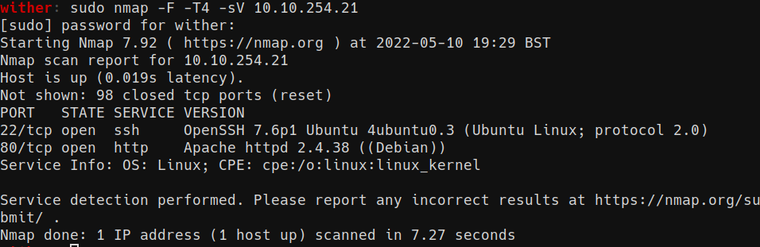

> You press a button and either a dog or cat is displayed with the parameter in the URL.

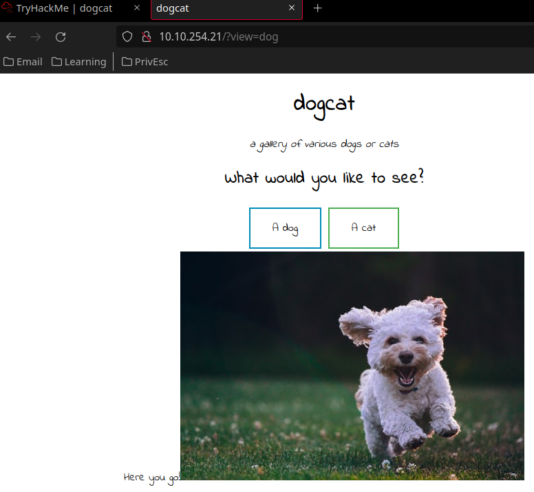

> But, it only allows us to access cats or dogs

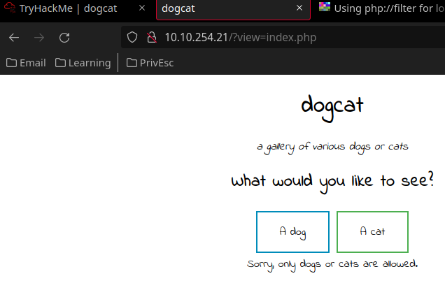

> However, we can use php filter bypasses such as b64 encoding to get around this:

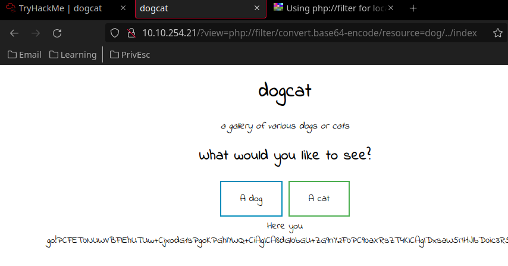

> As you can see, by decoding the base64 we get the raw index.php code. As you can see in the code, the "**ext**" variable can be set, meaning we could in theory read any file of any extension. Lets try read /etc/passwd

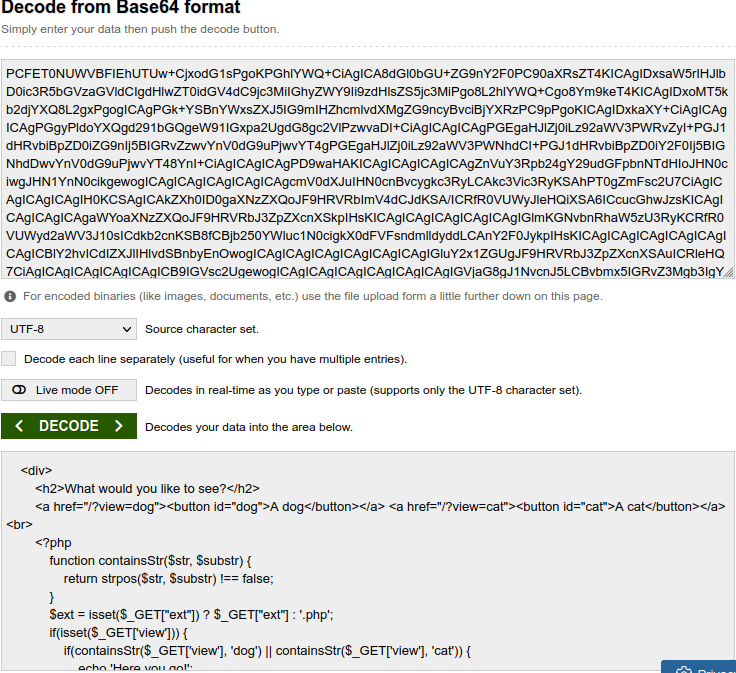

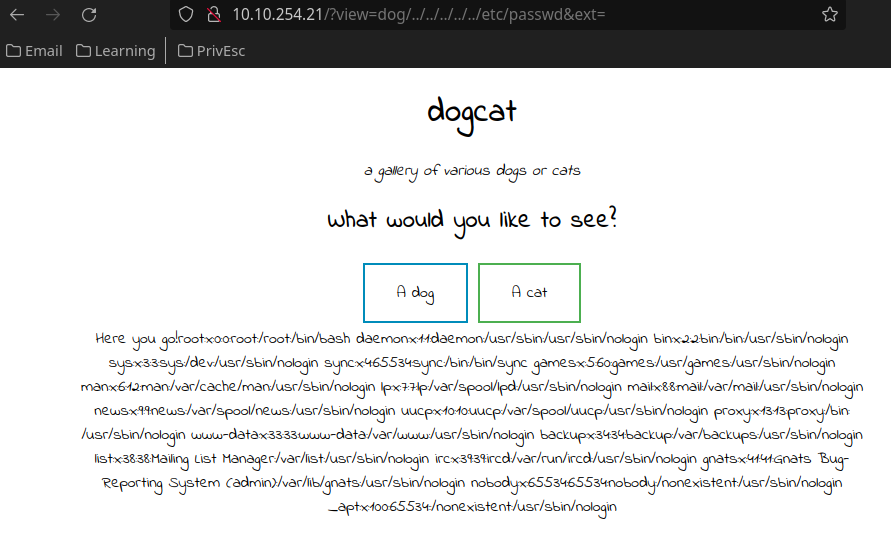

> Using the same method, we can access the apache2 log files

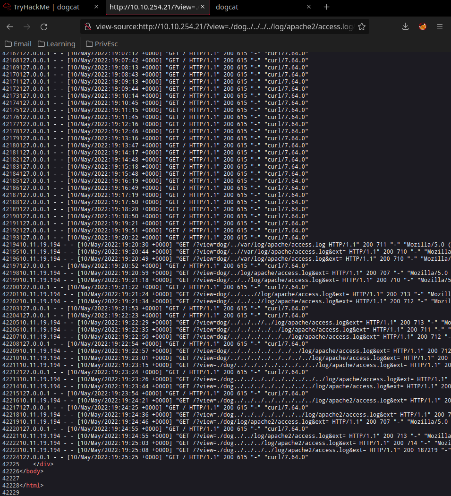

> capture and send the request in burpsuite

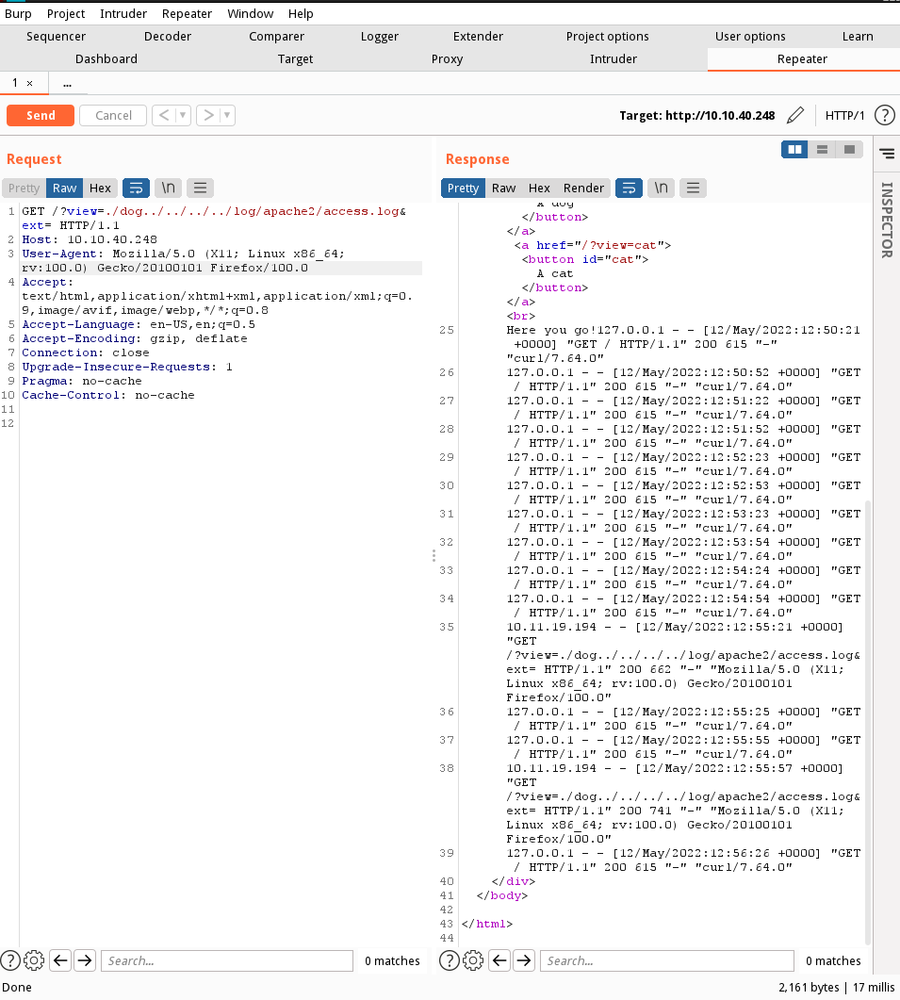

> rce using the php in the user agent

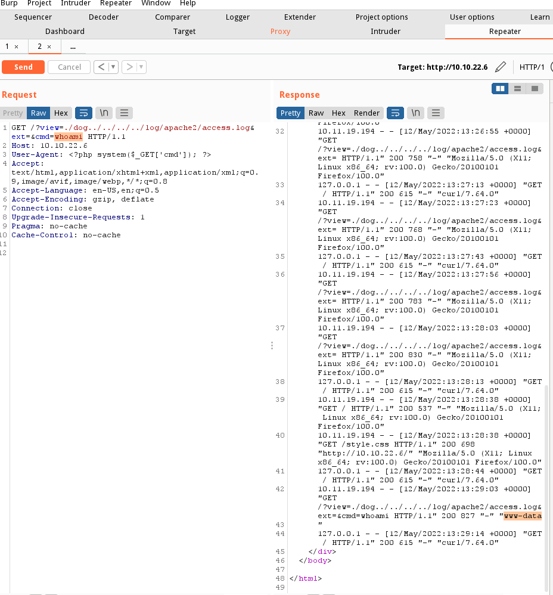

> Execute a remote shell using the same technique:

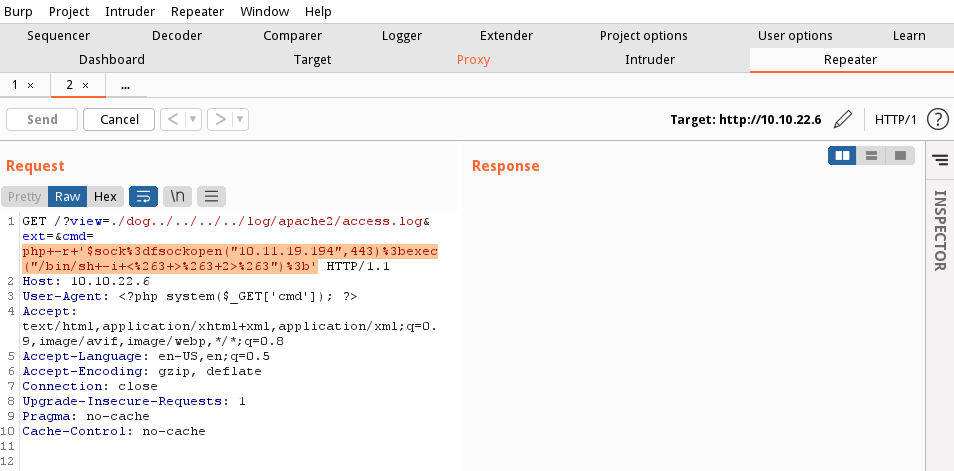

> Get shell!

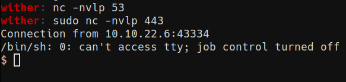

> Get Flag1

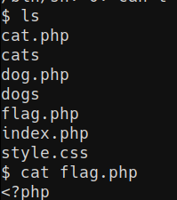

## Flag 2

> Get flag2

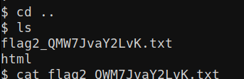

## Flag 3

> Use sudo -l to list all programs that we can run as root, and use env to get a bash shell

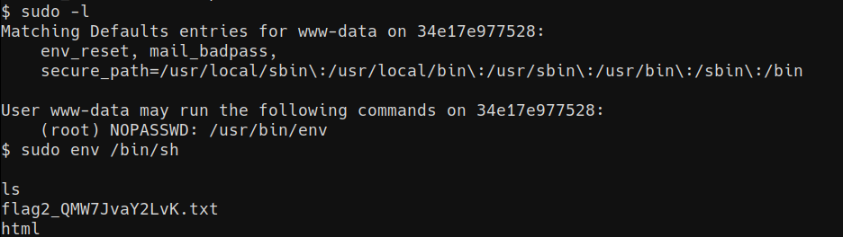

> we are root!

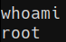

> get flag3

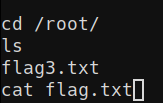

## Flag 4

> Using cat/proc/1/cgroup we can see that we are in a docker container

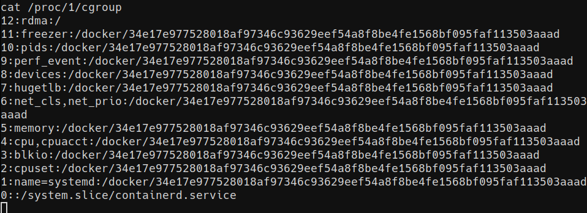

> in the /opt/backups folder,backup.sh is being backed up every minute

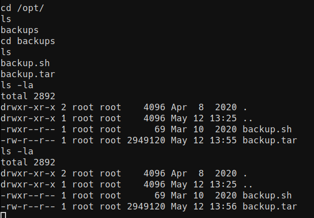

> we can overwrite backup.sh to get a reverse shell

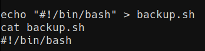

> Append the reverse shell onto the file and wait for it to execute to get a shell

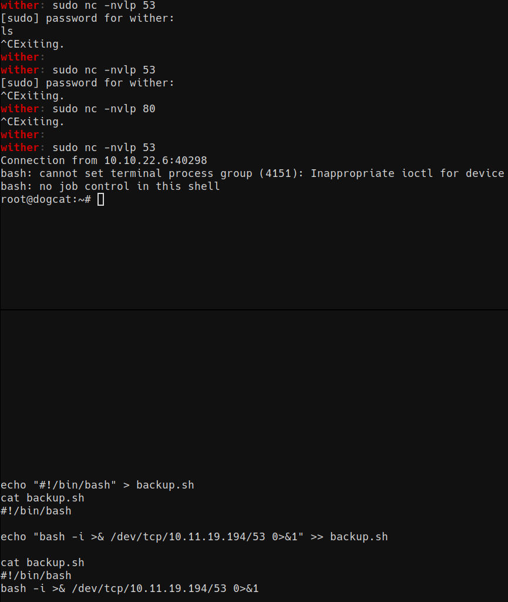

> get flag4!

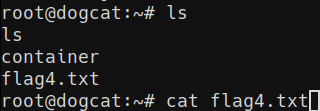
