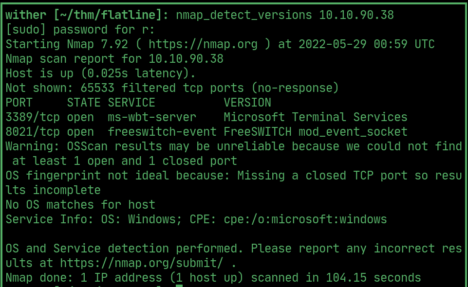
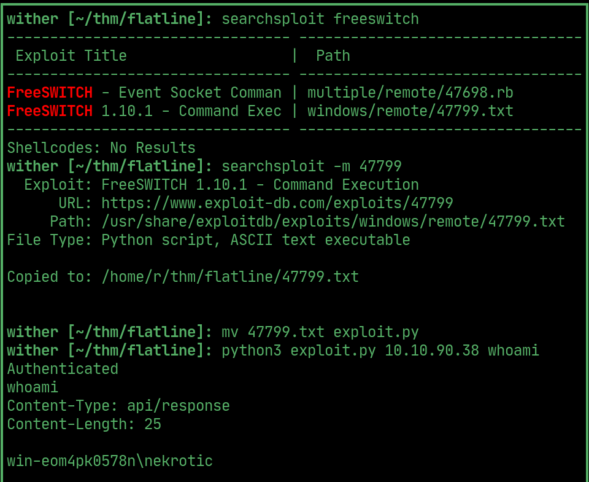
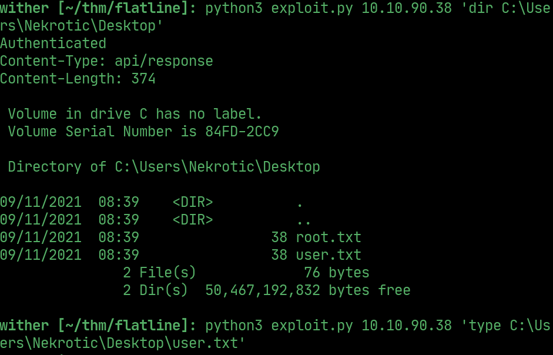
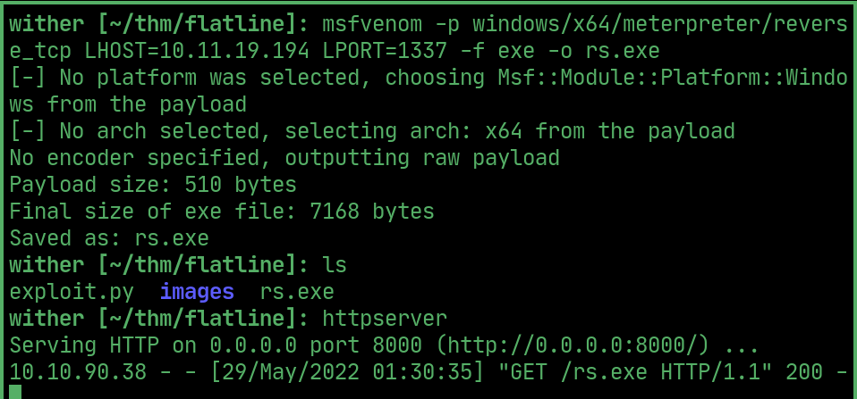
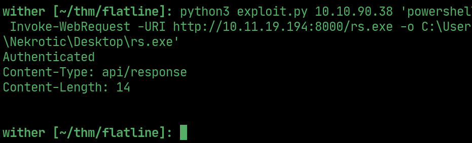
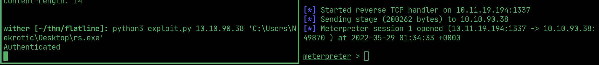
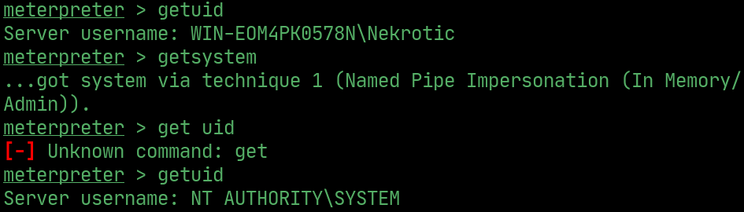
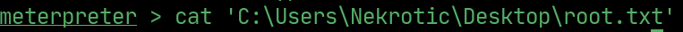

# flatline

---

## nmap

  

## rce

> using this exploit commands can be executed remotely

  

## User flag

> Navigate through the filesystem to find the flags on Nekrotics desktop

  

## reverse shell

> create a reverse shell exe in msfvenom and download it using powersell and the rce

  

  

> run the msf handler and the exe to get a meterpreter shell

  

## System

> getsystem

  

## Root flag

  

