# gallery

---

## nmap

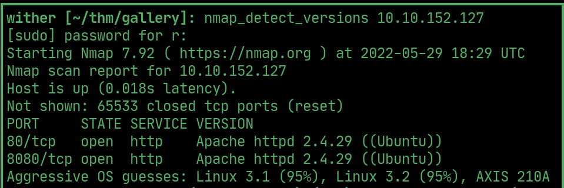  

## ffuf

> /gallery/ directory

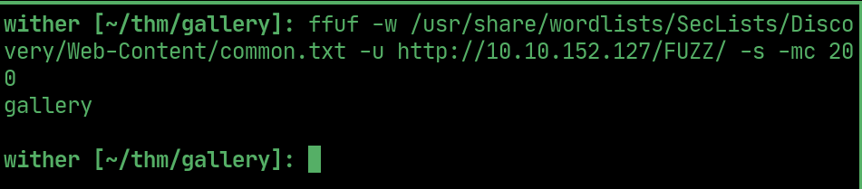  

> requires login

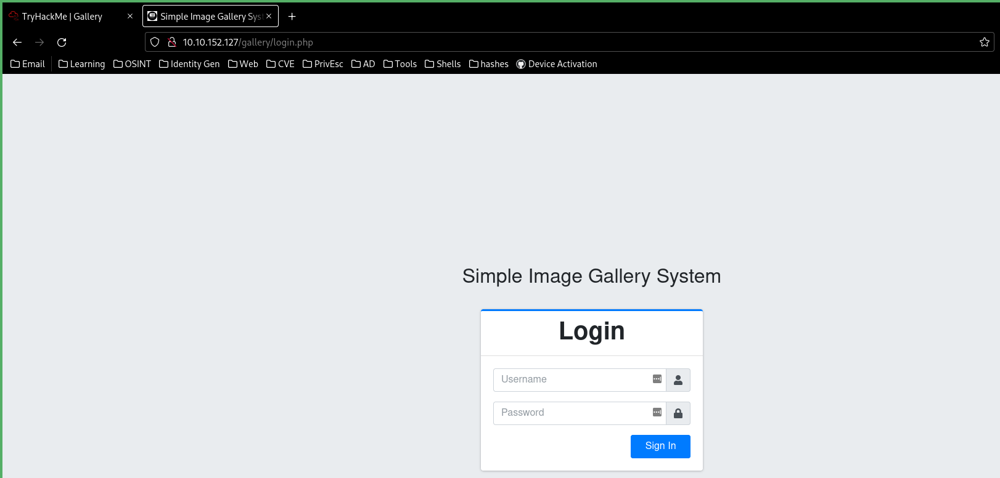  

## sql injection

> sending a login request in burp shows the sql query

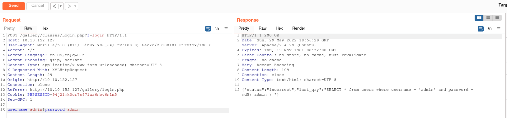  

> `') or 1=1#` allows for successful login

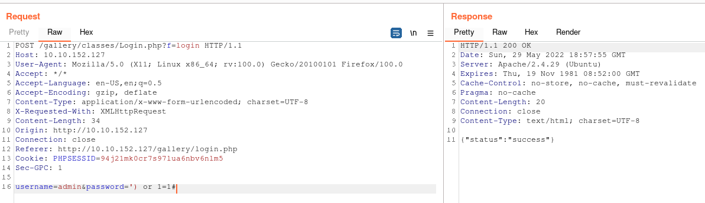  

## exploit

> use this exploit to generate a rce payload

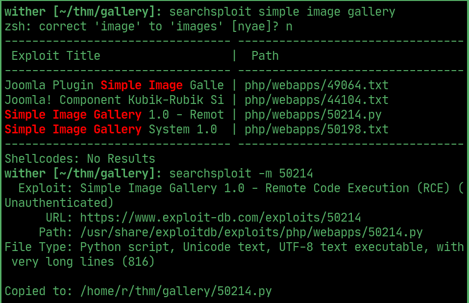

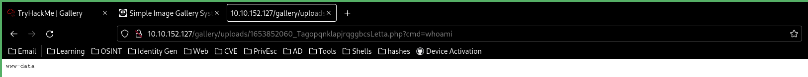  

## reverse shell

> capture the request and pass it into burp, the machine doesnt have python to upgrade the tty, so encode a socat reverse shell and send it

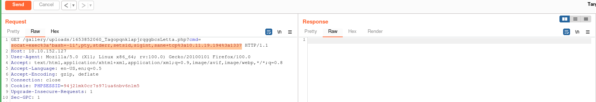  

> with a socat listener open to get an interactive shell

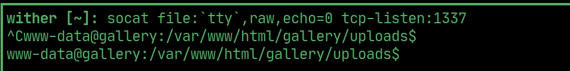  

## database

> the database initialize.php file contains the mysql login credentials

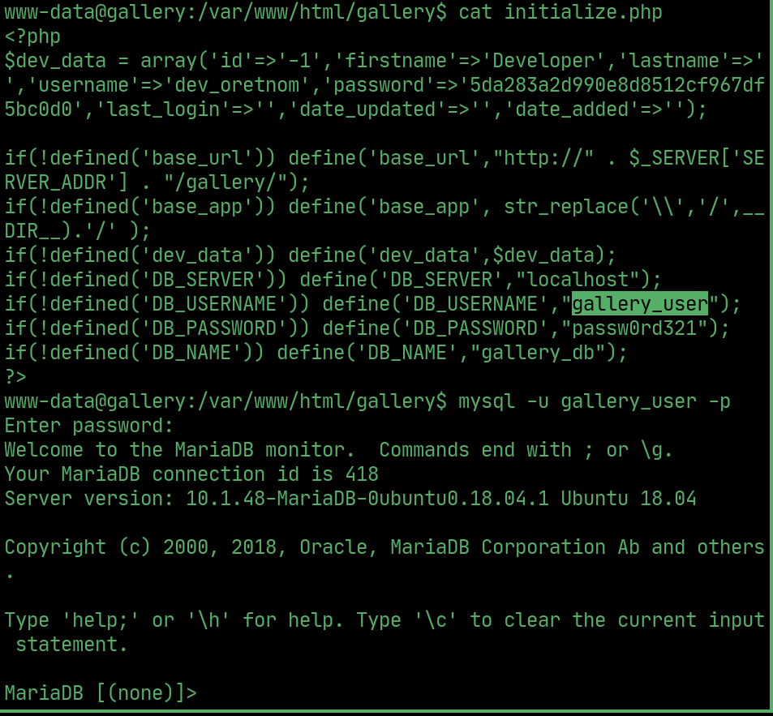  

> use mysql to get the admin's password hash

## PrivEsc

> linpeas found a mike user with the user flag

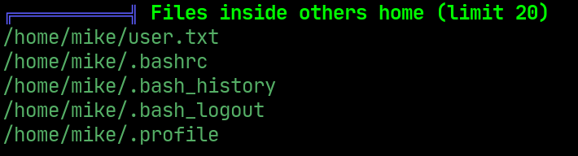  

> linpeas found mikes password in his history

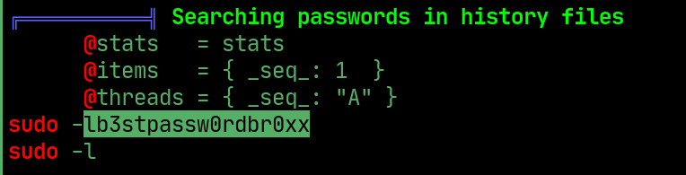  

## User

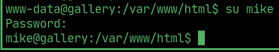  

## User flag

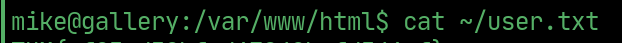  

## PrivEsc to root

> mike can run the following script as sudo

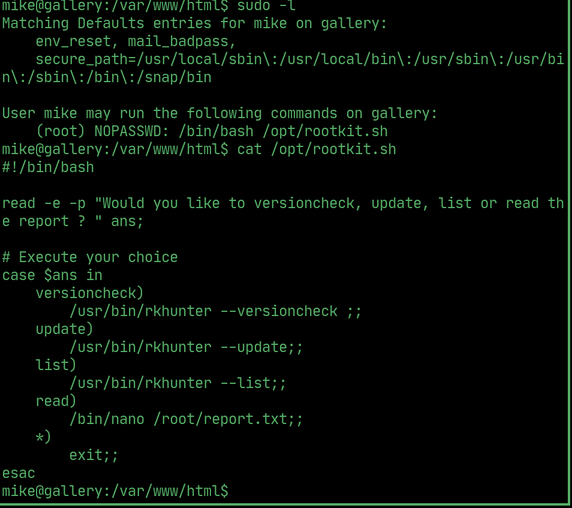  

## Root

> run the script, select to read it, then exploit nano to get root

## Root flag

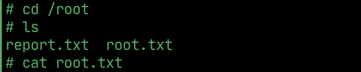  

