# gamingserver

---

## Rustscan

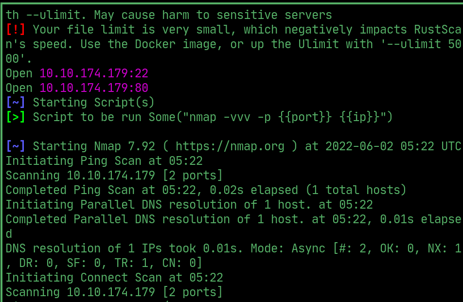  

## ffuf

 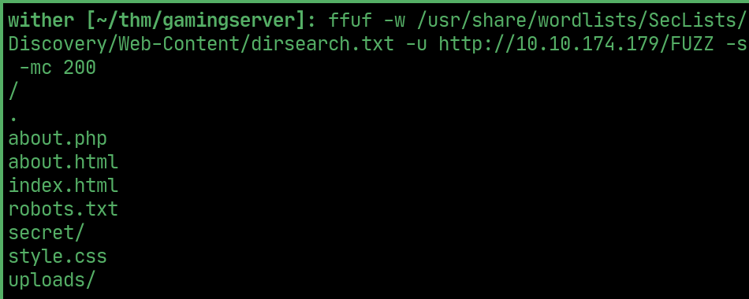  

> /secret/secretKey reveals an ssh key

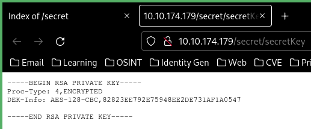 

> robots.txt allows /uploads/

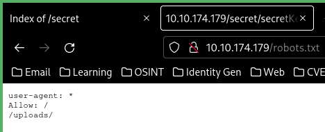  

> /uploads contains a dictionary file with a list of passwords

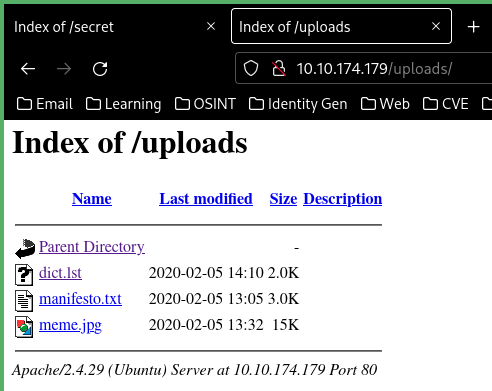  

> username john at the bottom of index source

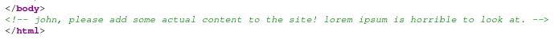  

## User

> crack the ssh key and ssh as john

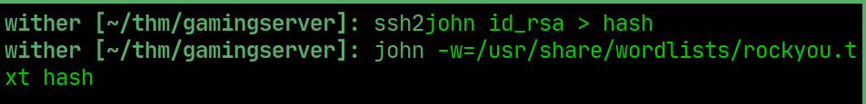  

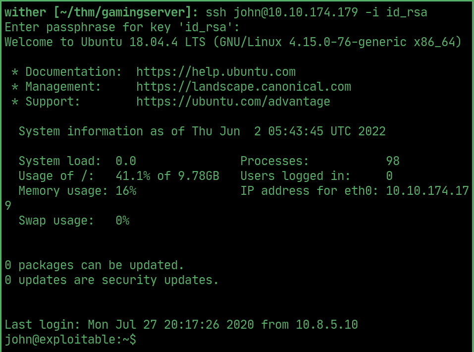  

## User flag

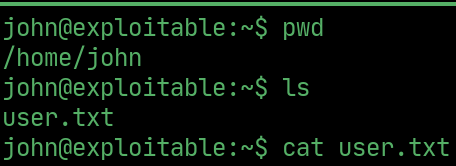  

## PrivEsc

> john is a part of the lxd group which can be exploited. Download alpine and copy it over

 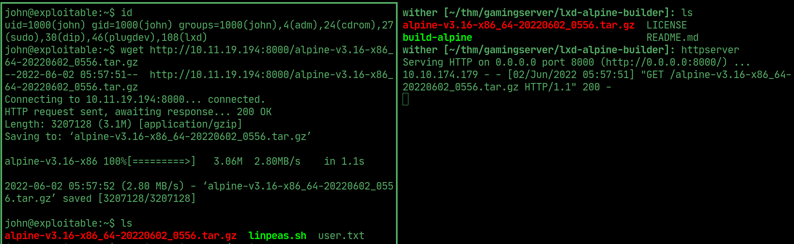  

## Root

> exploid lxd to get root

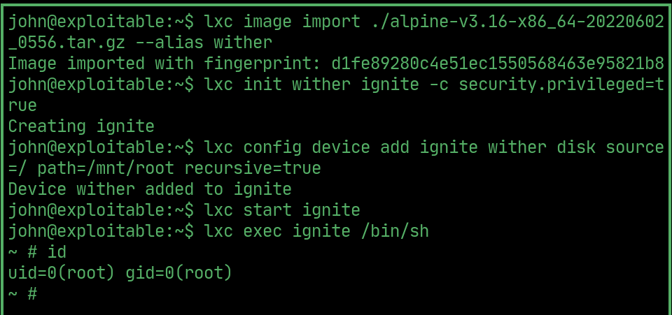  

## Root flag

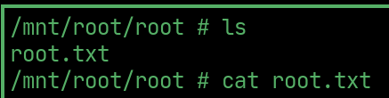  
