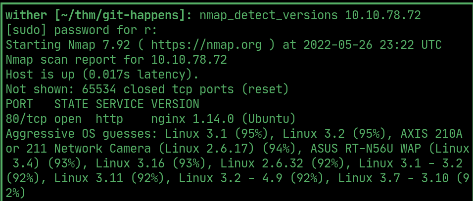
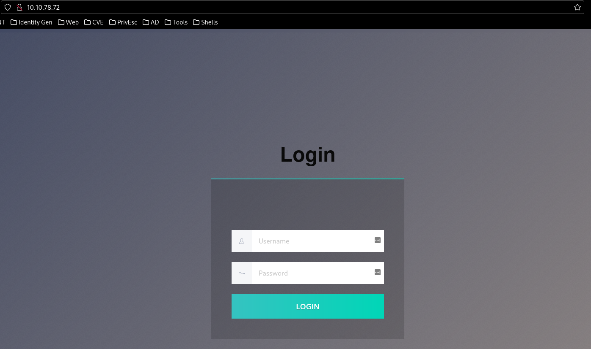
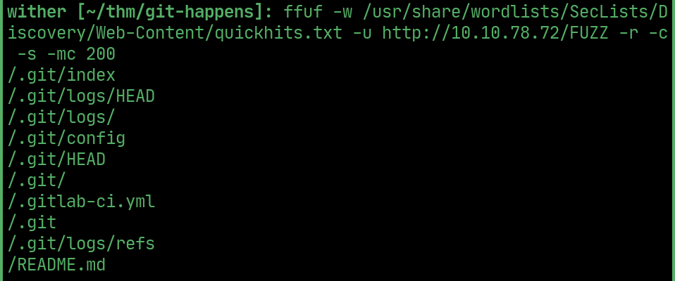
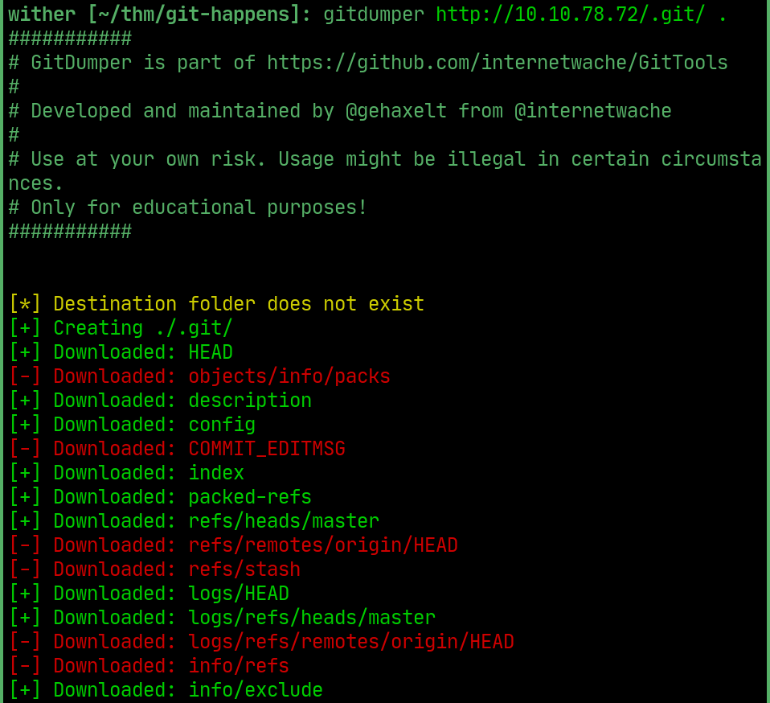
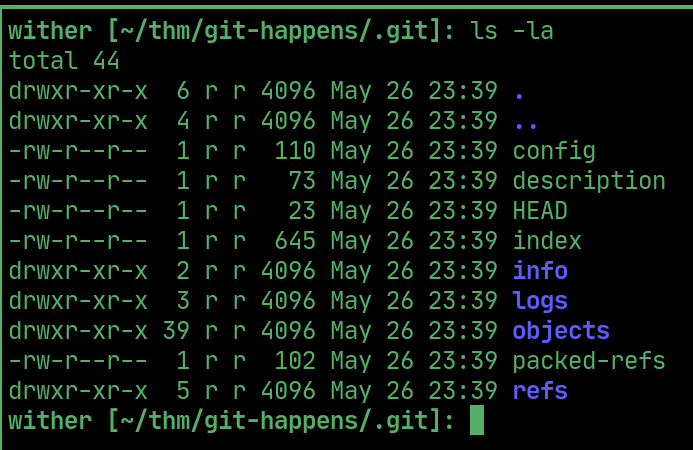
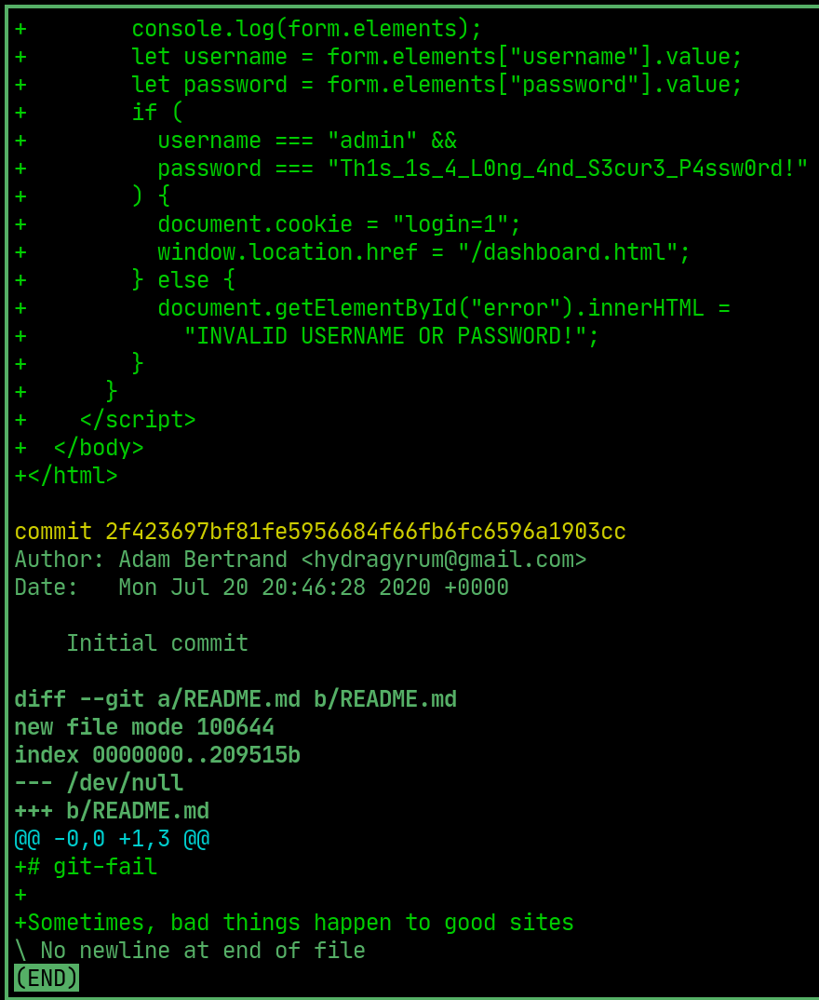

# Git Happens


---

## nmap

  

## Website

> this is the web application that we have to optain the password for

  

## ffuf

> using ffuf hidden a .git directory was found along with its files

  

## gitdumper

> Using GitTools' gitdumper I can download all of the files in the .git directory onto my machine (https://github.com/internetwache/GitTools)

  

  

## password

> using ```git log -p``` we can display the patch information, where at the bottom we can see the initial commit. In the html code, the username and password are hardcoded.

  


