# glitch

---

## Rustscan

> `:80 is open`

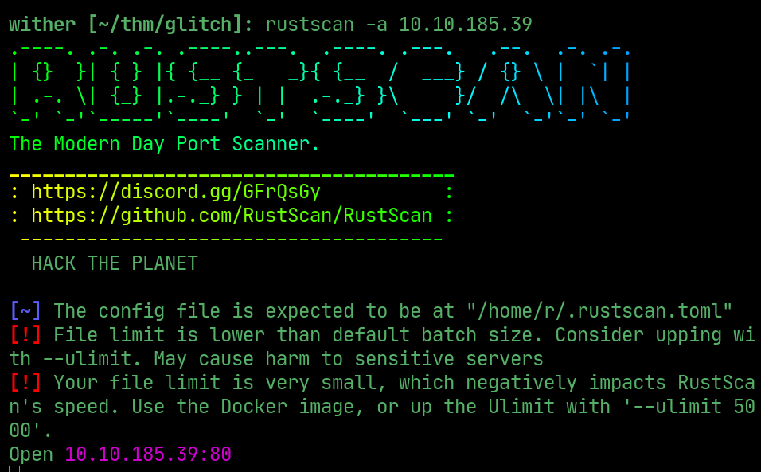  

## API

> Website has an endpoint called `access` in the source

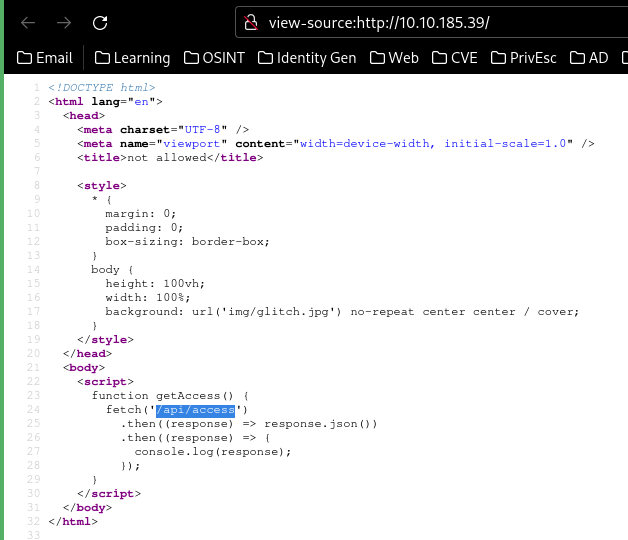  

## Flag 1 

> The first flag is the token found at the endpoint base64 decoded

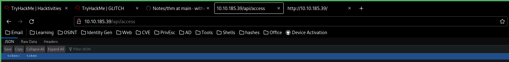  

## API

> Fuzz the API to find `/api/items` 

 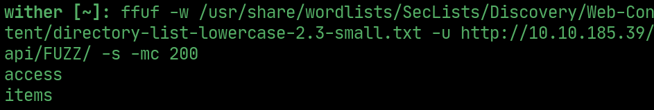  

> Which contains sins, errors and deaths.

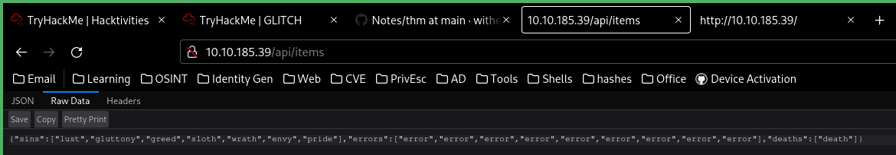 

> Change `GET` to `POST` in `BurpSuite` to get a message. 

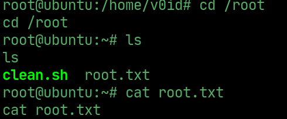 

> `/api/items` takes a `cmd` parameter

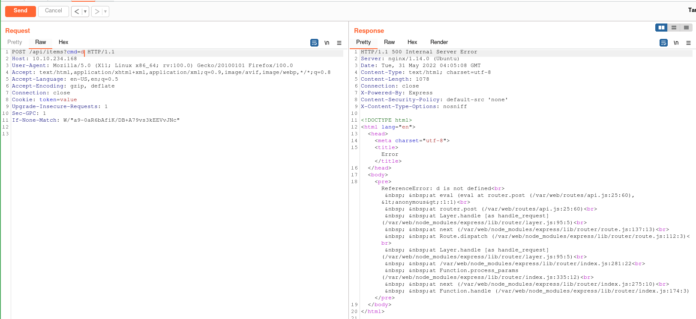  

## User

> Send a URL encoded reverse shell as the cmd with a listener open to get user shell

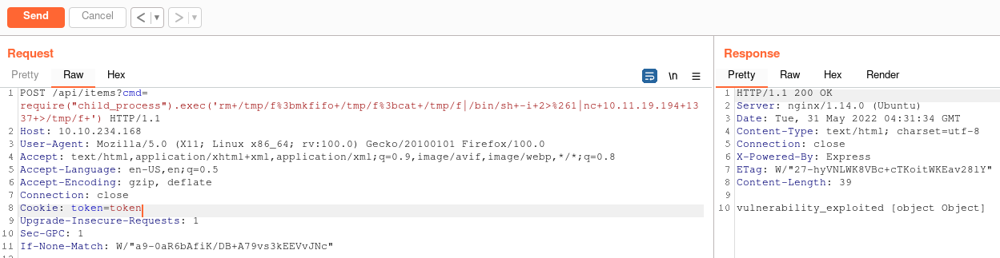  

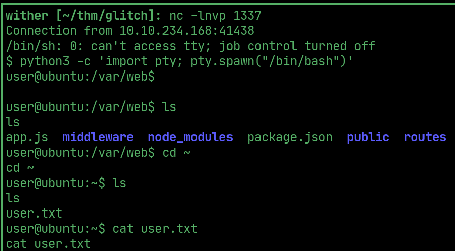  

## PrivEsc

> Theres a hidden folder called `.firefox` containing firefox data in `/home/user`

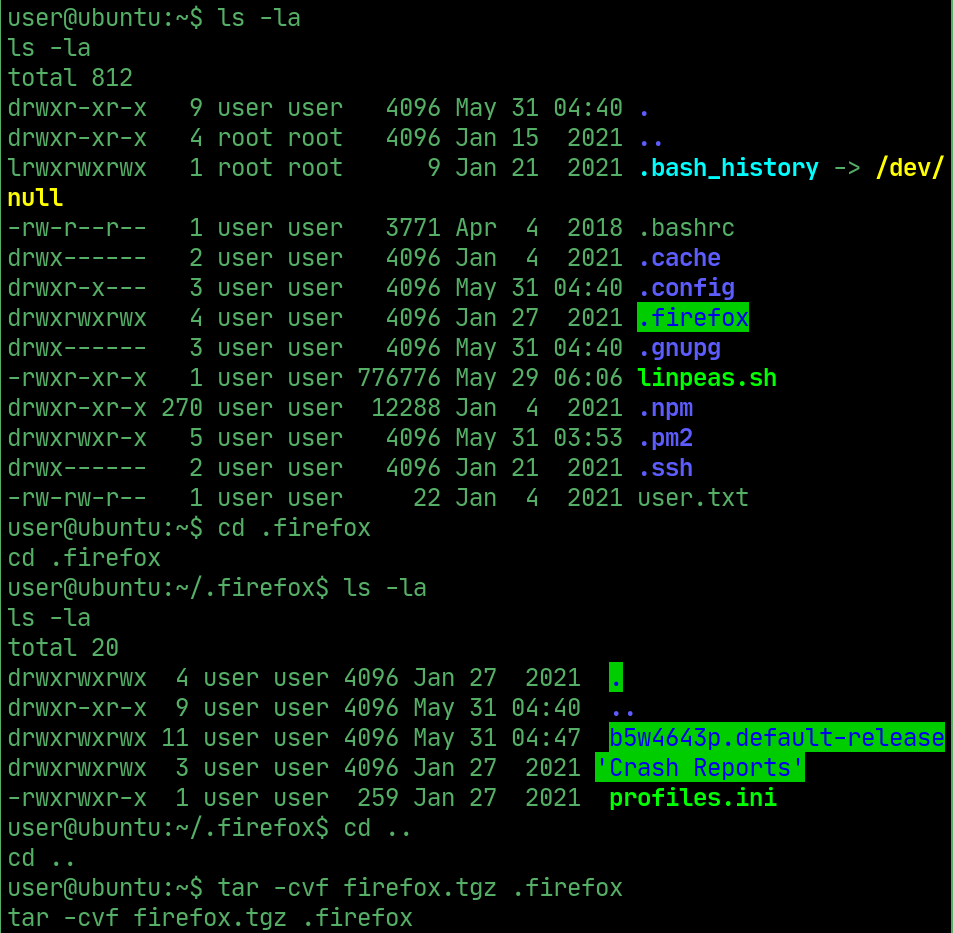  

> Archive it and send it via to analyze

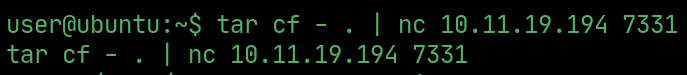  

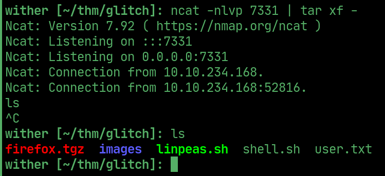  

> Unzip the folder and use `firefox-decrypt.py` to dump the firefox data, getting a `v0id` user and password.

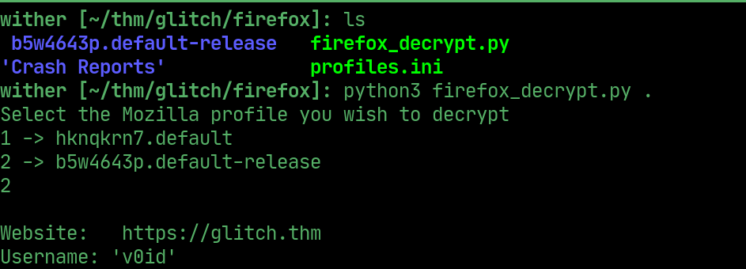  

## User v0id

> Login with the credentials found in firefox

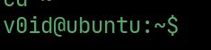  

## PrivEsc to root

> `v0id` can run `doas` as root

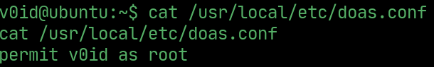  

> Start bash as root using `doas`

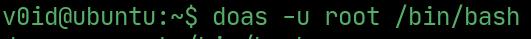  

