# ide

---

## nmap

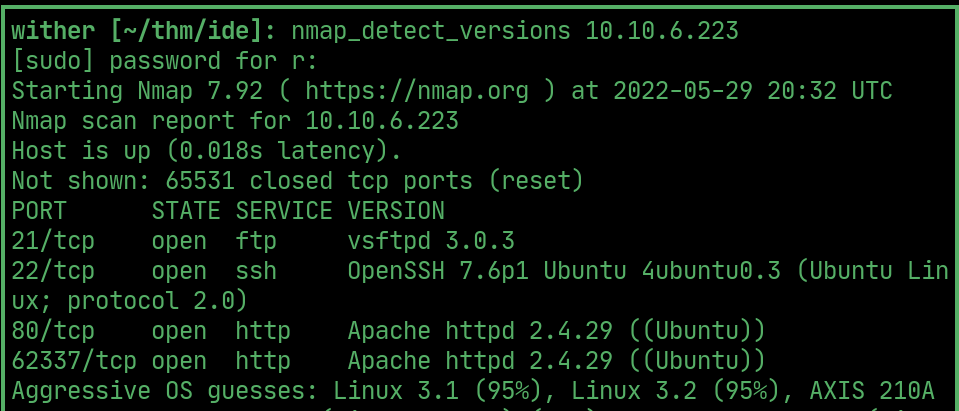  

## website

> codiad login portal on port 62337

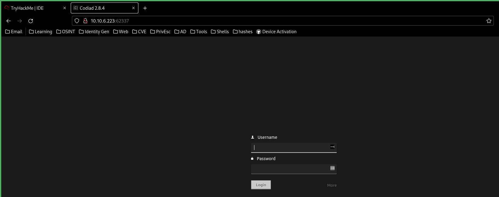  

## ftp

> login to ftp as anonymous and get .../- drac reset the pasword for john

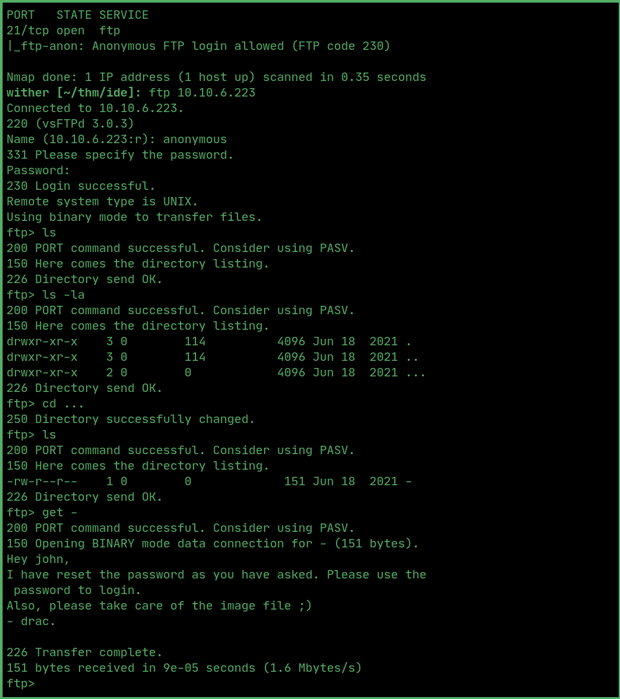  

## login

> johns credentials are john : password

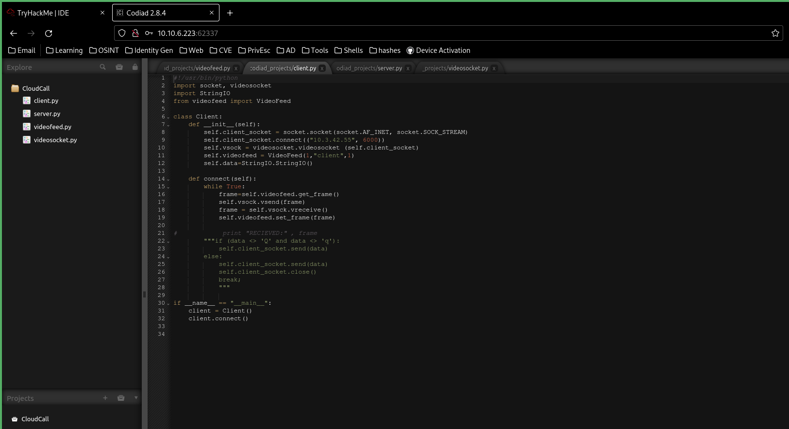  

## exploit

> use this rce exploit in codiad to get a reverse shell

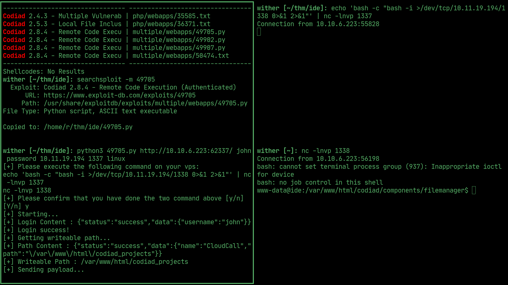  

## PrivEsc

> drac is the other user

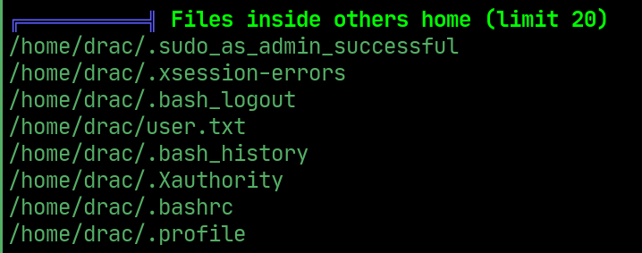  

> drac's password is in their bash history

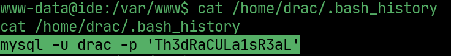  

## User flag

> ssh into the machine as the drac user using his password

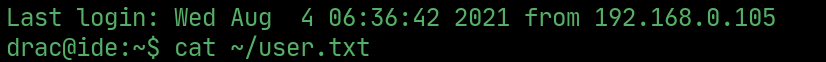  

## PrivEsc to root

> drac can restart ftp as sudo, essentially running the config file

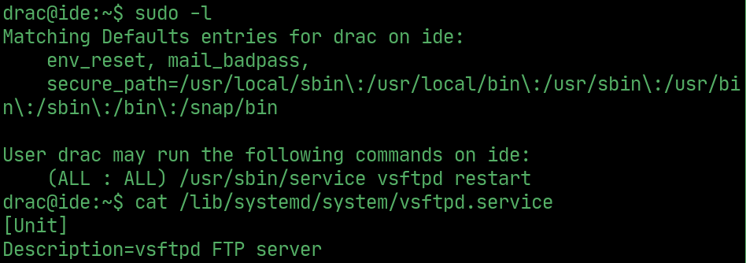

> change on start command to a reverse shell

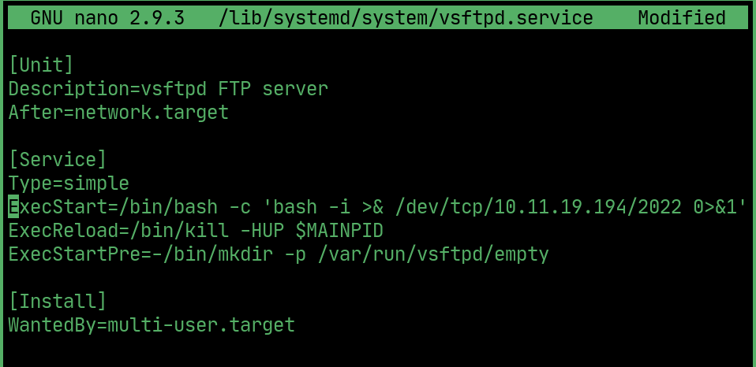  

> restart daemon and run the sudo command

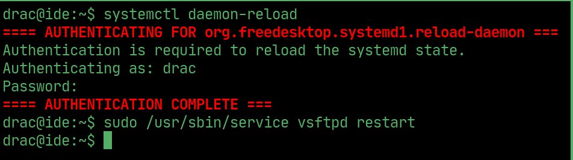  

## Root

> open listener and wait for root

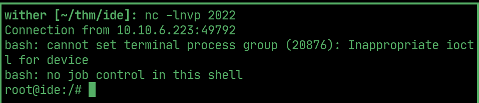  

## Root flag

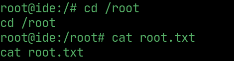  

