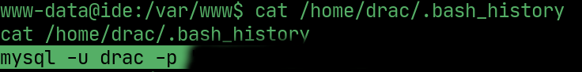

# ide

---

## Nmap

  

## Website

> There is a `codiad` login portal on port `62337`

  

## FTP

> Login to FTP with `anonymous:anonymous` and `get .../-`. `drac` reset the pasword for `john`.

  

## Login

> Login with johns credentials

  

## Exploit

> Use this RCE exploit in codiad to get a reverse shell

  

## PrivEsc

> drac is the other user

  

> drac's password is in their `.bash_history`

  

## User flag

> SSH into the machine as the `drac` user using his password

  

## PrivEsc to root

> drac can `restart` FTP as sudo, essentially running the config file

> Change `ExecStart` variable to a reverse shell so that it execute upon FTP starting back up.

  

> Restart system daemons and run the sudo command

  

## Root

> Open a listener and wait for root

  

## Root flag

  

