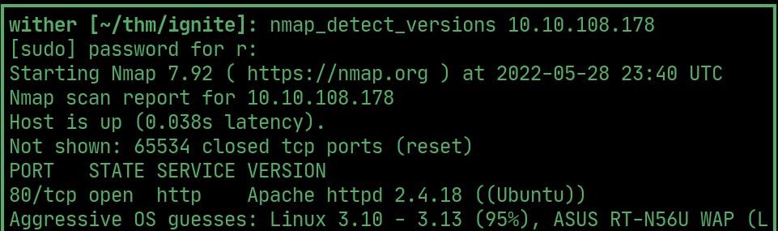
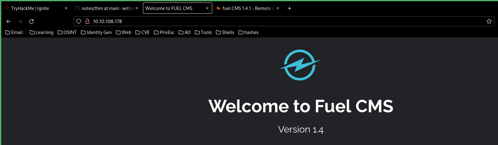
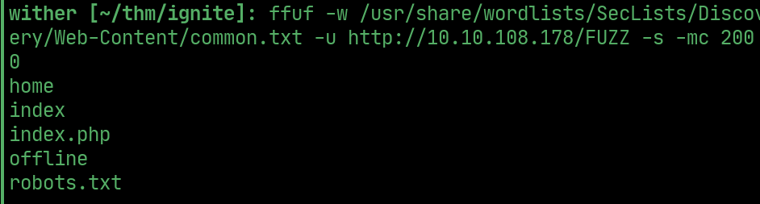
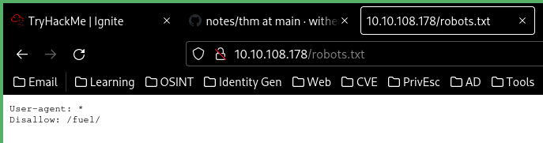
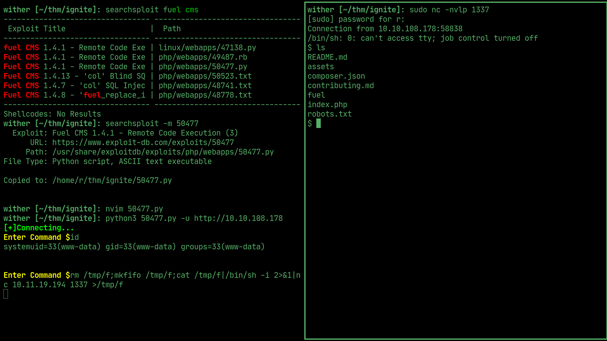
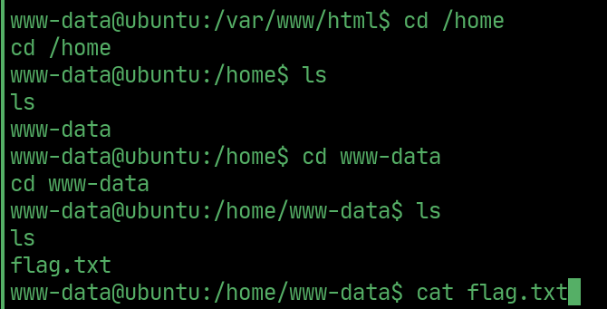
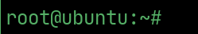
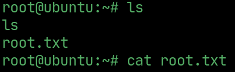

# ignite

---

## nmap

  

## website

> running fuel cms 1.4

  

## ffuf

> ffuf found the following

  

## robots

> robots.txt dissallows access to /fuel/

  

## User

> use the following exploit to get rce and then a netcat reverse shell on the machine

  

## User flag

  

## PrivEsc

> database.php in the /fuel/ directory contains admin credentials

## Root

> which we can use to su - and login as the root user

  

## Root flag

  