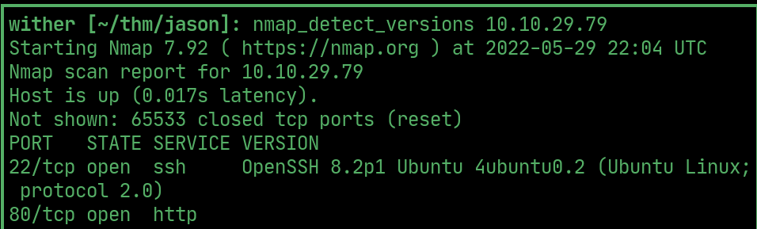
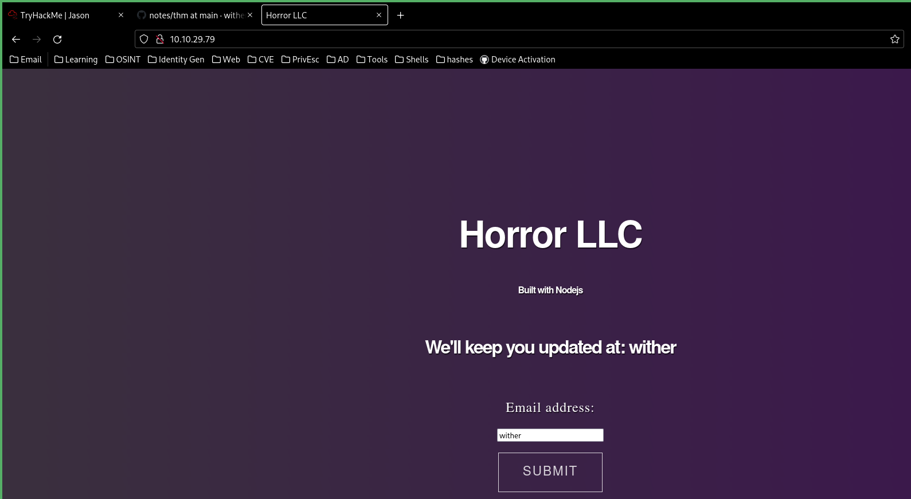
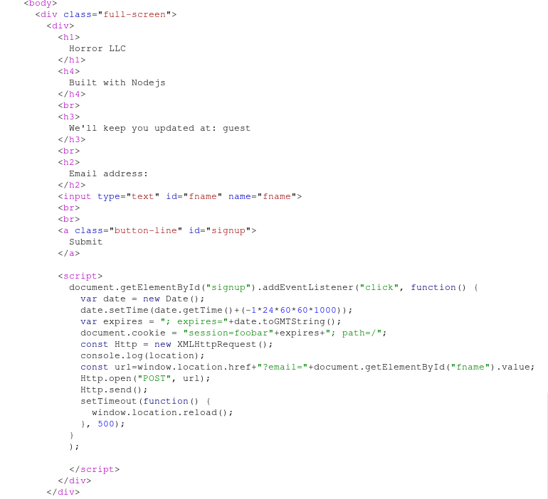
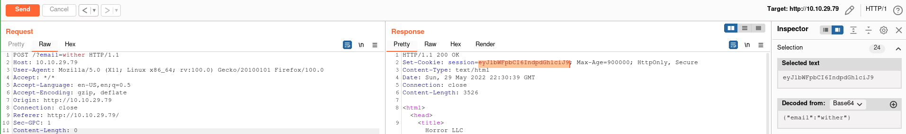
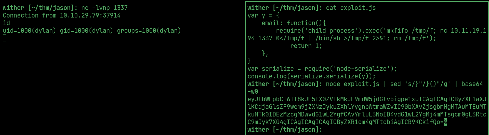
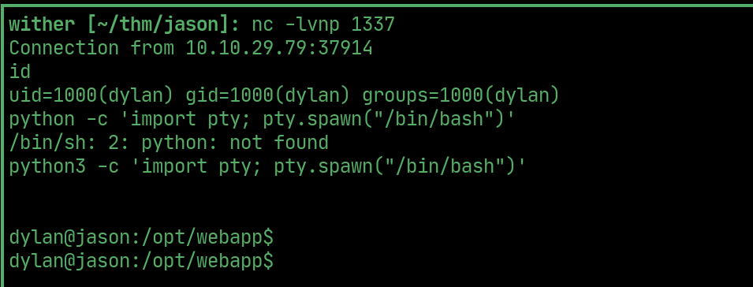
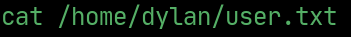
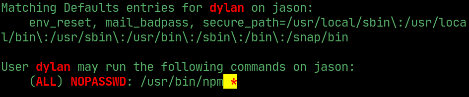
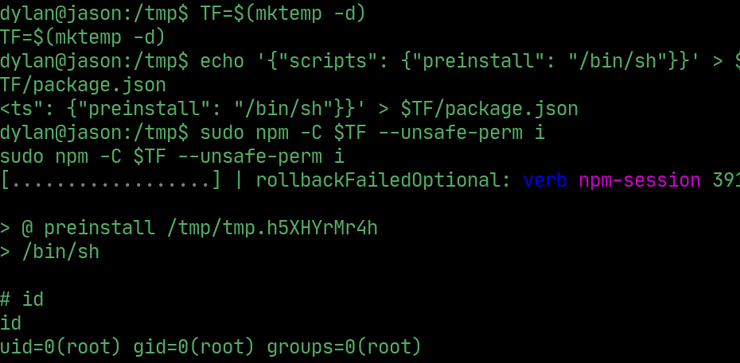
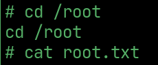

# jason

---

## nmap 

  

## website

> The website adds the entered email as `fname` in the text 

  

> The email can be sent in the url parameter: `email`

  

## cookie

> The cookie is set as the `base64` `encoded` email

  

## exploit

> Use the following exploit in `node-serialize`, `base64 encode` it and set it as the `session` cookie to get a reverse hell

  

## User

> Upgrade the tty using python

  

## User flag

  

## PrivEsc

> `dylan` can run `npm` as sudo

  

## Root

> Exploit `npm` to get root

  

## Root flag

  