# Mr Robot CTF

---

## Nmap

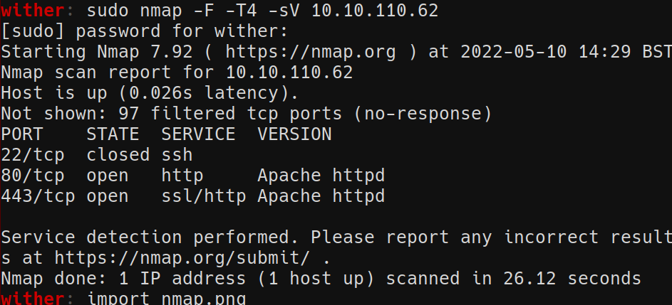

## Ffuf

>  Scan the url using ffuf

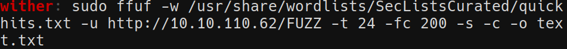

> Notably, ffuf will discover `robots.txt`

## Key 1

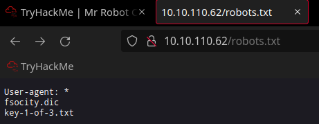

## WPScan

> ffuf will also find a `wordpres` login form. Use the dictionary file `fsociety.dic `(remove duplicates using `uniq` and `sort`) referred to in the `robots.txt` file to find the username.

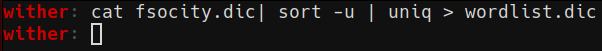

> Get the user `Elliott`

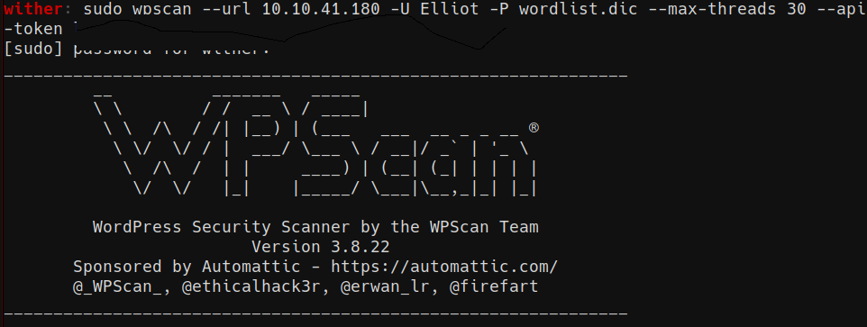

> Get his password

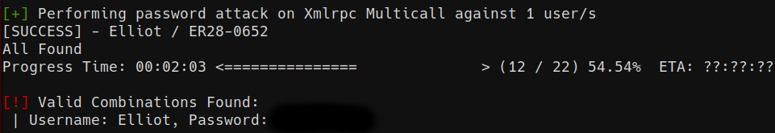

## Reverse Shell

> Edit the php theme to upload and run a reverse shell.
 
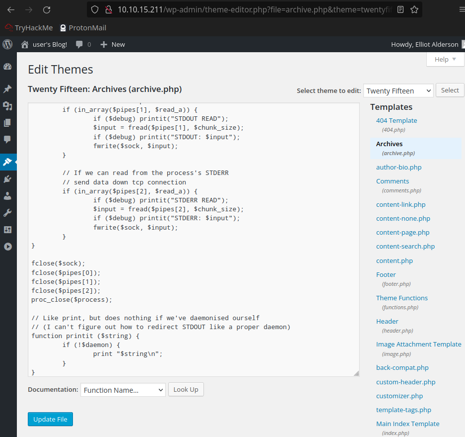

> Open a netcat listener

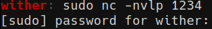

> Run the compromised file by accessing it in the URL.

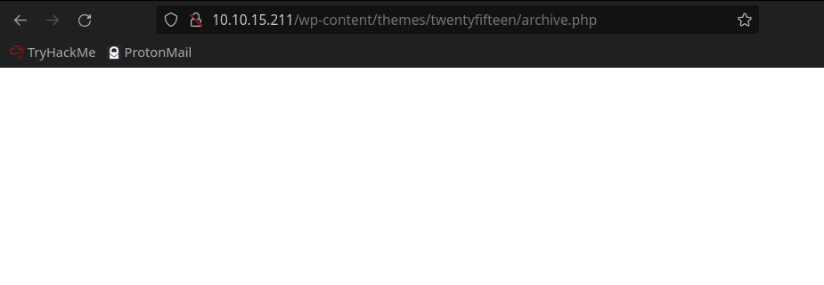

> Get a reverse shell and upgrade the tty using `python`.

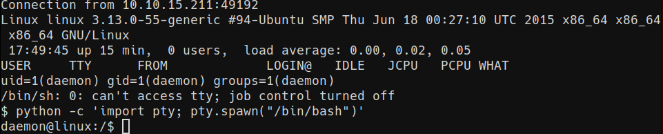

# PrivEsc

> Search for `setuid` binaries

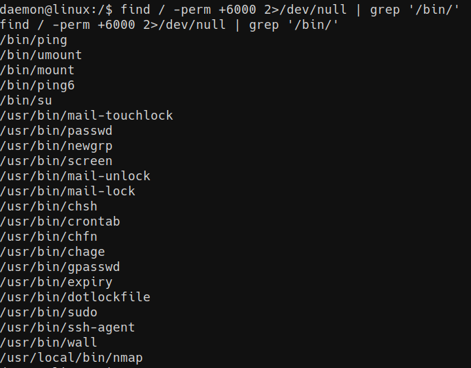

> Abuse the `nmap` binary to get root

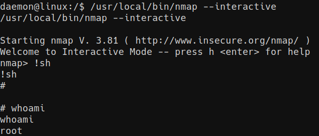

## Key 2 

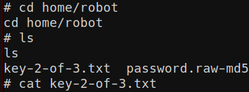

## Key 3

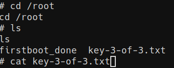

