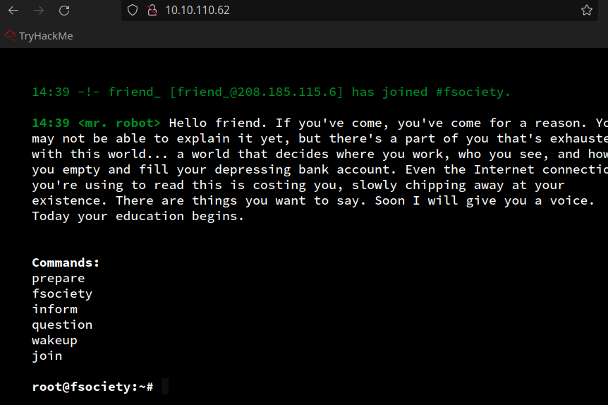
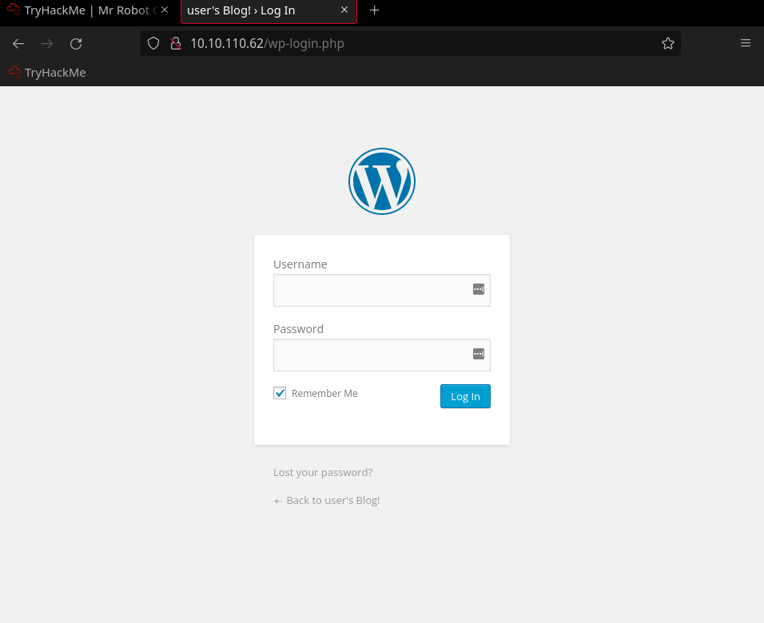
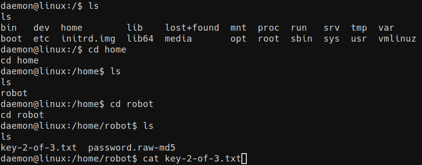
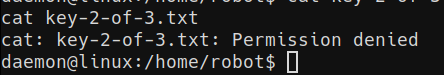

# Mr Robot CTF

---

## nmap

<<<<<<< HEAD
> Web server is running, lets check it out.

> Seems to be a shell/terminal application.

## ffuf
 Let's scan for files and directories using ffuf.

> Notably, ffuf discovered **robots.txt**, which given the name of the CTF, I think is a priority here.
=======

## ffuf

>  Scan the url using ffuf

> Notably, ffuf will discover **robots.txt**
>>>>>>> d42aefa (change tense)

## Key 1

<<<<<<< HEAD

# Key 2

> For this key, I'll be focussing my attention on the wordpress login form that we found when fuzzing ('/**login**').

## WPScan

> First, we need to get the login. I'm going to use the dictionary file referred to in the robots .txt file ('**fsocity.dic**') to find the username. But it has some duplicates, so I need to remove those:

> We found **Elliott**, now to find his password. I'm going to use the same dictionary to attack the password field.

> Found it!
=======
## WPScan

> ffuf will also find a wordpres login form. Use the dictionary file referred to in the robots.txt file ('**fsocity.dic**') to find the username. Remove those.

> Get the user "**Elliott**"

> Get his password
>>>>>>> d42aefa (change tense)

## Reverse Shell

<<<<<<< HEAD
> Now that we've logged in, as you can see here, in the dashboard we are able to edit php files, thus allowing us to upload and run a reverse shell.
=======
> Edit the php theme to upload and run a reverse shell.
>>>>>>> d42aefa (change tense)
 

> Open a netcat listener

> Run the compromised file

> Get and upgrade shell

<<<<<<< HEAD
> get key #2

> we can't!

> we need to escalate our privelages to root.

# PrivEsc
Search for setuid binaries:

> We're going to abuse the nmap binary to get root

## Keys 2 and 3

> We can now read key2

> And key3
=======

# PrivEsc

> Search for setuid binaries

> Abuse the nmap binary to get root

## Key 2 

## Key 3
>>>>>>> d42aefa (change tense)

