# mustacchio

---

## Nmap

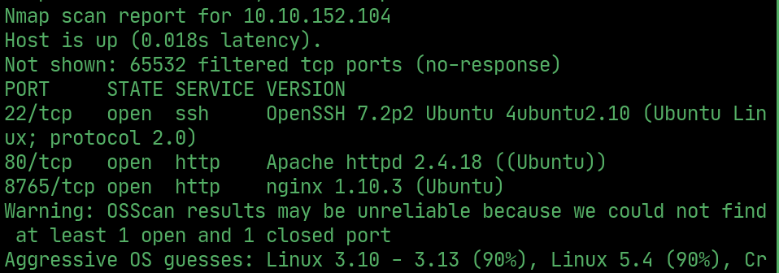  

## Users

> The webserver has a file called `users.bak` in a `/custom/js/` folder.

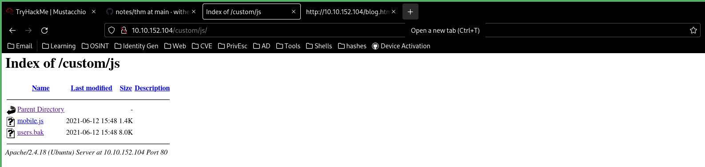  

> It contains some SQL admin credentials

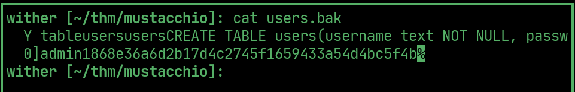  

> Crack the password 

## Admin panel

> Theres an admin panel on `:8765`, login with the admin credentials.

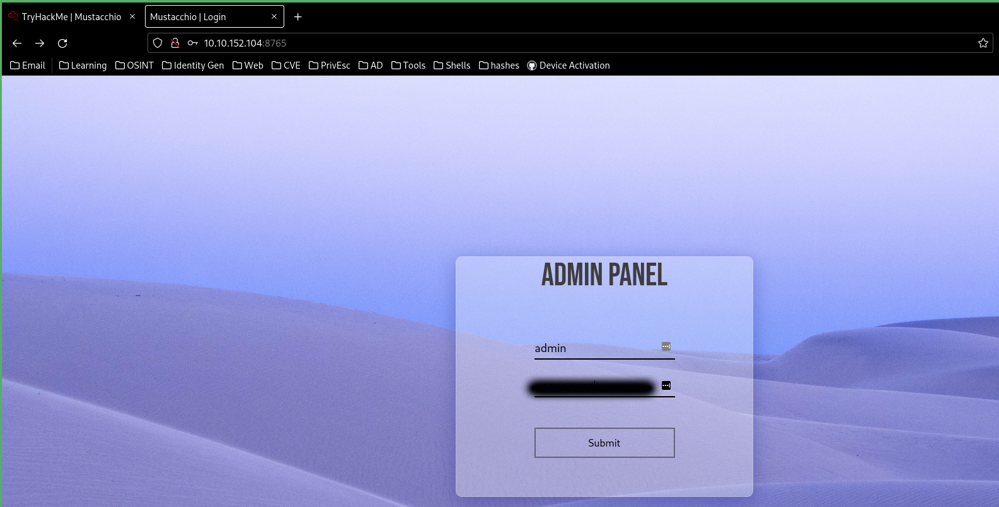  

> After logging in theres a comment box

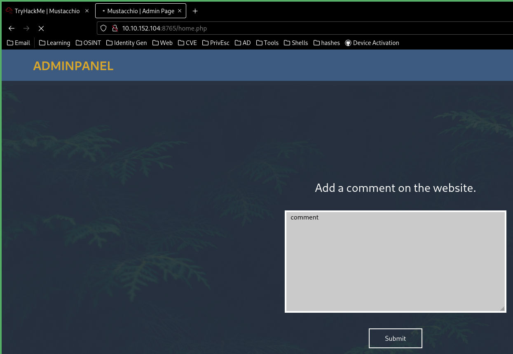  

## XXE

> Which sends the comment as `xml`

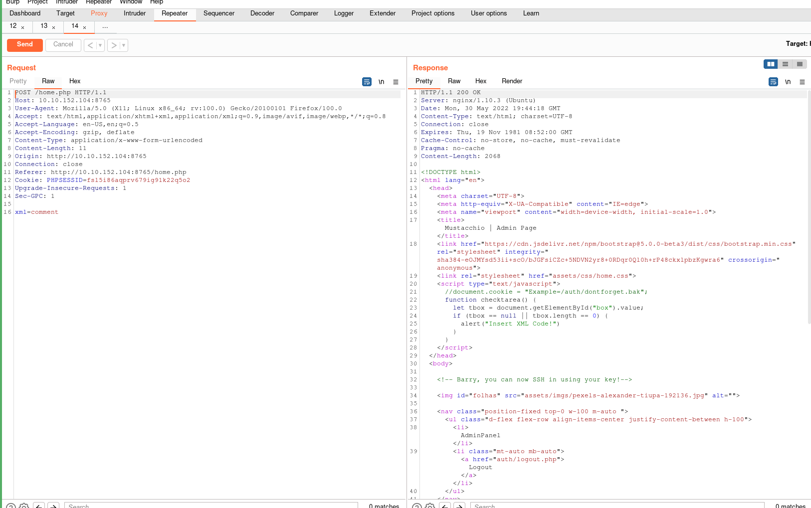  

> Theres a comment in the source about a `/auth/` dont `forget.bak`, which contains a comment example in the form of `xml`.

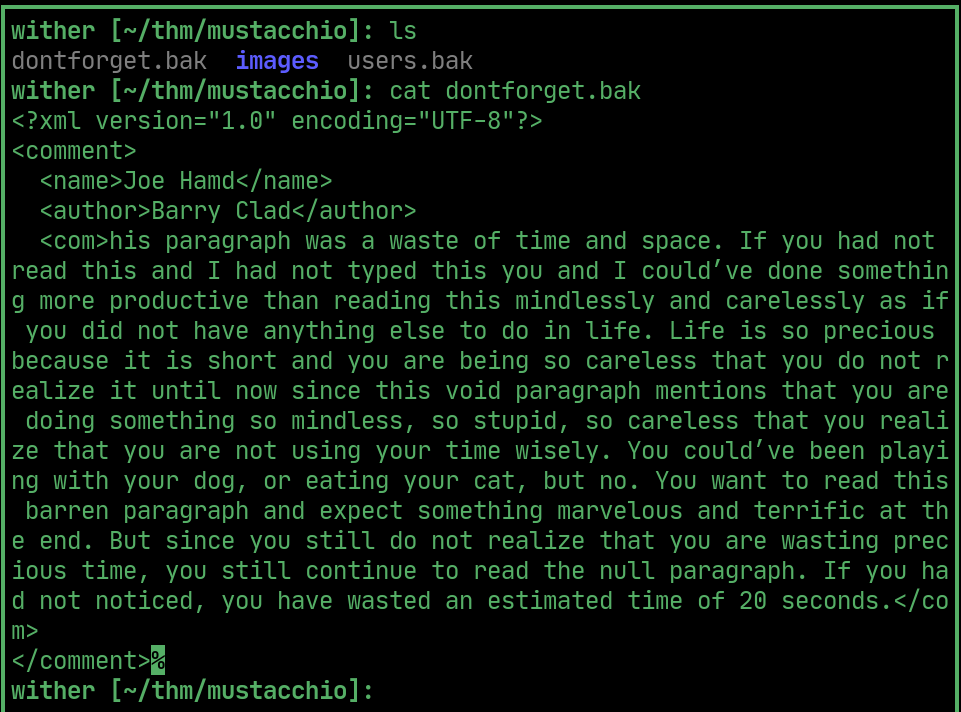  

> Sending the `xml` comment displays it in the response

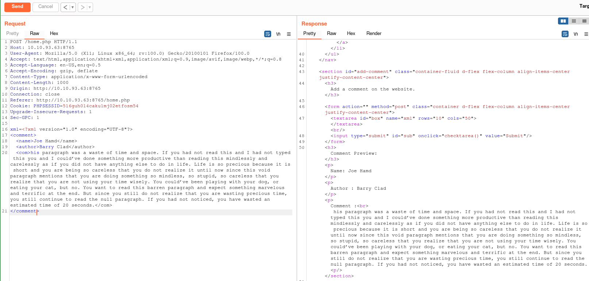  

> Use `XXE` `LFI` to get `barry`'s SSH key

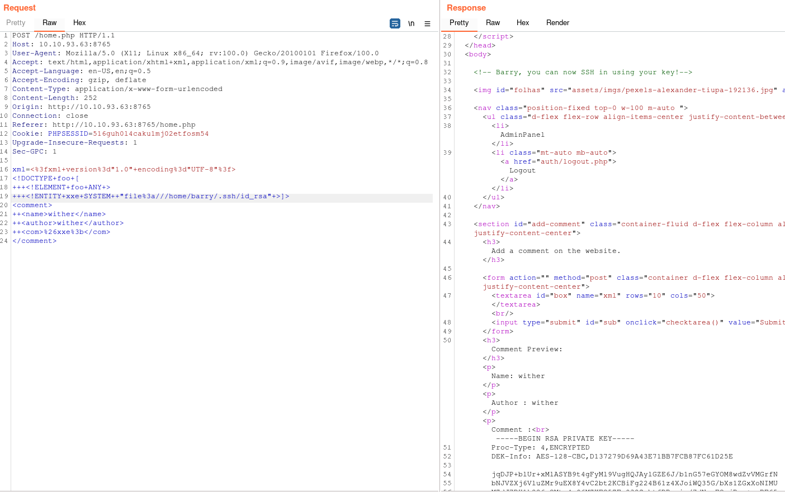  

## User

> Pass the `id_rsa` to `ssh2john`, crack it to get the passphrase and ssh into the machine as `barry`.

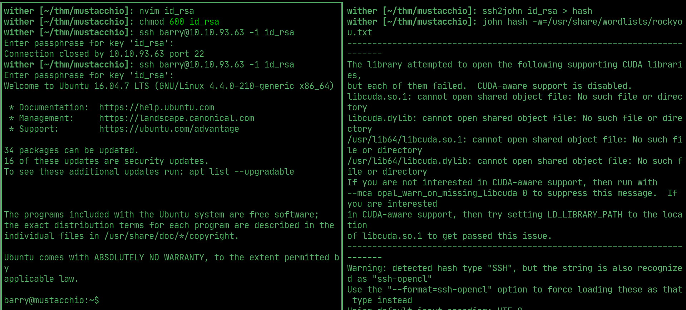  

## User flag

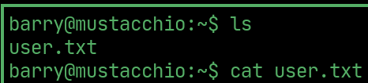  

## PrivEsc

> There's a binary in the `joes/home/` folder has `suid` permissions

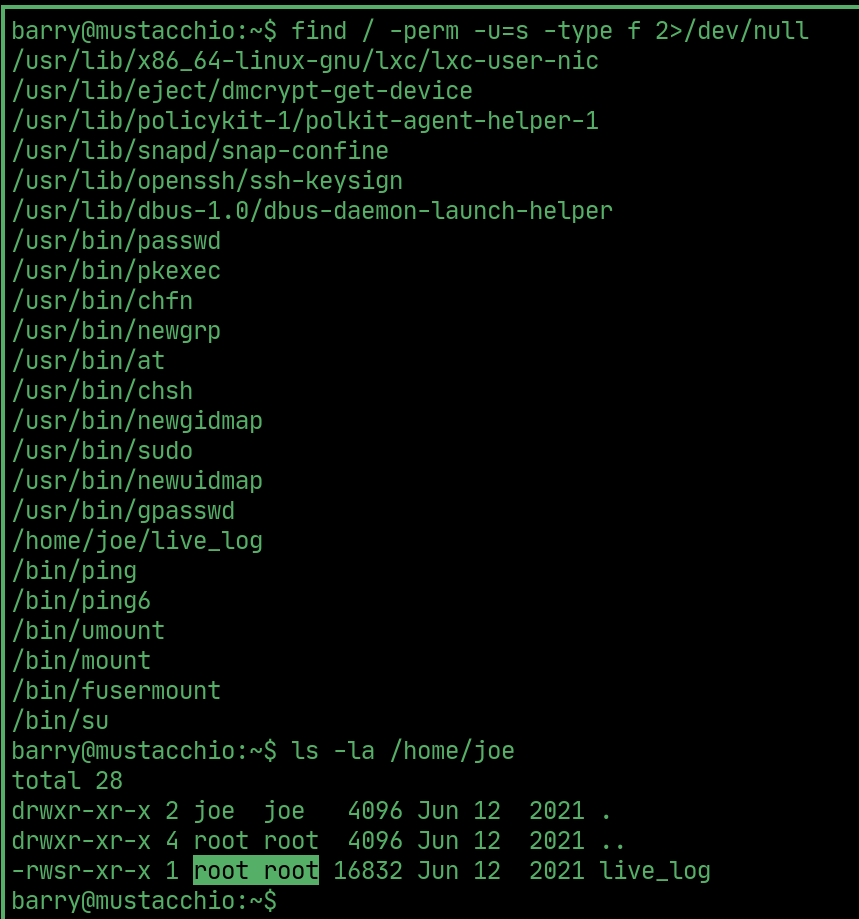  

> Download it using `scp`

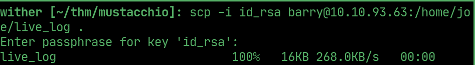  

> it `tail`s the access log

## Root flag

> Add `barry`'s home to `$PATH `and write a command to a `tail` file, so that when `live_log` is ran, `tail` is also ran as root.

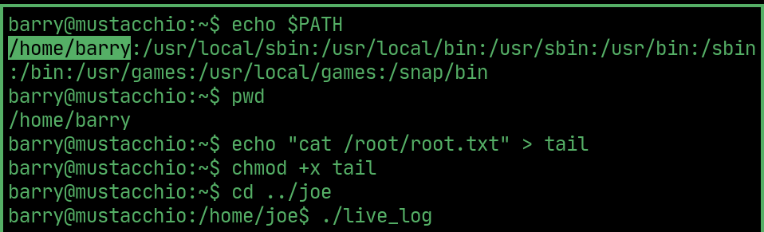  

