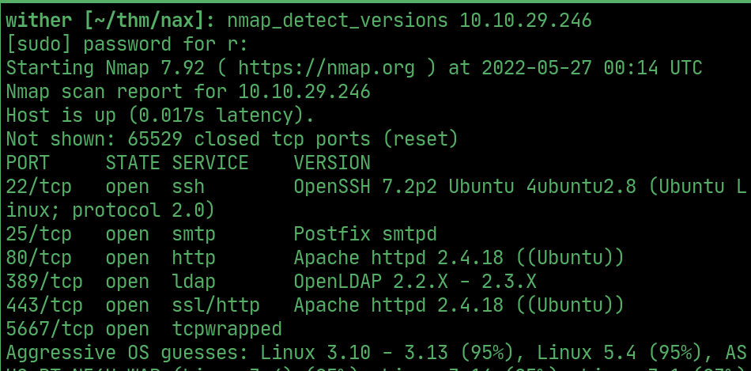
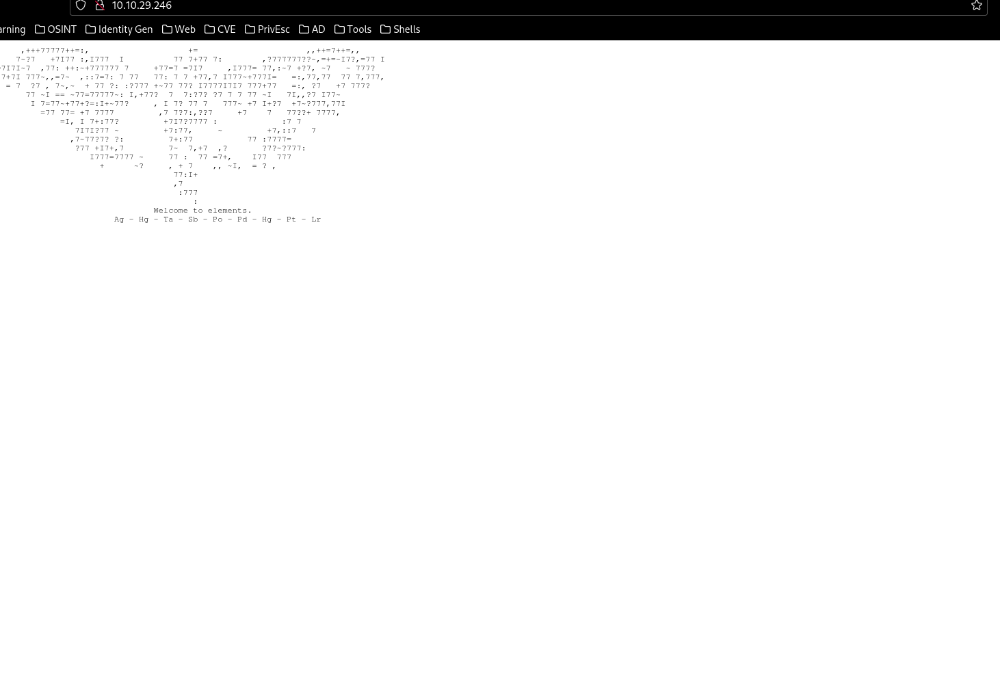
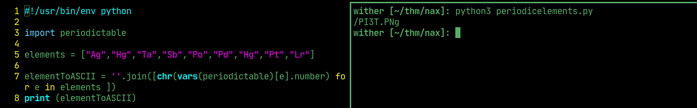
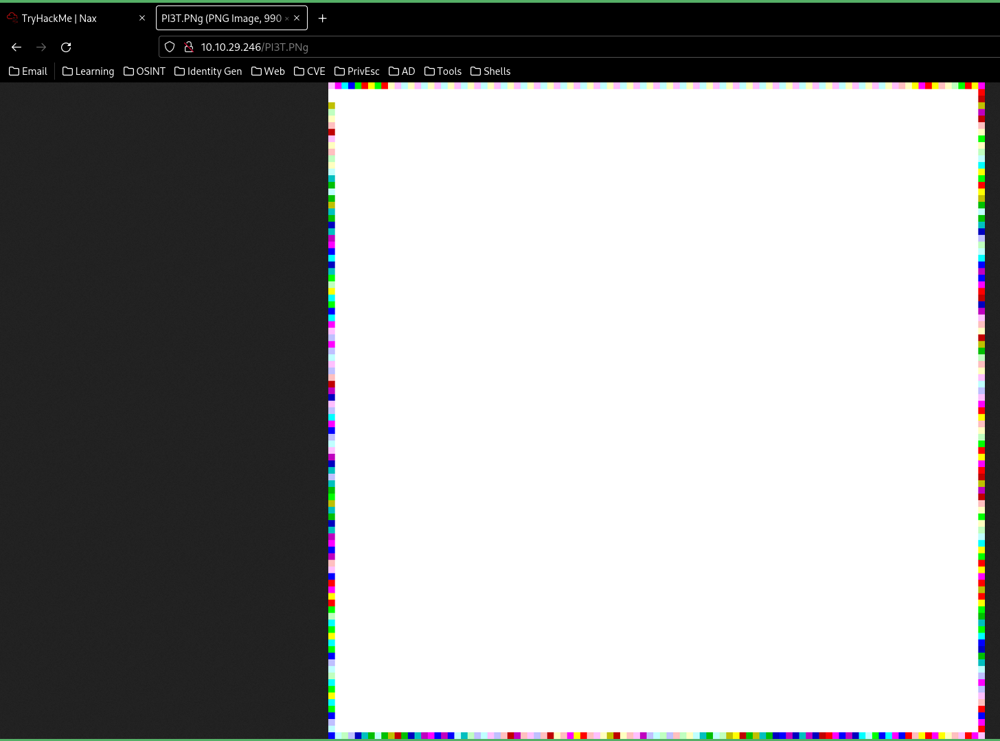
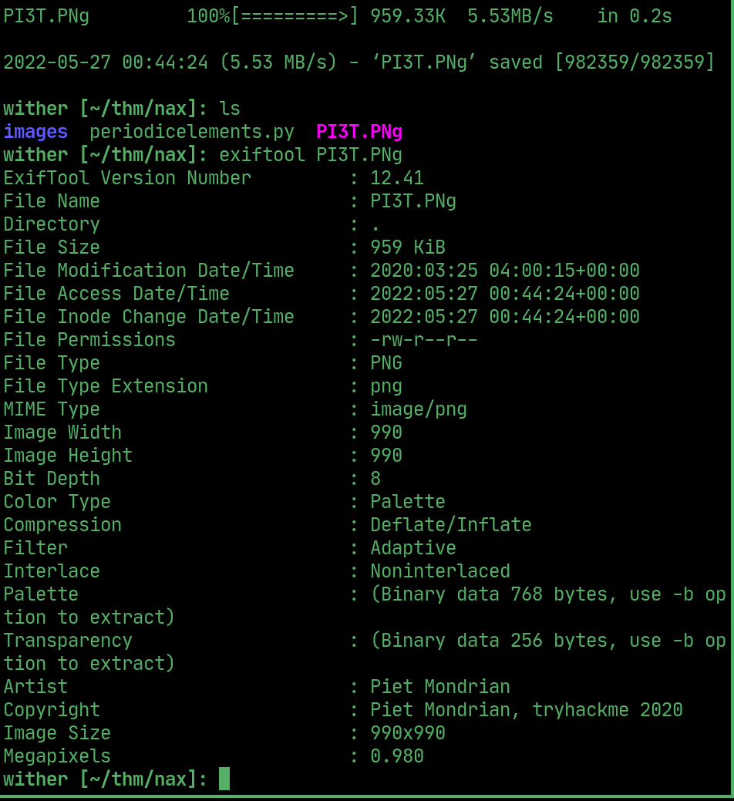
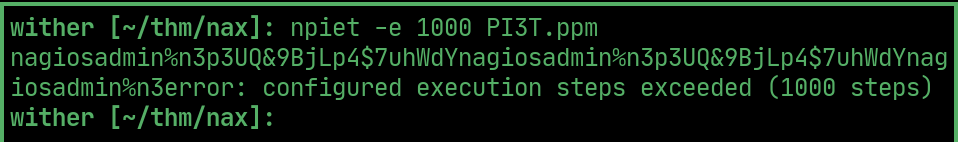
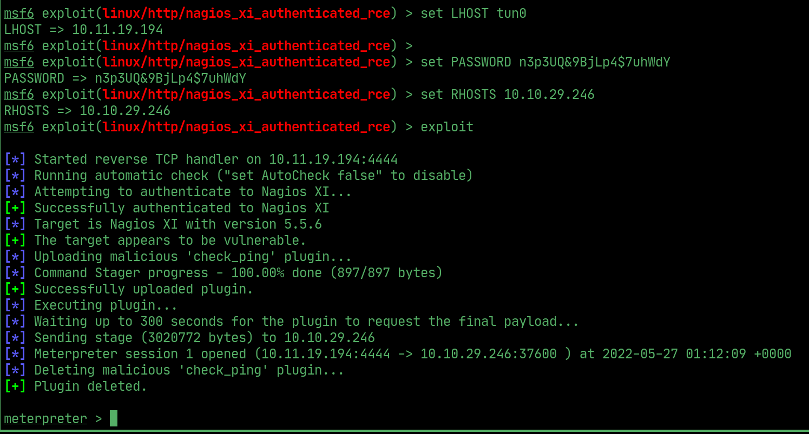
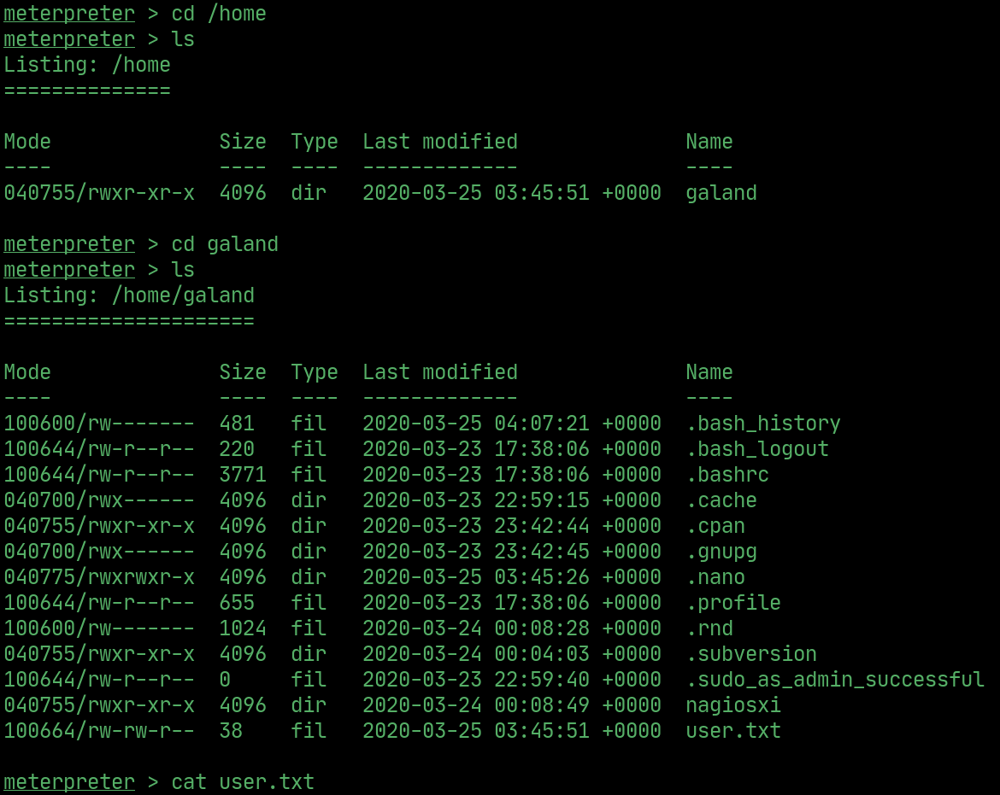
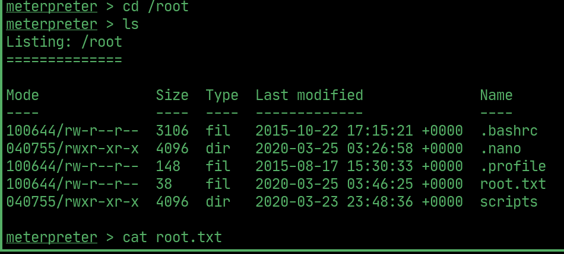

# nax

---

## nmap

  

## Website

> not much to the website at first glance, however there are some elements.

  

## Secret file

> I wrote a python program to take the elements and convert each one to their corresponding periodic number, then that number to ascii to get the path to the secret file.

  

> when I go to that path, this is the image

  

> using wget and exiftool (https://www.exiftool.org/install.html#Unix), we can download and view the metadata of the file 

  

> after converting it to ppm, we can use npiet (https://www.bertnase.de/npiet/) to interpret the file into readable text, revealing a username and password.

  

## Exploit

> using the username and password as well as authenticated rce in metasploit we can get a meterpreter shell 

  

## User flag

  

## Root flag

  

