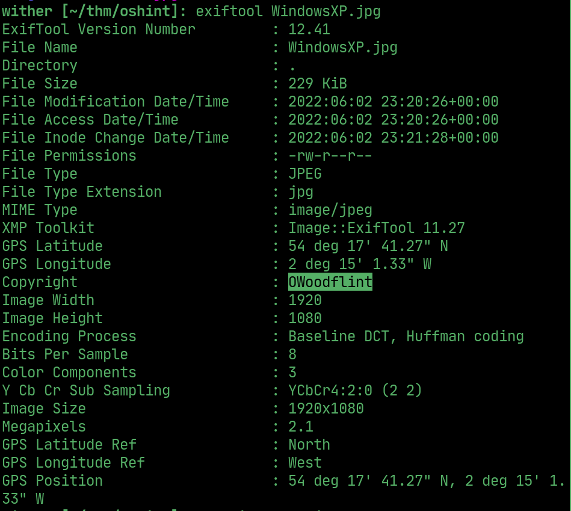
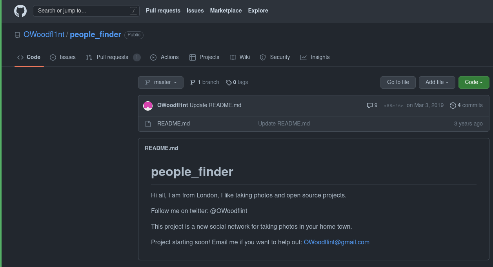
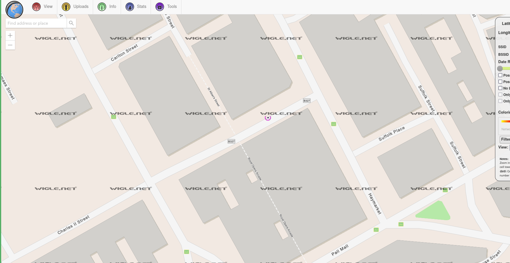
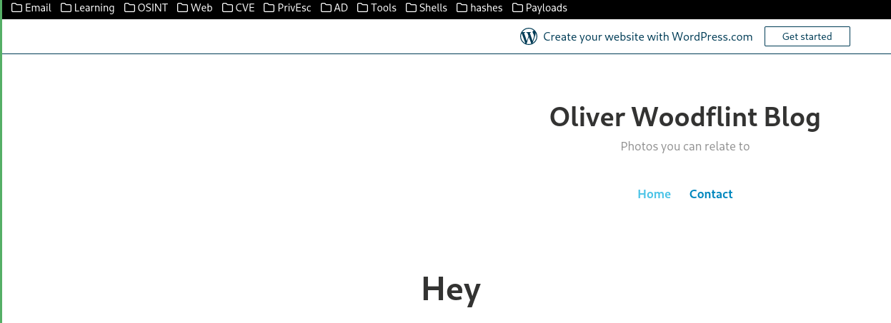
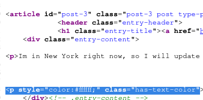

# oshint

---

## Username

> Exiftool reveals a potential username

  

> Googling the username leads to a github repository with their city, email and twitter handle

  

> Using wigle.net and the BSSID found in one of their tweets find their SSID

  

> They have a wordpress blog

  

> Their password is in the source in white text

  