# overpass

---

## Nmap

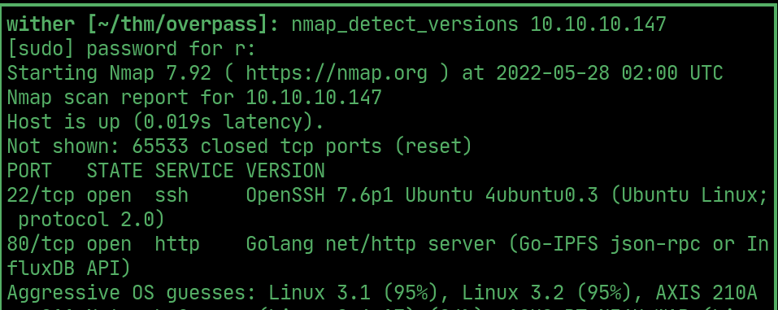  

## Ffuf

> `/admin/` is a login page

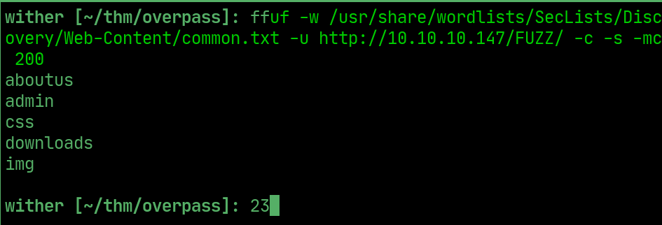  

> it uses `login.js` that shows "Incorrect Credentials" if there is no cookie

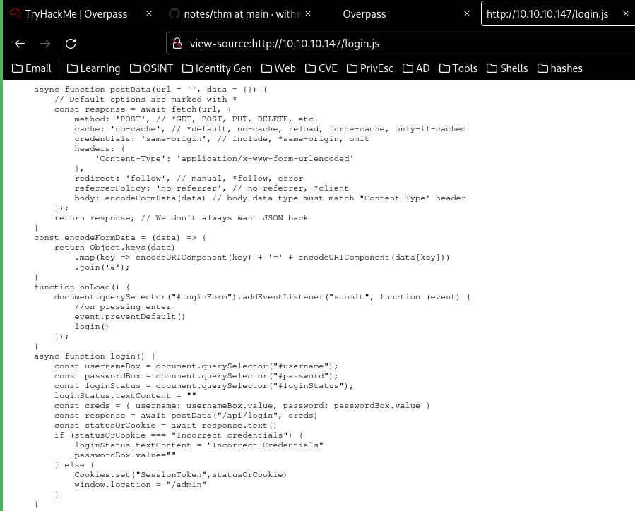  

> so by setting a cookie, `login.js` no longer displays `"Incorrect Credentials"` and instead allows access to `James`'s SSH key

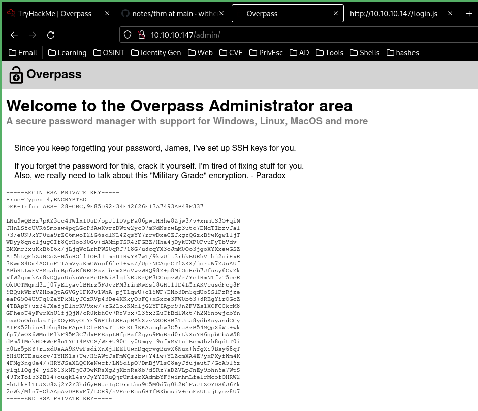 

## John

> Save the key and pass it to `ssh2john`

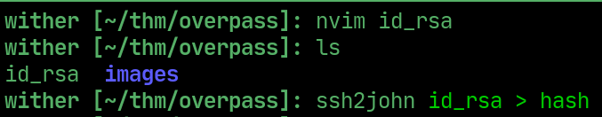  

> Pass the hash to `john` and get a password

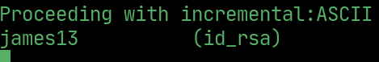 

## User flag

> Enter the passphrase and login

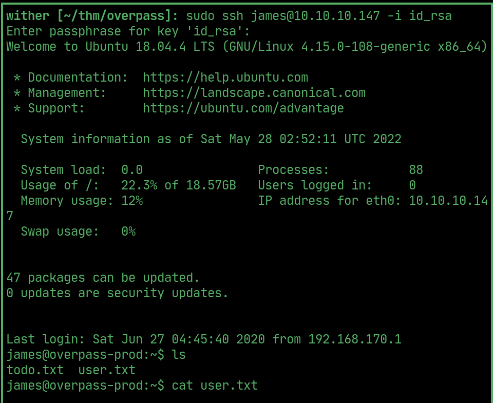  

## PrivEsc

> `todo.txt` tells `Paradox` to get an automatic build script working, which they seem to have done as shown in `/etc/crontab`. Theres a cronjob to get and run `buildscript.sh` from `overpass.thm`, which must be a reference in `/etc/hosts`

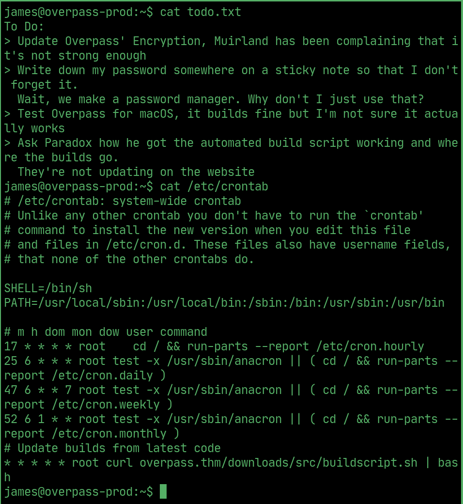  

> `/etc/hosts` is `writable`, change the IP assigned to `overpass.thm`

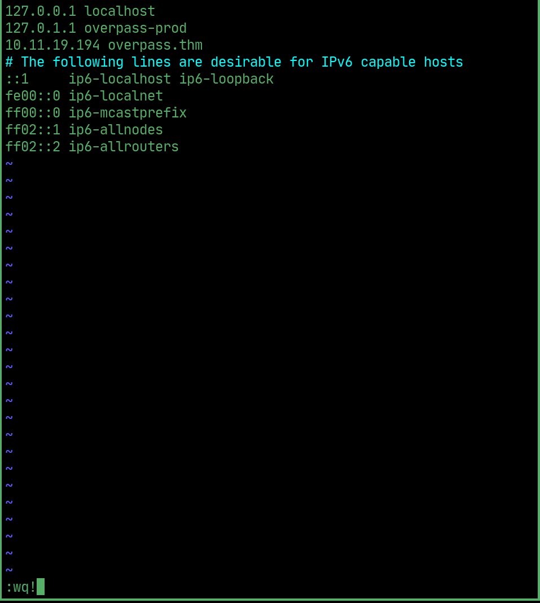  

## Root

> Write a reverse shell script called `buildscript.sh` in a folder called `/downloads/src` and start a http server there, the `cronjob` will `wget` and `run it` to give a root shell.
 
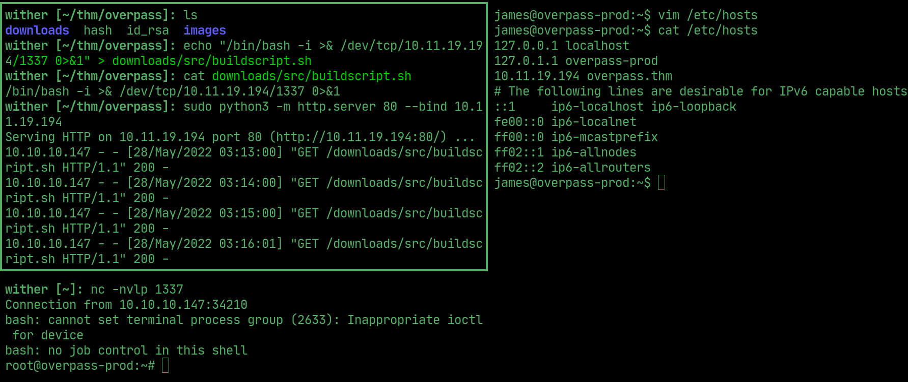  

## Root flag

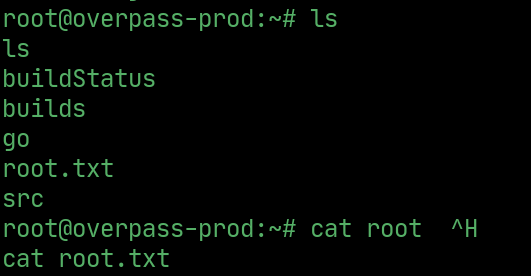  