# plotted-tms

---

## nmap

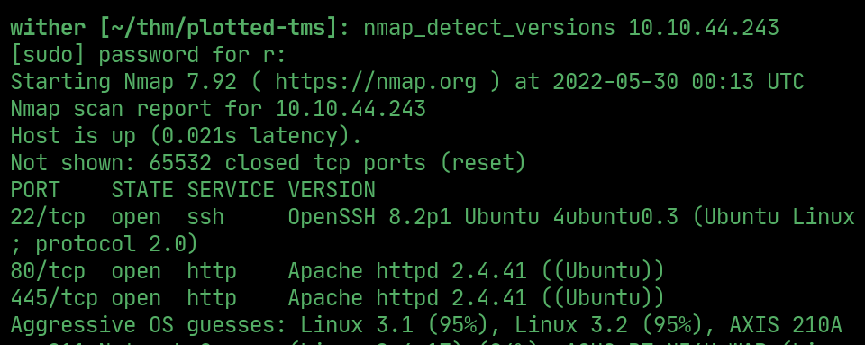  

## ffuf

> nothing on :80, found :445/management/

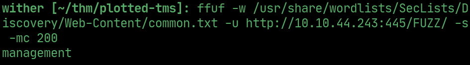  

## website

> has a login page

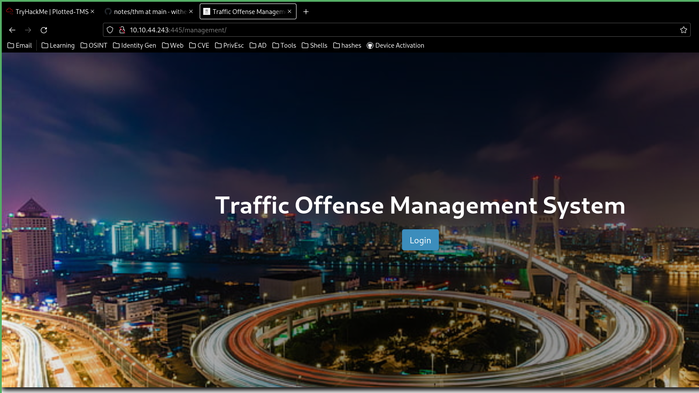   

## exploit

> use this exploit to upload an rce payload

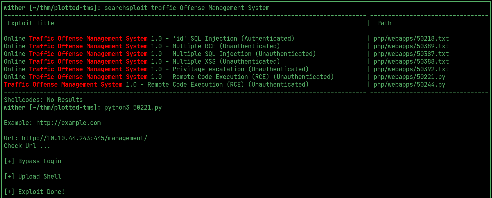  

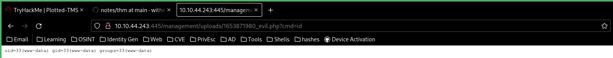  

## reverse shell

> send a url encoded netcat reverse shell with a listener open to get a reverse shell

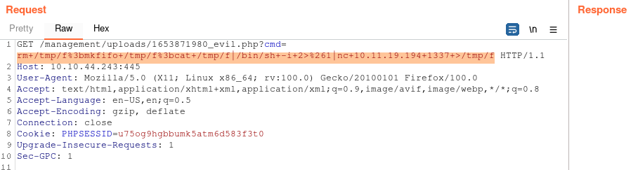  

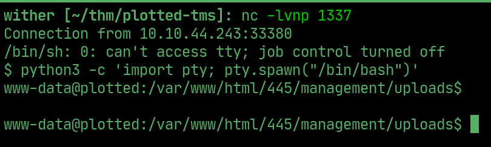  

## PrivEsc

> plot_admin is the other user

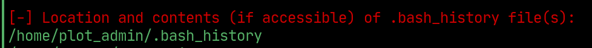  

> backup.sh is being run as plot_admin in cronjobs

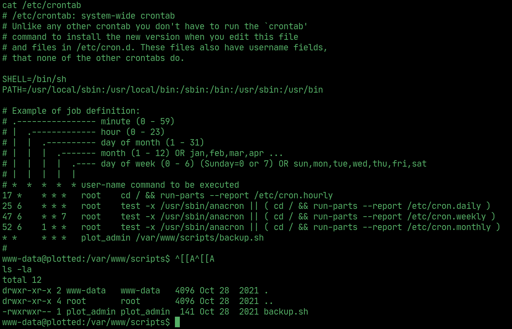  

> backup.sh

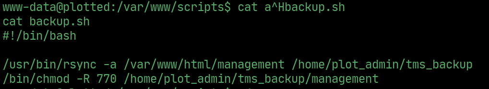  

## User

> delete backup.sh, and make a new one that spawns a reverse shell, wait for it to be ran as plot_admin

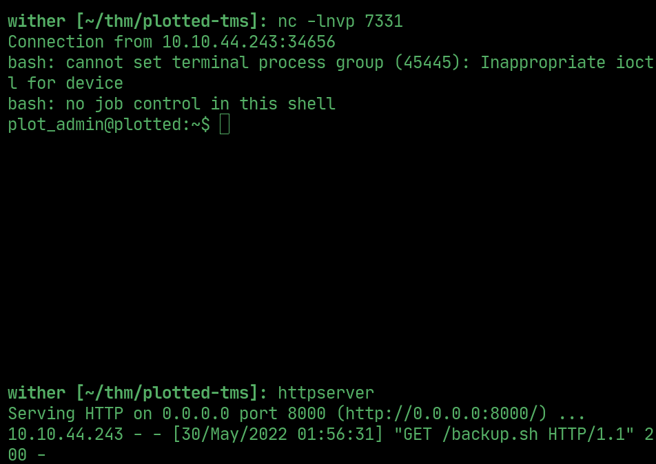  

## User flag

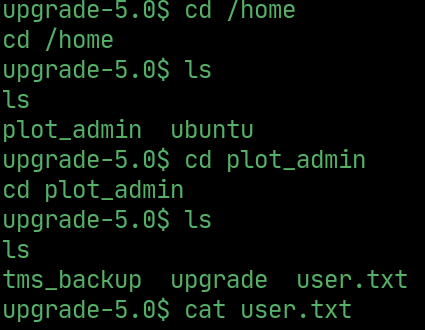  

## PrivEsc

> openssl can be ran as root using doas, exploit that to add another root user to /etc/passwd

`LFILE=/etc/passwd`
`echo "wither:$1$wither$HlLgmlz4PVTP7kcFAbgRt0/:0:0:/root/root:/bin/bash" | doas -u root openssl enc -out "$LFILE"`
