# res

---

## nmap

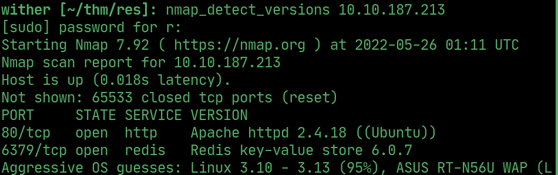

## redis-cli

> Connect using `redis-cli`

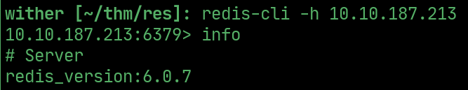

## RCE

> Make a new redis php db to perform `RCE`

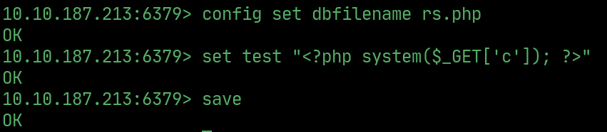

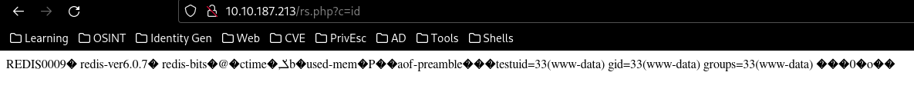

## reverse shell

> Use netcat and the `RCE` to get a reverse shell

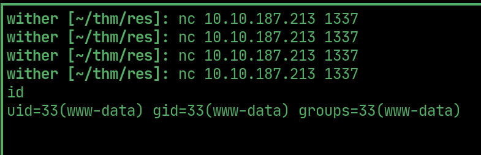

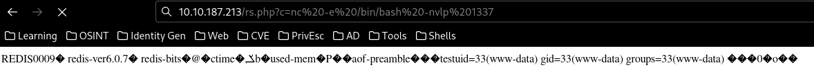

> Upgrade the shell using python

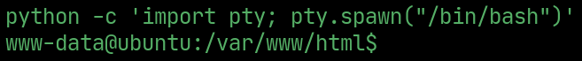

## PrivEsc to Vianka

> Use `linenum` to find linux privilage escalation routes. On this machine, `xxd` is an `SUID binary`.

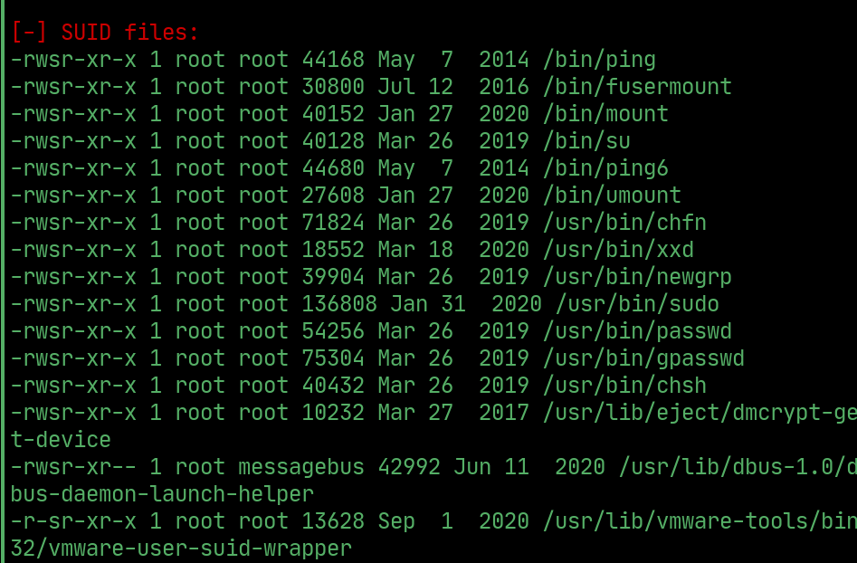

> Exploit `xxd` to `read /etc/shadow` and `/etc/passwd` and `save` both to files

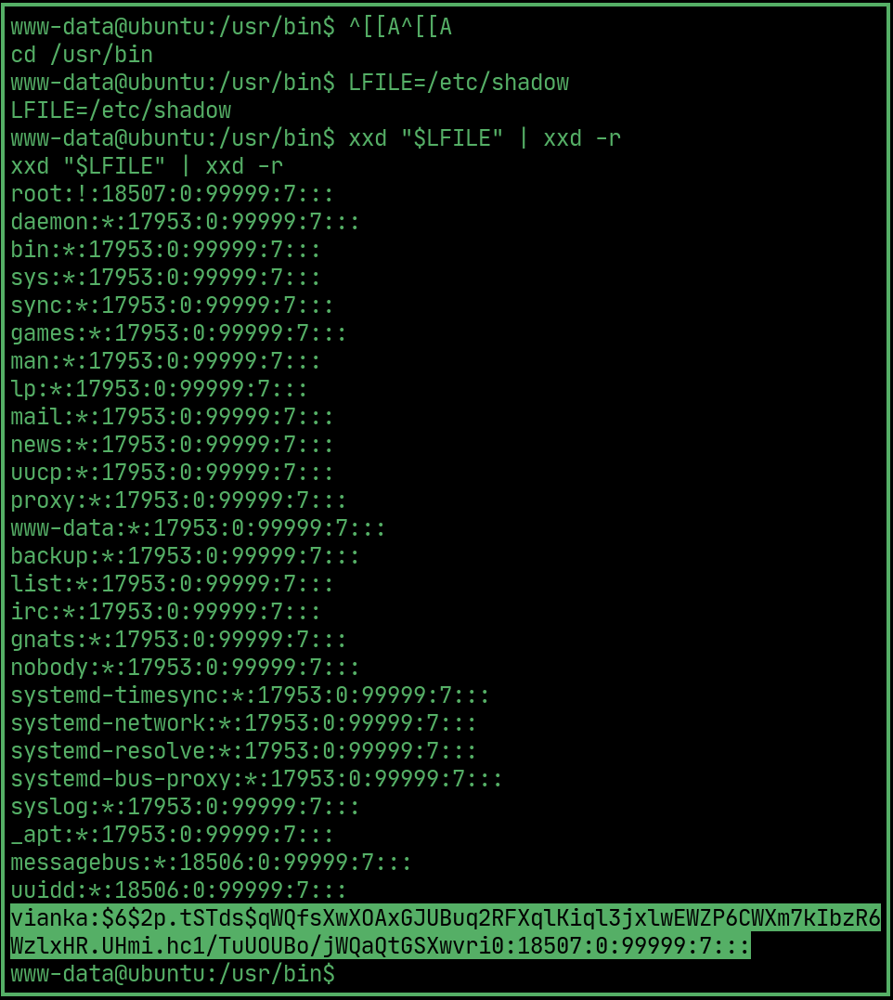  

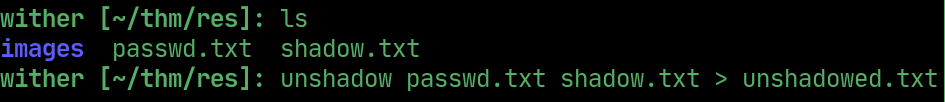

> Crack the `unshadow.txt` file

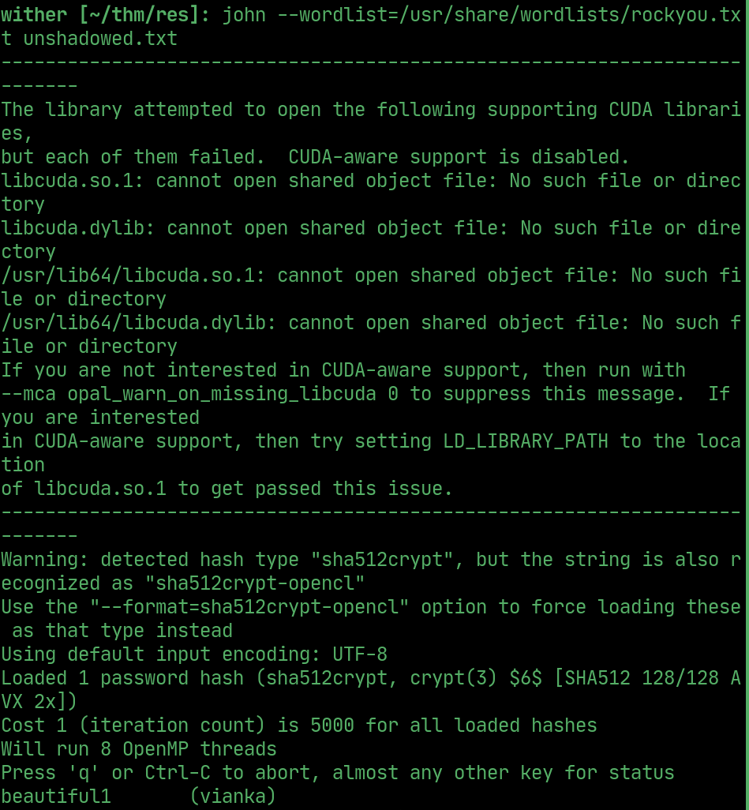

## User Flag

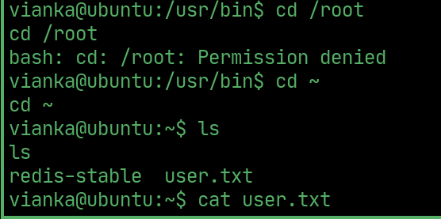

## PrivEsc to Root

> Use the same exploit to read the `/etc/sudoers` file and `copy` it to a new file

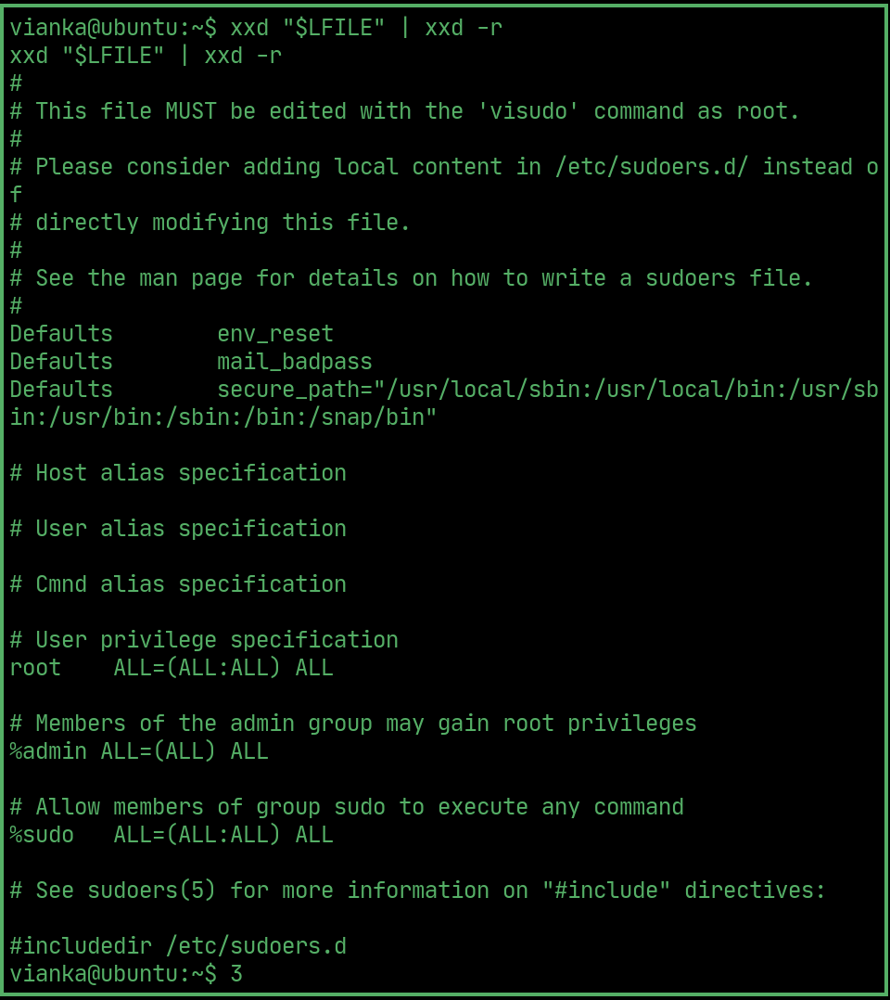

> `Add vianka` to the `new sudoers file` and `overwrite` the original, then switch to root. 

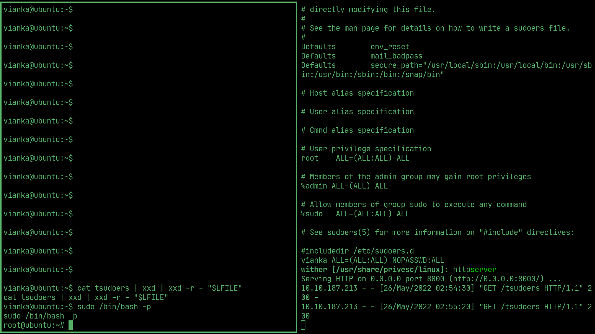

## Root Flag

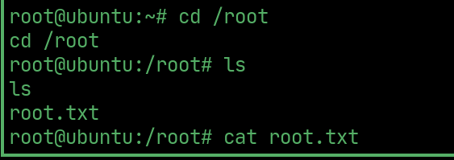
