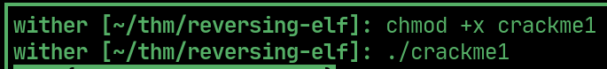
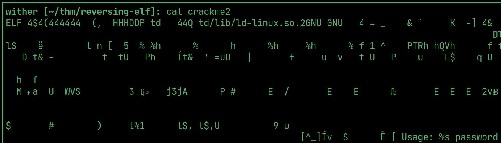
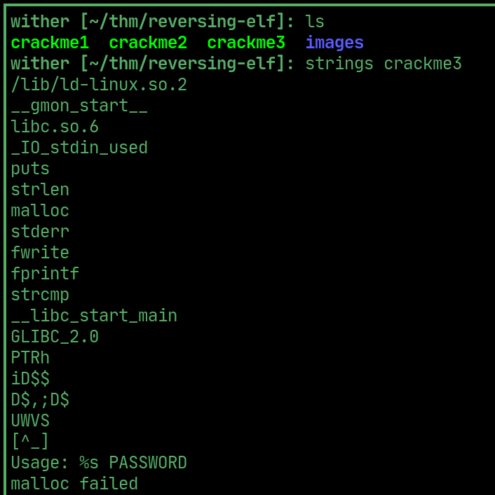
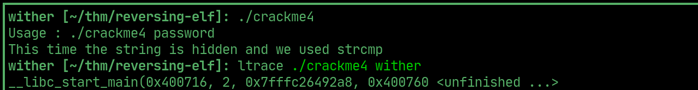
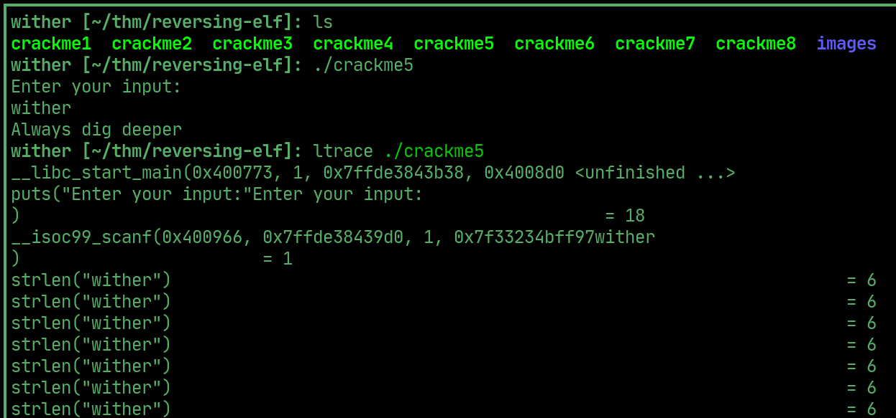
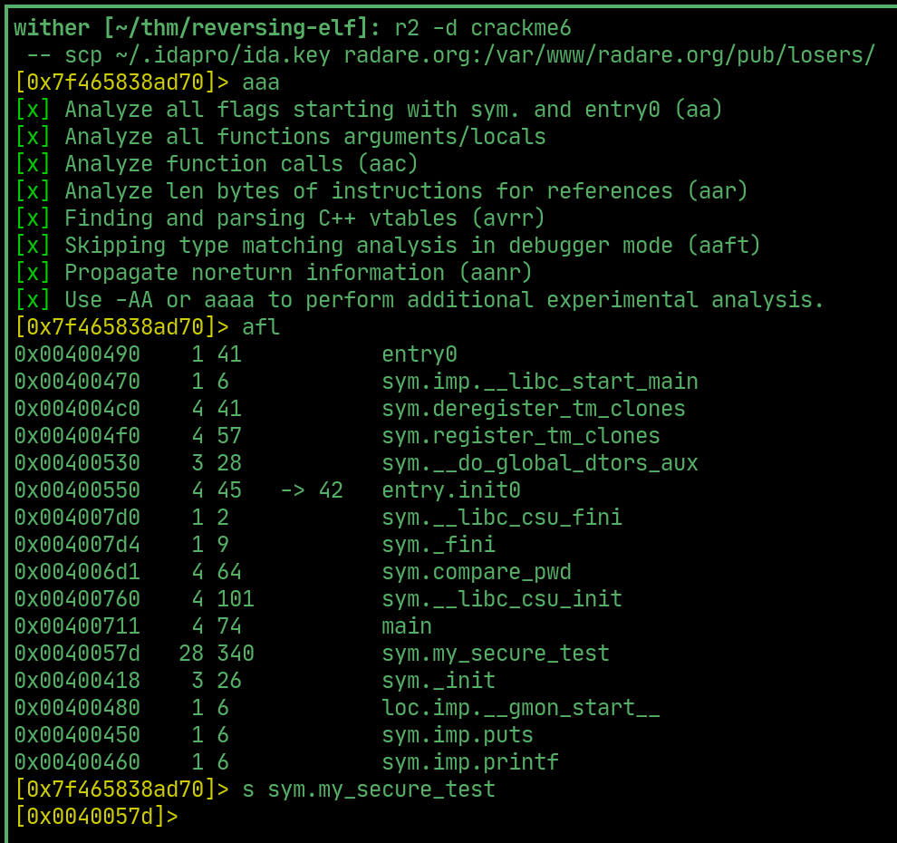
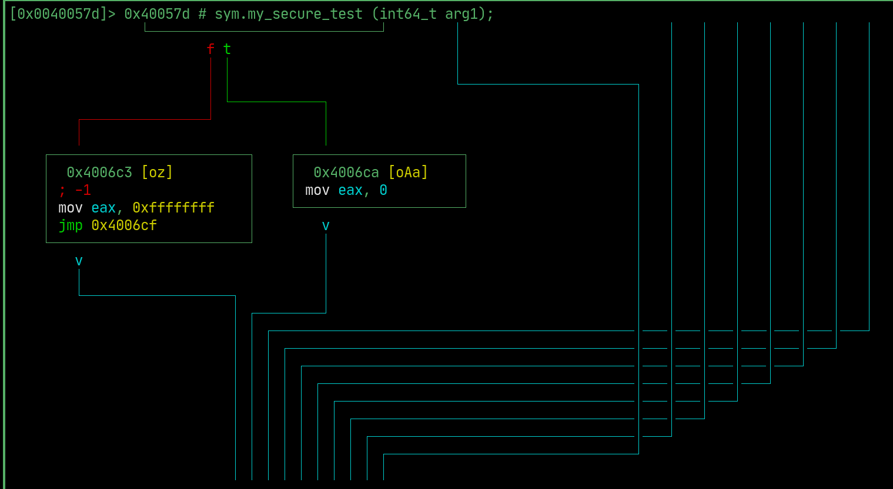
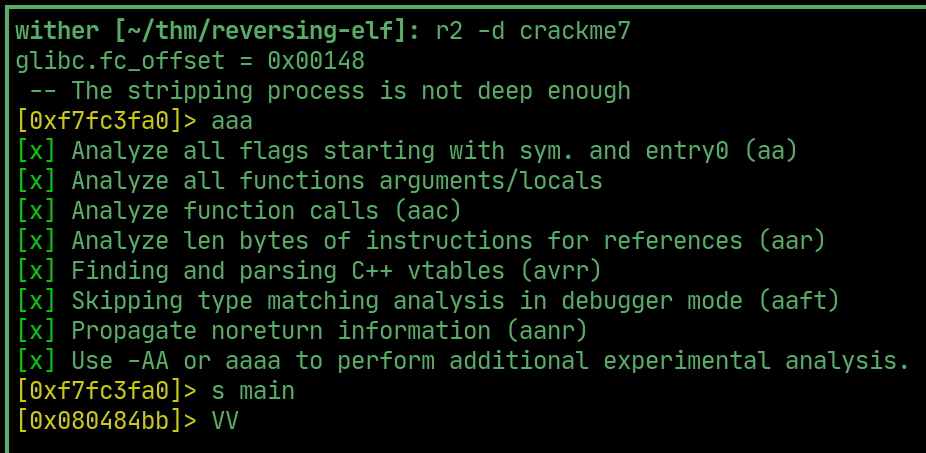
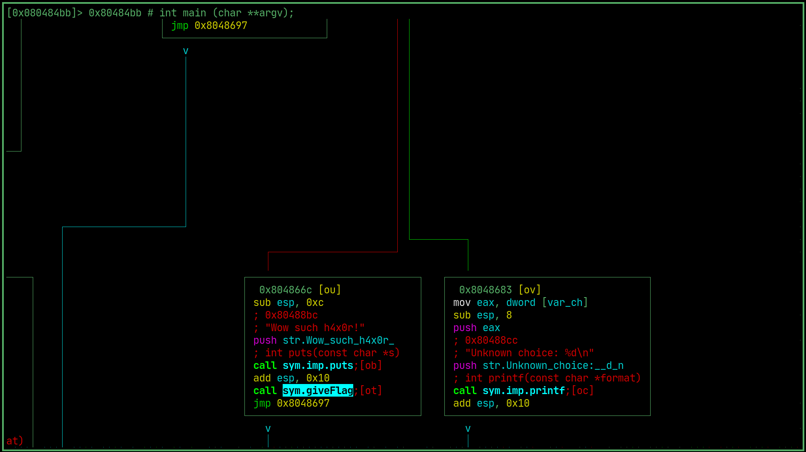
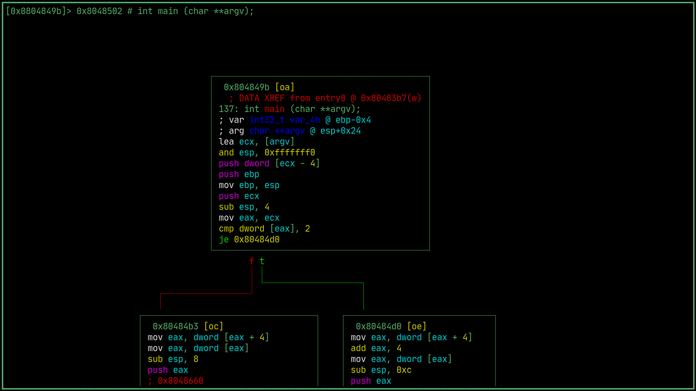

# Reversing Elf

---

## Flag 1

> run it

  

## Flag 2

> cat it and run it with the password

  

## Flag 3 

> base64 decode the strings

  

## Flag 4

> when run the binary says it used strcmp, use ltrace to see which two strings it compares, one of them is the flag and the other is the password entered.

  

## Flag 5

> Run ltrace again to see which two values it compares, one will be a string the other will be the entry, enter the string to get Good game.

  

## Flag 6

> interesting function sym.my_secure_test

  

> go through the entire r2 flow-chart and compile all of the hex characters that are involved in the comparison and decode using cyberchef to get a password

  

## Flag 7

> follow the same initial methodology as the previous

  

> except find on what condition this event is triggered, that comparison will reveal a hex number, which can be converted to decimal and entered as an option to give a flag

  

## Flag 8

> again follow the same methodology, check this condition and comparison, decode the compared hex to 2s compliment and use that as the password to get the flag.

  