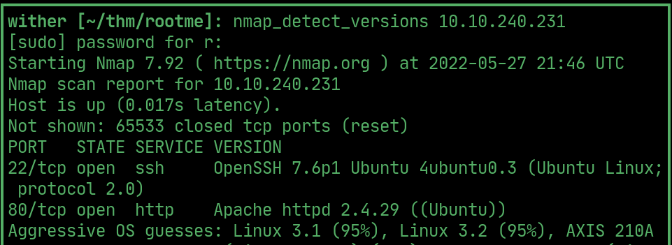
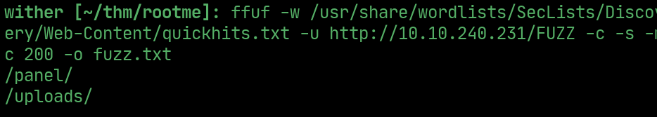
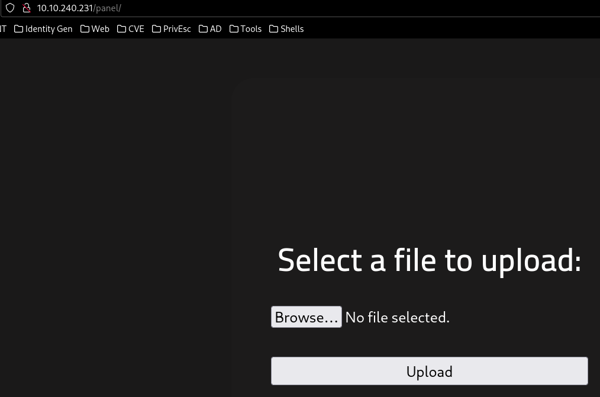
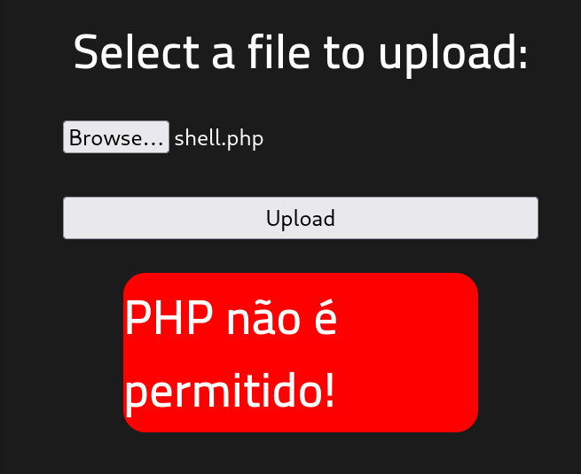
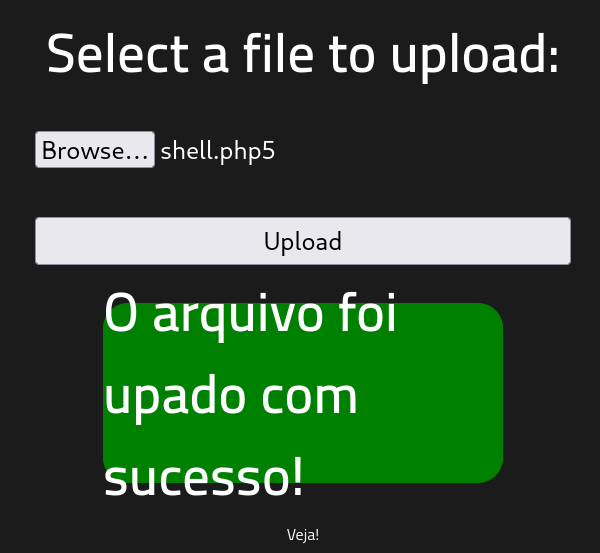
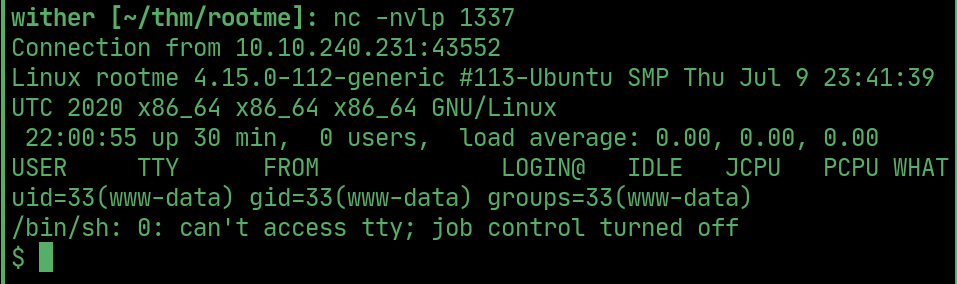
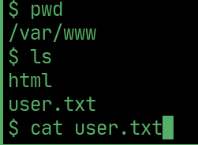
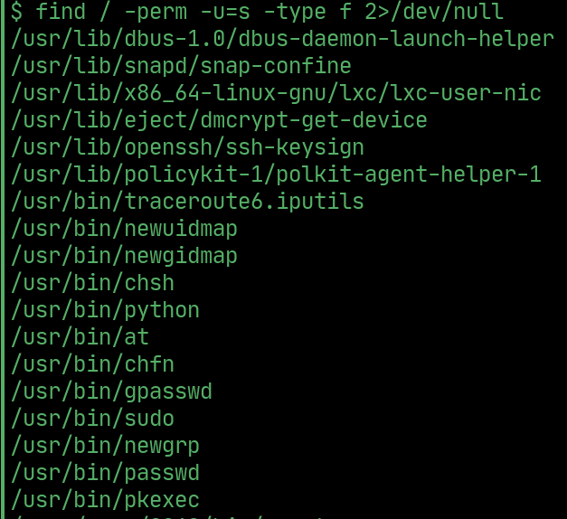
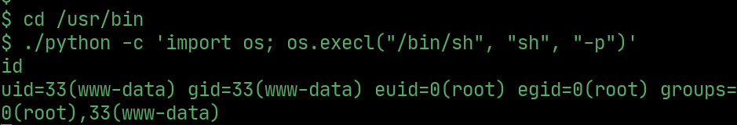
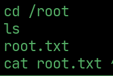

# RootMe

---

## nmap

  

## ffuf

> found two hidden directories

  

## upload

> /panel/ is a file upload interface

  

> php uploads arent allowed

  

> rename shell to .php5 to bypass the filter

  

> open a netcat listener and go to /uploads/shell.php5 to get a reverse shell

  

## User flag

  

## PrivEsc

> find suid binaries, python is exploitable

  

## Root

  

## Root flag

  

