# Team

## Rustscan

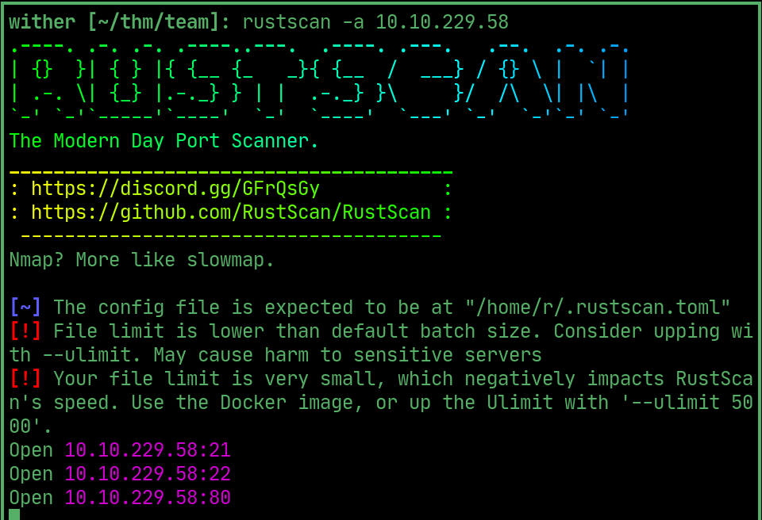  

## Robots

> name in robots.txt

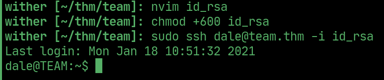  

## Script

> /scripts/ reveals a script, at the bottom says the old one contained creds

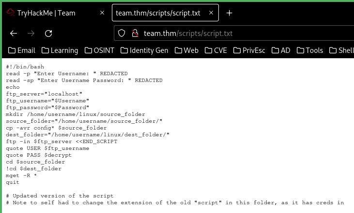  

> script.old is the old script

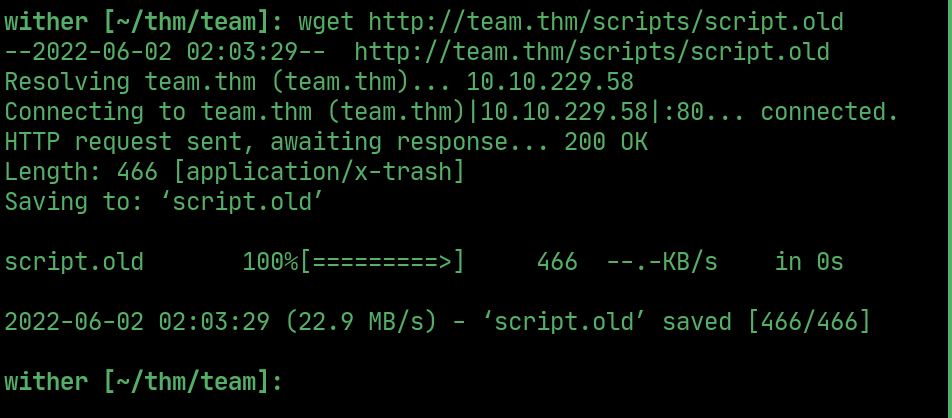  

## FTP

> login with those credentials and download `workshare/New_site.txt`

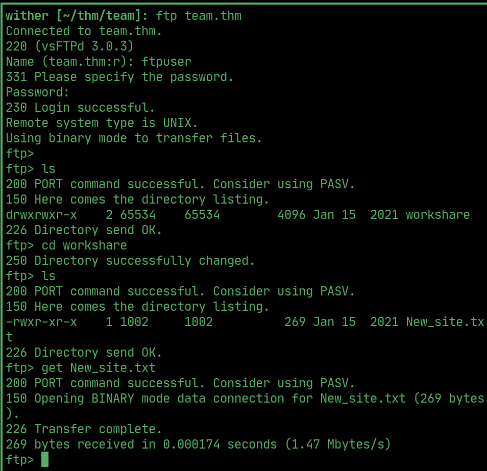  

## New Site

> dale says hes making a new PHP website on the dev. subdomain

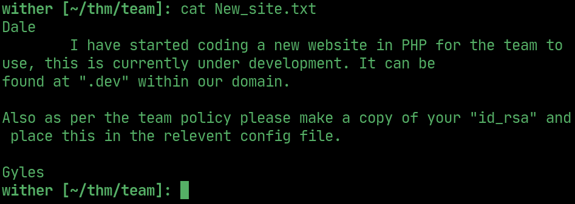  

> new site has a placeholder page

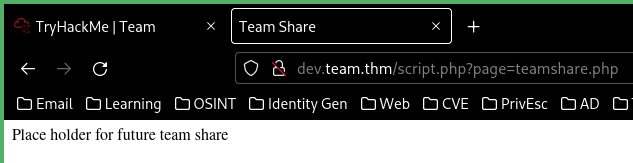  

> change the URL to read a different file (LFI)

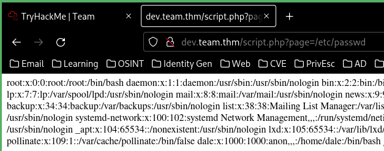  

> /etc/ssh/sshd_config gives dale's id_rsa

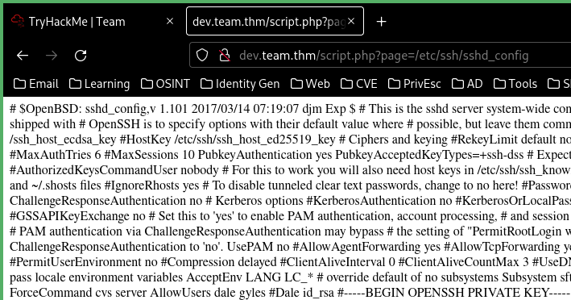  

## User

> save the id_rsa and ssh as dale

  

## User flag

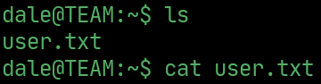  

## PrivEsc

> dale can run this script as gyles

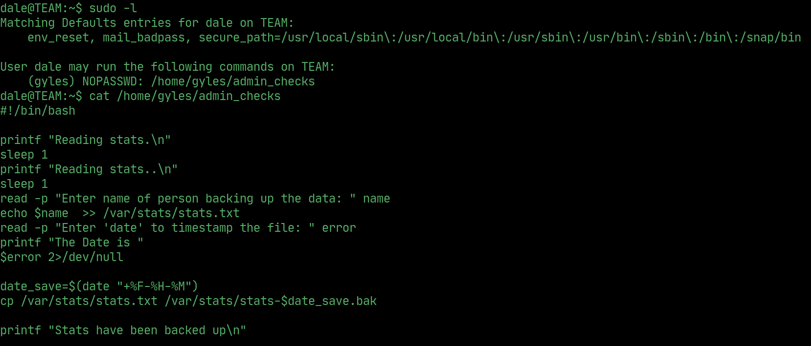  

> inject /bin/bash into the script as the date variable to get a shell as gyles

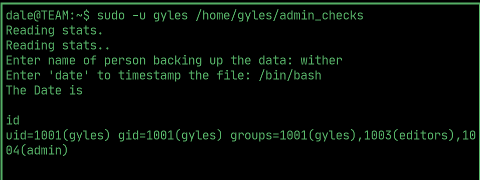  

## PrivEsc to Root

> noticed /usr/local/bin in the PATH, theres a backup script in there that gyles can edit, add a reverse shell and open a listener

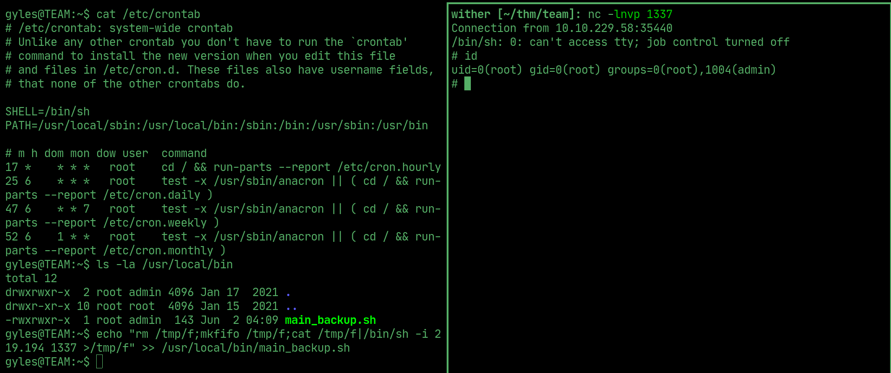  

## Root flag

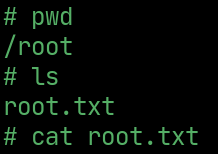  