# tech-supp0rt-1

---

## nmap

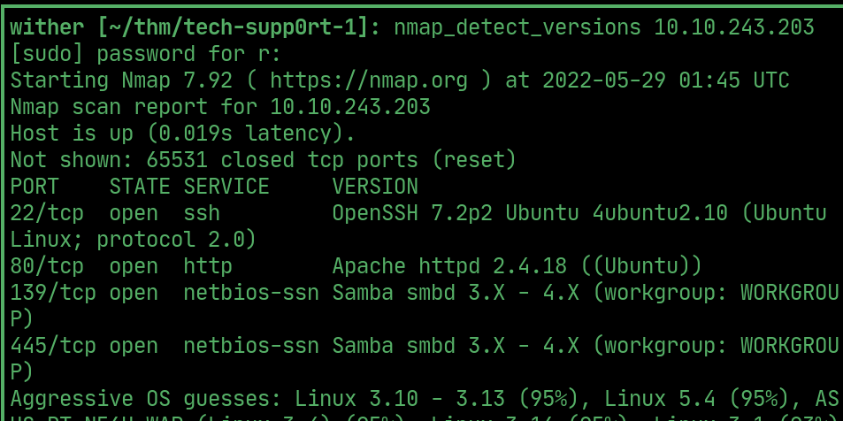  

## ffuf

> directory called test

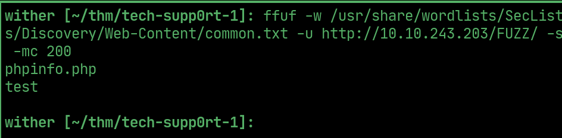  

## smb

> enumerate shares

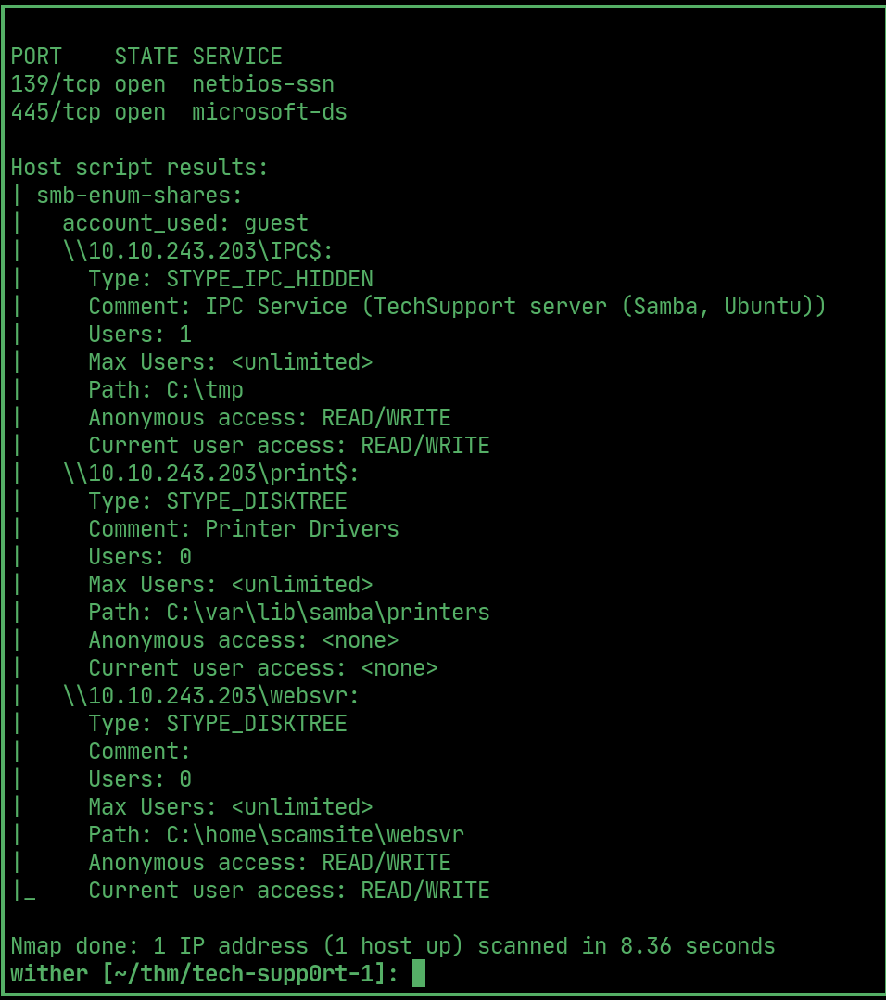  

> login and download the .txt file

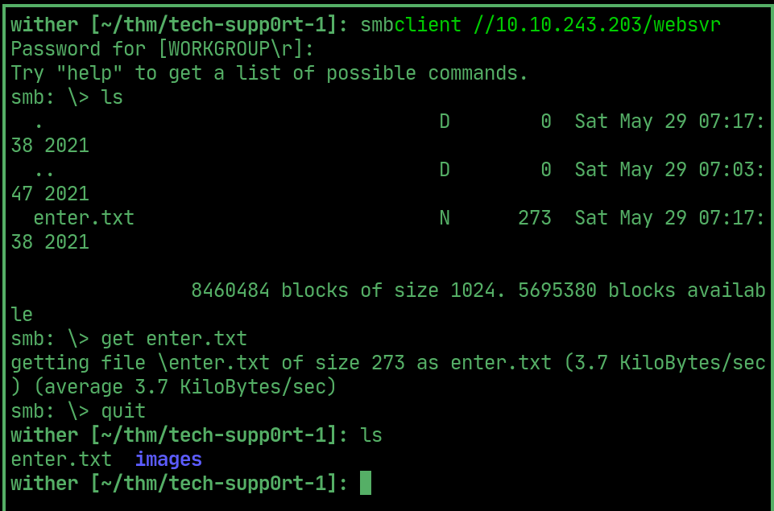  

> file has admin credentials 

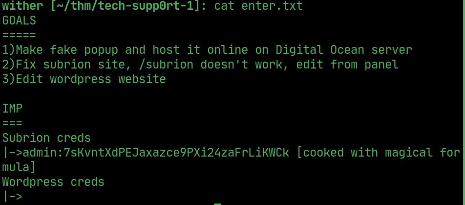  

## cracking

> use cyberchef magic recipe to crack the password

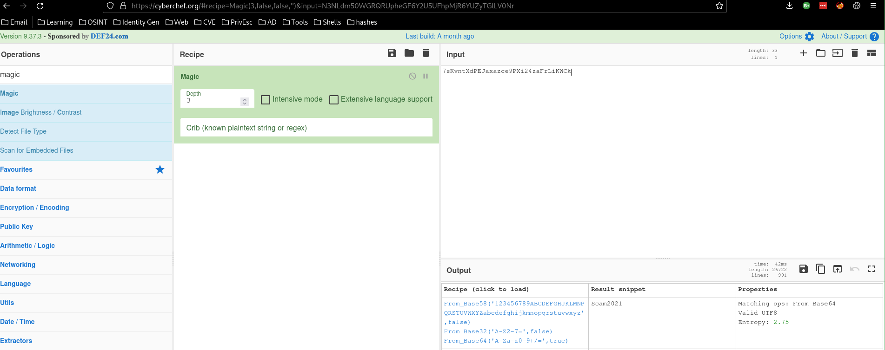  

## exploit

> use this exploit to get rce

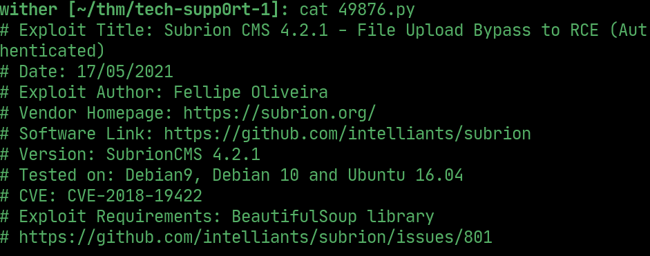  

## shell

> use the rce to download and run a reverse shell

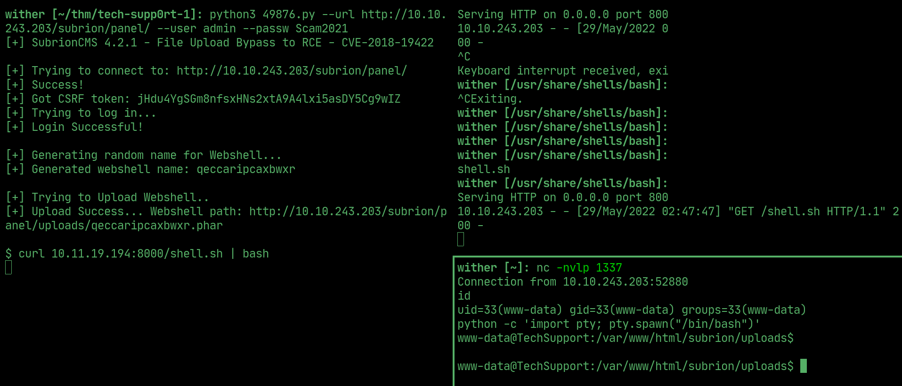    

## PrivEsc

> wp-config file in /wordpress/ contains credentials

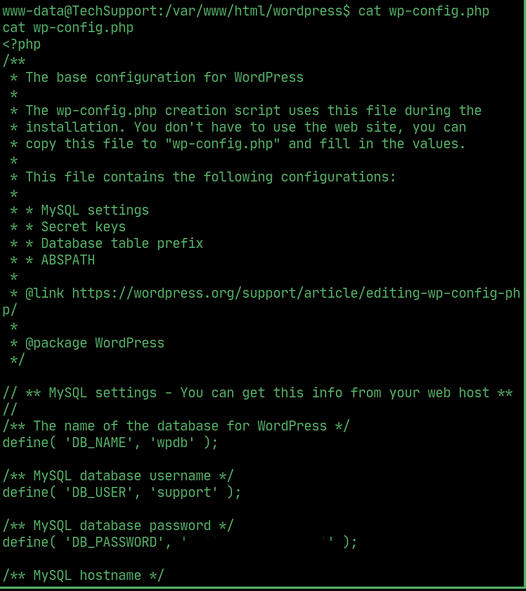  

> /etc/passwd shows that scamsite is the other user

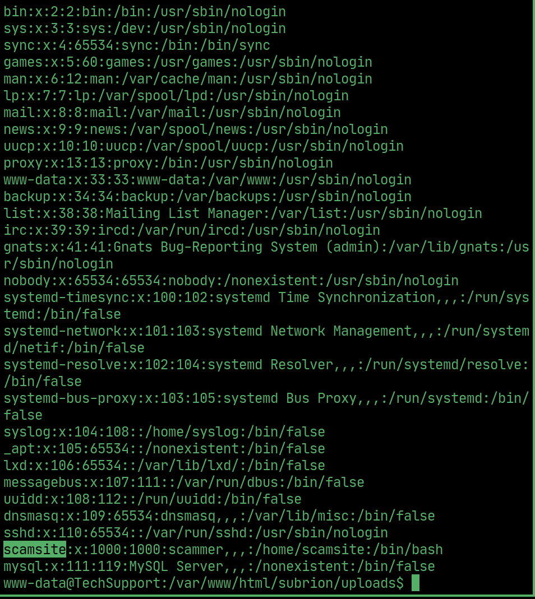  

## User

> use the wp password to ssh into the machine as scamsite

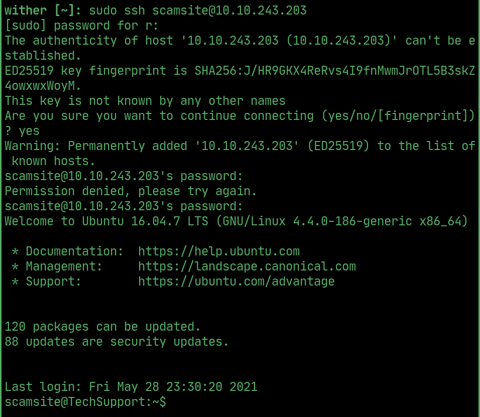  

## PrivEsc to root

> iconv can be ran as sudo without password

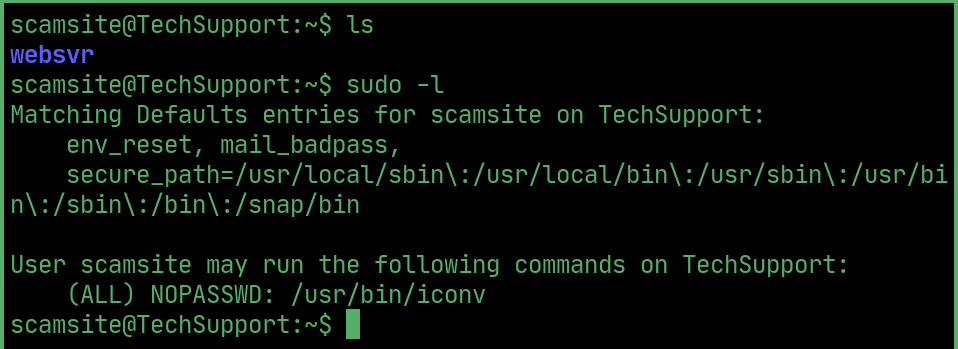  

## Root flag

> exploit iconv to read the root flag
 
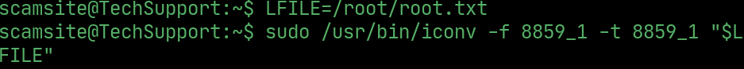  
