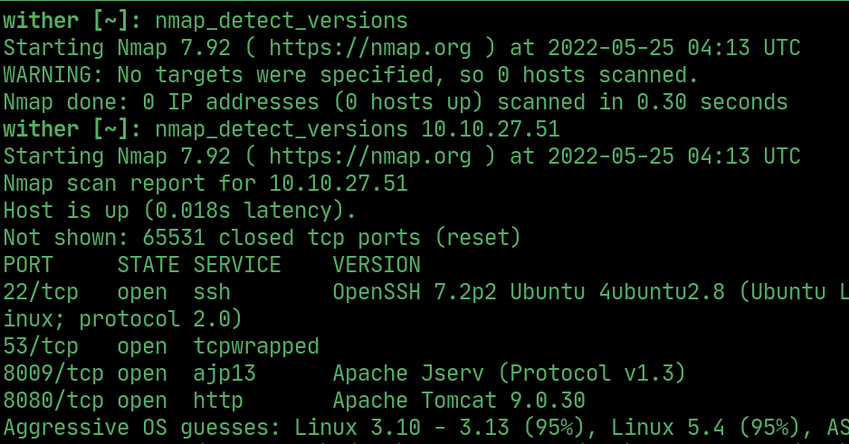
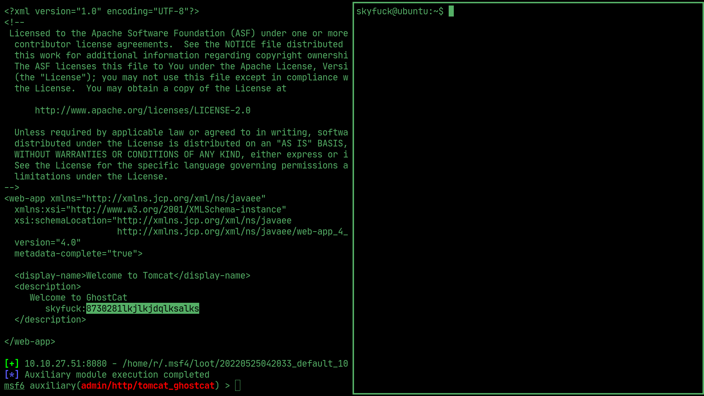
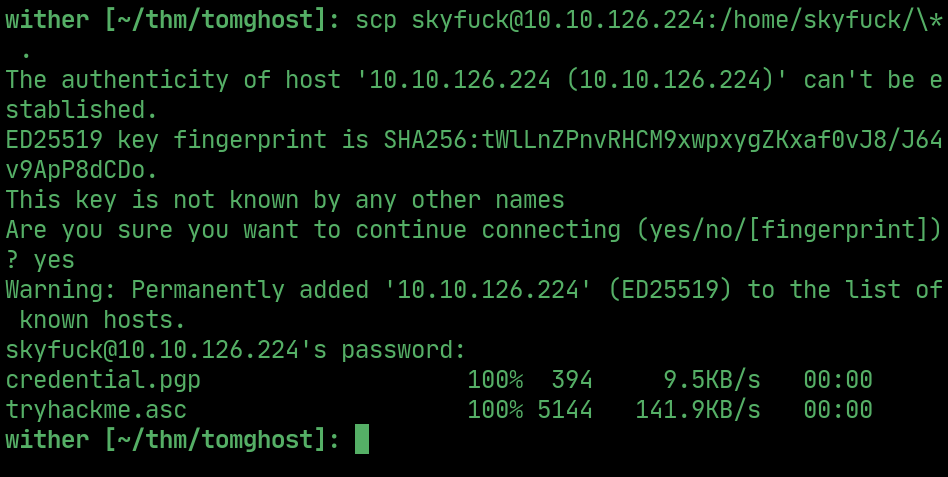
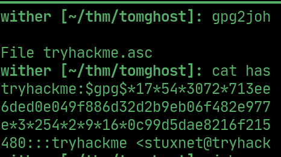
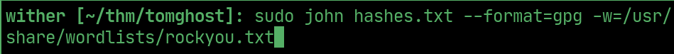
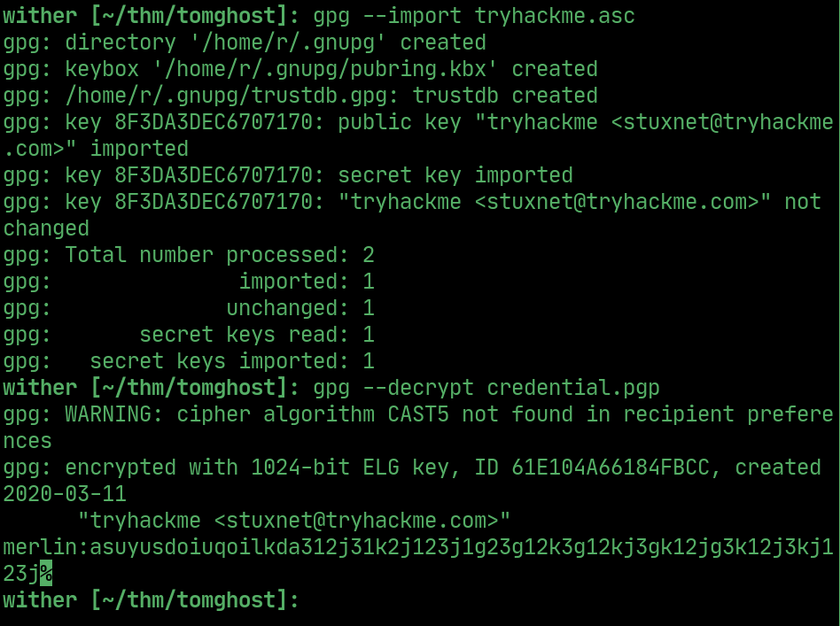
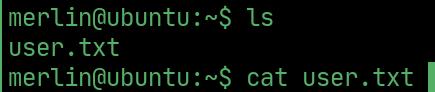
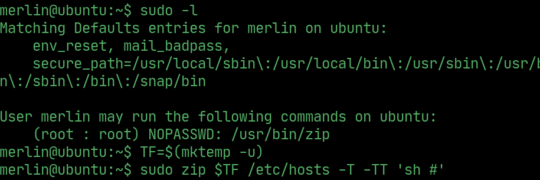
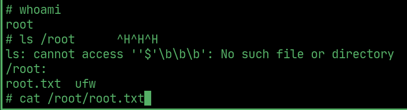

# tomghost

---

## nmap

## ssh

> Exploit `tomcat` using the `ghostcat` vulnerability in `metasploit` and get the user `skyfuck`'s SSH login.

## scp

> `scp` the files from `/home/skyfuck`

## gpgjohn

> Use `gpg2john` to crack the `.asc` file and get the hash

## john

> Use `john` to crack the hashes and get the passphrase

## gpg

> `gpg --import` the `.asc` file to decrypt the credentials to get a new user.

## User Flag

## PrivEsc

> `sudo -l` to show binaries that can be ran as root, exploit `zip` to escalate privelages

## Root Flag

