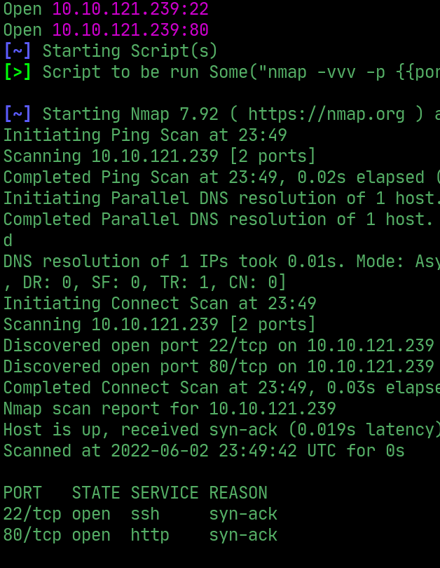
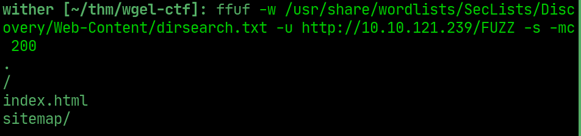
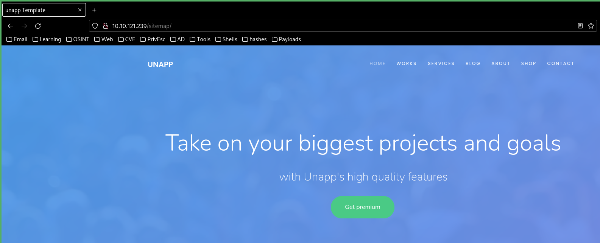
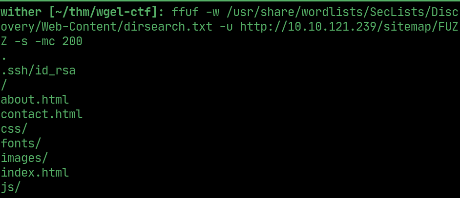
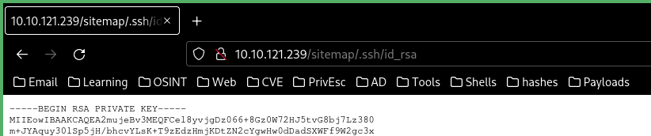
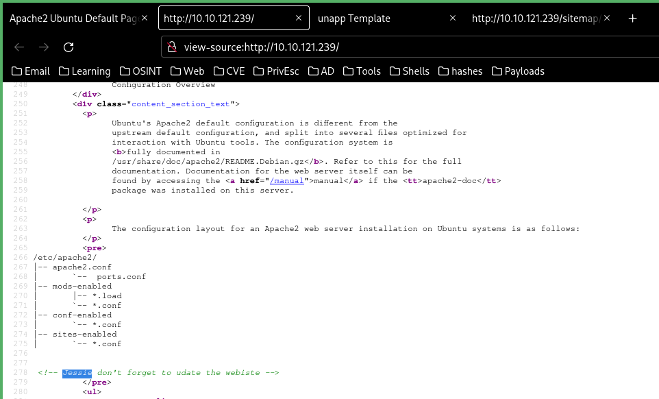
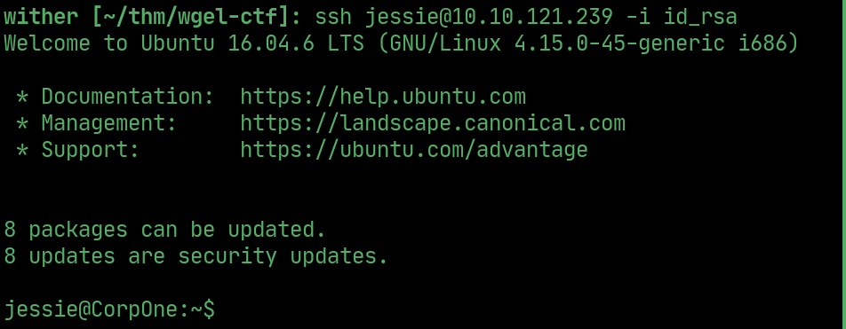
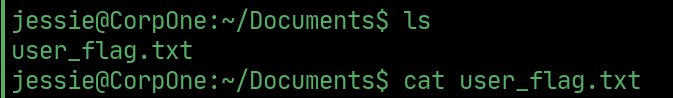
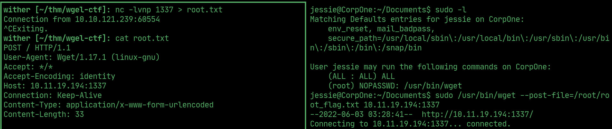

# Wgel CTF

---

## Rustscan

  

## ffuf

> ffuf found /sitemap

  

  

> found more files under sitemap including .ssh/id_rsa

  

  

> username in the Apache2 index.html source

  

## User

> Use the id_rsa to ssh as the user

  

## User flag

  

## Root flag

> wget can be run as sudo, post the root flag over to attacker machine and read it

  

