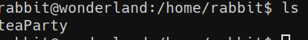

# Wonderland

## nmap

## fuff

> found a folder tree called /r/a/b/b/i/t, leads to:

> In the source of this page, theres a hidden message containing ssh credentials

## User

> worked

## Privilege Escalation

> rabbit can run the python script found in the home directory as root
the script uses the random module, create our own random.py to import

## User 2

> now the rabbit user

> theres a binary called teaparty in rabbits home directory

> get this when ran

> download teaparty using netcat

> using strings we can see the source, it uses 'date' using a path variable maybe its overwritable

## User 3

> make a new directory in rabbits home, make a file called date and add the directory to the PATH variable, so that when 'date' is called in teaParty, it executes the file instead

![[Pasted image 20220515233145.png]]

### Root

> hatters password is in their home directory

> Using getcap we can list binaries with capabilities set, these can be exploited

> after switching to the hatter user, using gtfobins' perl capabilities line we can get root

## Flags!

get em

