# Wonderland

## nmap

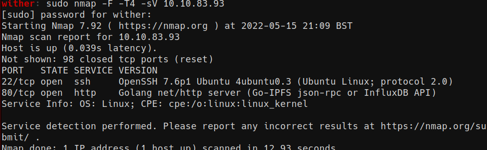

## fuff

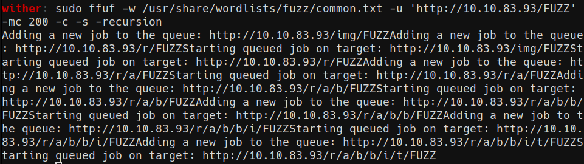

> Use ffuf to find a folder tree called /r/a/b/b/i/t, leads to

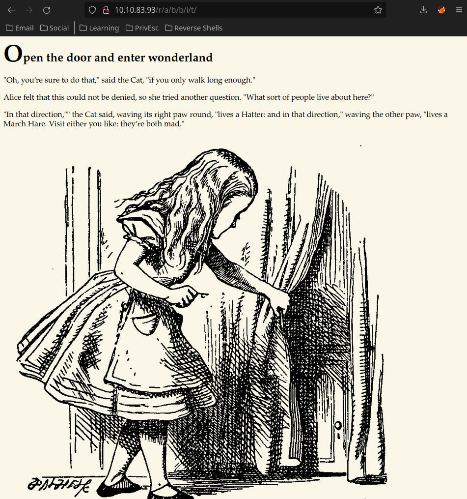

> In the source of this page, theres a hidden message containing ssh credentials

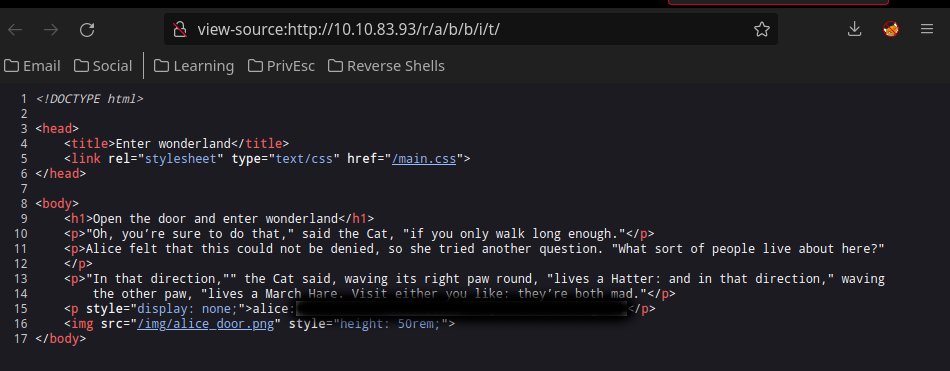

## User

> Login with credentials

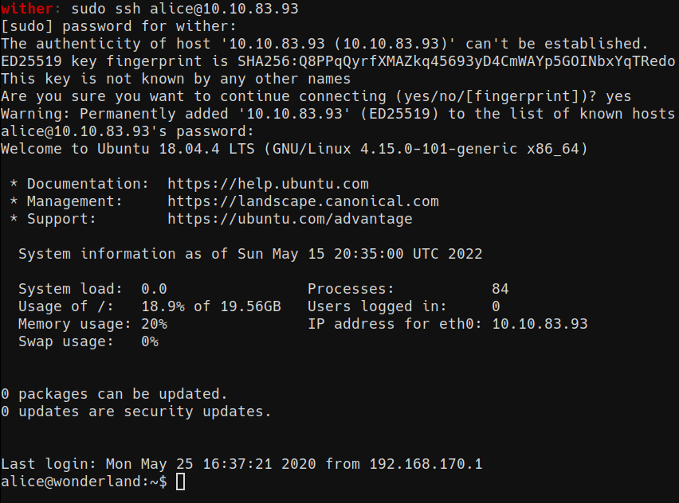

## Privilege Escalation

> Rabbit can run the python script found in the home directory as root
the script uses the random module, create a random.py to import

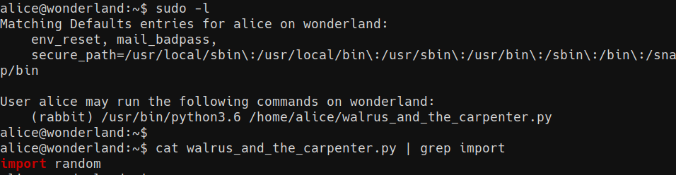

## User 2

> Now the rabbit user

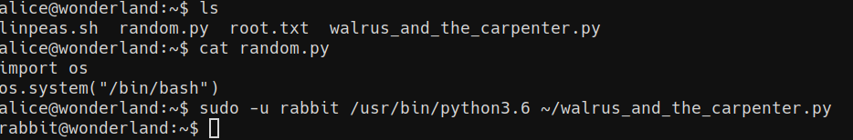

> Theres a binary called teaparty in rabbits home directory that outputs this when run

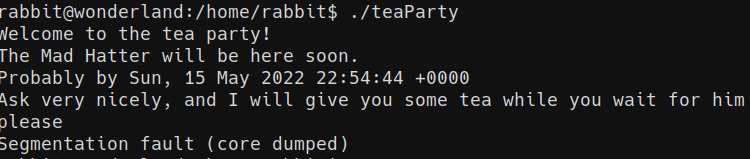

> Download teaparty using netcat

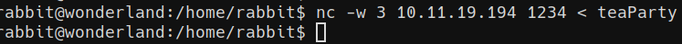

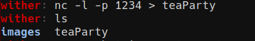

> Use strings to see the source, it uses 'date' using a path variable

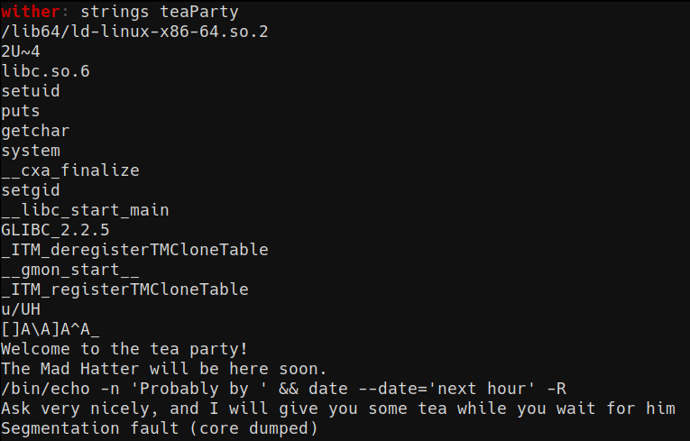

## User 3

> Make a new directory in rabbits home, make a file called date and add the directory to the PATH variable, so that when 'date' is called in teaParty, it executes the file instead

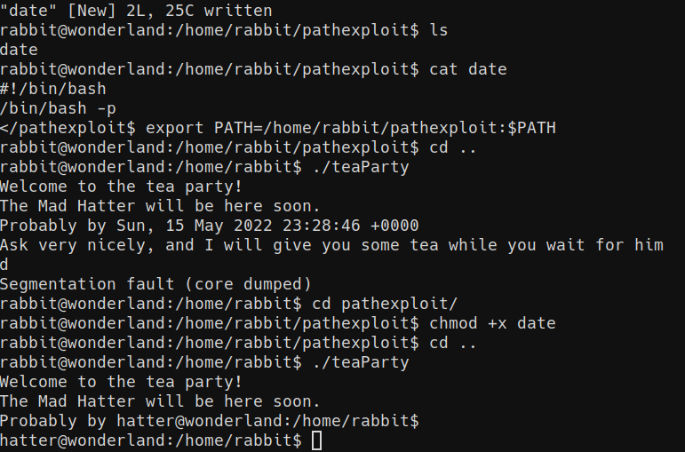

### Root

> hatters password is in their home directory

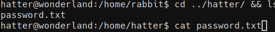

> Use getcap to list binaries with capabilities set

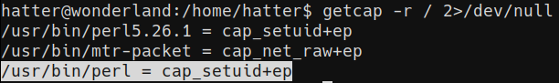

> After switching to the hatter user, use gtfobins' perl capabilities payloads to get root

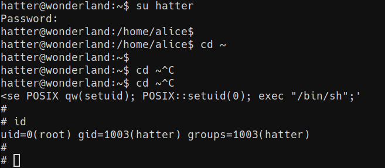

## Flags!

> Capture them

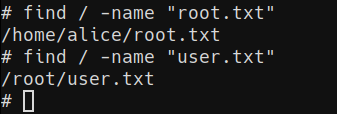
